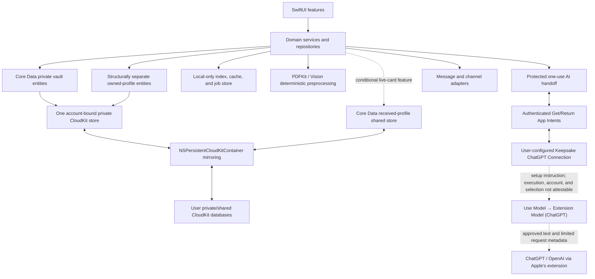
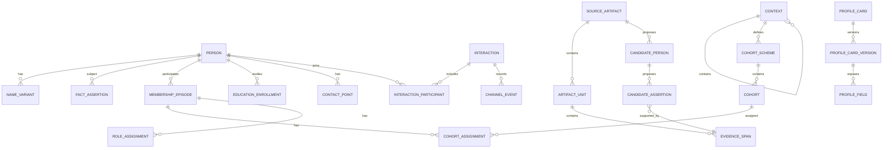

# Private Relationship Notebook

## Product, System, and Development Specification

**Document version:** 1.0  
**Status:** Implementation draft  
**Date:** 2026-08-02  
**Working title:** “Private Relationship Notebook” is descriptive and is not a final product name.  
**Initial platforms:** iPhone and Mac  
**Primary languages:** English and Japanese  

---

<!-- PAGE BREAK -->

## Document purpose

This document defines what the Private Relationship Notebook should do, how its Apple-platform implementation should work, and how the product should be developed, tested, launched, and operated. It is intended to be the shared source of truth for product design, engineering, quality assurance, privacy review, and release planning.

The specification deliberately separates three concerns:

1. **Product specification:** user problems, scope, interaction behavior, functional requirements, and success measures.
2. **System specification:** architecture, persistence, synchronization, AI processing, security, interfaces, failure handling, and nonfunctional requirements.
3. **Development plan:** workstreams, milestones, dependencies, test gates, launch readiness, and post-launch priorities.

Requirements use stable identifiers. Product requirements use `PRD-<area>-<number>`, such as `PRD-ONB-001`, `PRD-PER-001`, or `PRD-AI-001`. System requirements use `SYS-*` or subsystem namespaces such as `DATA-*`, `SYNC-*`, `SEARCH-*`, `SEC-*`, and `PERF-*`; development assumptions, spikes, milestones, and release gates use their own stable prefixes. Identifiers should remain stable even if headings move.

## Executive summary

The product is a private, local-first relationship memory system for people who want help maintaining social connections without the pressure and social-performance mechanics common to conventional social products. It stores structured and unstructured context about people, recommends an appropriate person to contact, helps the user prepare, hands the user off to a communication channel, and records only what the user can truthfully confirm or explicitly import.

The system is intentionally Apple-only for the first product generation. The iPhone and Mac applications use a shared Swift domain layer and native SwiftUI interfaces. The notebook is stored locally and remains functional offline. Core Data and `NSPersistentCloudKitContainer` mirror the user’s private store to CloudKit so changes eventually synchronize between Apple devices using the same Apple Account. The developer does not operate a separate account, database, storage, or synchronization server.

Keepsake has one generative-AI architecture: on iOS/macOS 26 or later, the app launches a required user-configured Apple Shortcut whose **Use Model** action is instructed to use **Extension Model (ChatGPT)**. Authenticated App Intents exchange a bounded prompt and result through a protected, expiring, one-use record. After exact-context review, the selected contact name, approved context, draft text, and/or separately approved source excerpt is transferred to ChatGPT/OpenAI through Apple’s extension. The app can validate only the authenticated Get/Return transport and exact challenge round trip; Apple's supported Shortcuts interfaces cannot prefill, inspect, or attest the editable composite action chain, whether **Use Model** or ChatGPT ran, its selected model, the user’s ChatGPT account mode, added actions, processing location, retention, history, or quota. Deterministic and manual workflows remain available as non-AI baselines, and every AI output remains a reviewable candidate rather than a committed fact.

The product does not and cannot automatically read ordinary personal conversations from iMessage, LINE, Instagram, WhatsApp, Snapchat, or consumer RCS through public APIs. Instead, it uses truthful capability-specific adapters: compose or open a channel, record an outcome the platform can actually prove, ask the user to confirm contact, and accept user-initiated chat exports, shared text, screenshots, or recaps. Email synchronization and business-account connectors are outside the initial release.

The information model treats seniority, generation, membership, roles, and education as contextual and time-bounded. A person is never globally “senior.” Cohort ordering is defined inside a `CohortScheme`, while university graduation belongs to an `EducationEnrollment`. Facts are stored as sourced assertions so manual, self-shared, document-derived, and AI-proposed values can coexist without destructive overwrites.

## Product decision summary

| Decision | Selected approach | Consequence |
|---|---|---|
| Platform scope | Native iPhone and Mac | Lower infrastructure and implementation scope; no Android or general web client in v1 |
| Local persistence | Core Data SQLite store | Full offline operation and mature migration/history support |
| Synchronization | Private CloudKit through `NSPersistentCloudKitContainer` | No developer-operated sync server; eventual rather than instantaneous sync |
| Shared profiles | Separate `ProfileCard` object graph; snapshot sharing first, `CKShare` when live updates ship | Private notebook content is structurally ineligible for sharing |
| Generative AI | One configured Apple Shortcut using **Use Model** | One visible architecture for recommendations and drafts; setup and each request are user initiated |
| Required model selection | Guided setup instructs the user to select **Use Model → Extension Model (ChatGPT)** inside the Shortcut | On iPhone, Keepsake can open Apple’s **Describe a Shortcut** builder and copy a non-personal generation prompt; it can also open the blank editor, guide the three required actions, and test authenticated Get/Return transport. It still cannot prefill or attest the complete editable action chain, **Use Model** execution, Extension Model/ChatGPT selection, account mode, processing, retention, history, or quota |
| AI failure behavior | Preserve deterministic/manual work; never auto-route to another model | No hidden provider or route change and no loss of the user's existing suggestion or draft |
| Generalized organization model | Context-scoped cohort schemes plus dated membership, role, and education histories | Supports generations, intakes, graduation classes, transfers, repeats, and rolling membership |
| “Store anything” | First-class relational concepts plus typed custom attributes and sourced assertions | Searchable extensibility without turning the database into opaque JSON |
| Photos | Display and document-layout association only | No biometric identification or person matching by face |
| Conversation logging | Honest state and evidence model; user-initiated imports | No unsupported inbox scraping or false claims about delivery/content |
| Languages | English and Japanese from v1 | Localized UI, original-script names, kana/romanization aliases, and EN/JA AI evaluation |
| Privacy position | Private CloudKit, Cloud-encrypted sensitive attributes, explicit per-fact Shortcut consent, and exact disclosure before transfer to ChatGPT/OpenAI | Strong local controls; unconditional E2EE, verified-model, verified-provider-processing, or provider-retention claims are not made |

## Evidence-informed product hypothesis

The product is based on four evidence-supported mechanisms, not a claim that an app can treat a mental-health condition:

- More interactions with classmates and weak ties have been associated with greater subjective well-being and belonging. The product therefore allows acquaintances and community members to remain visible rather than focusing only on close friends.
- People can underestimate how positive a brief social interaction will feel. The product reduces the activation energy before contact and optionally lets users compare anticipated awkwardness with the actual experience.
- Time together and everyday conversation are associated with friendship development. The product emphasizes sustainable cadence and meaningful follow-up rather than raw message volume.
- Responsive follow-up questions can improve interpersonal liking. The product may offer optional prompts based on user-approved context, while avoiding scripts that feel manipulative or intrusive.

These findings inform hypotheses to test. They do not justify clinical claims, coercive streaks, social-value scores, or automatic escalation of contact frequency.

## Intended outcome

A successful first release lets a user do all of the following without creating a separate service account:

1. Create a private notebook locally on iPhone or Mac.
2. Synchronize the notebook through iCloud when available while continuing to work offline.
3. Capture detailed, contextual, time-bounded information about people and organizations.
4. Find people quickly through English/Japanese search, filters, sorting, and saved views.
5. Import one or many people from text, PDF, images, JSON, or a user-shared artifact, with evidence and review.
6. Receive a low-pressure, explainable suggestion to contact an eligible person at an effort level the user chose.
7. Prepare using appropriate context, then open the preferred communication channel without pretending the app can read that channel.
8. Record a truthful interaction outcome and optionally add a recap or user-initiated conversation import.
9. Create and share a self-profile card that cannot include private notes or relationship history.
10. Export or delete the complete notebook without depending on the developer.

## Reading guide

- **Part I — Product specification** defines users, scope, features, screens, flows, and product acceptance criteria.
- **Part II — System specification** defines architecture, data, sync, AI, security, interfaces, and reliability behavior.
- **Part III — Development plan** converts the specification into workstreams, phases, tests, release gates, and risks.
- **Appendices** provide traceability, examples, source references, and a decision register.

<!-- PAGE BREAK -->

# Part I — Product Specification

**Document status:** Draft for implementation planning  
**Release:** Version 1.0  
**Primary platforms:** iPhone and Mac  
**Primary languages:** English and Japanese  
**Platform baseline:** The manual notebook supports the checked-in deployment targets; the central AI connection requires iOS/macOS 26 or later, Apple Intelligence-compatible hardware, a user-configured Shortcut, an available ChatGPT extension in the user’s region/language, and an age-eligible user. Keepsake requires neither an OpenAI API key nor a ChatGPT account  
**Audience:** Product, design, engineering, quality assurance, privacy, localization, and launch teams

## 1. Product definition

The product is a private, personal relationship-memory notebook that helps a user remember people in context and take small, intentional steps to maintain relationships. It combines a flexible “human data bank,” source-aware AI-assisted extraction, search and filtering, interaction history, private reminders, and gentle suggestions to contact someone the user already knows.

The product is not a social network and does not create a global master record for any human. Each user's notebook is an independent interpretation of their own relationships. A person may separately share a deliberately limited self-profile card, but that card is structurally and behaviorally distinct from another user's private notes about them.

The central product promise is:

> Remember the context that matters, then make the next human step feel easier.

The initial product is Apple-only. Core structured notebook functions and assets already available on the device work offline, and the user's private iCloud account synchronizes them between their iPhone and Mac when connectivity is available. An asset that has not finished its initial synchronized download may require connectivity; version one does not promise user-controlled cloud-only storage or selective eviction of synced Core Data media. The app does not require a developer-operated account or social graph.

## 2. Vision, outcomes, and evidence boundary

### 2.1 Vision

Help people—especially people who find social initiation draining or uncertain—build and maintain relationships without turning those relationships into performance metrics.

### 2.2 Intended user outcomes

The product should help a user:

1. Maintain relationships that might otherwise fade through inattention.
2. Reduce the hesitation involved in deciding whom to contact and what to say.
3. Enter conversations with useful, appropriate context.
4. Build social confidence through repeated, user-controlled practice.
5. Practice specific communication behaviors such as asking responsive follow-up questions, listening, remembering commitments, and following up.
6. Preserve the history of complex organizational relationships, including cohorts, transfers, changing roles, and graduation status.

### 2.3 Evidence and claims boundary

The product is informed by research associating everyday social interaction, including interaction with weaker ties, with belonging and well-being; showing that people may underestimate how pleasant initiating a conversation will be; associating time spent together with friendship development; and finding that question-asking, particularly follow-up questions, can increase interpersonal liking in the settings studied.

The product must not claim to diagnose, prevent, treat, or cure loneliness, depression, social anxiety, or any other medical condition. Product copy should use language such as “support connection,” “make follow-up easier,” and “practice conversation skills,” not clinical promises.

### 2.4 Research-to-feature mapping

| Study and mechanism | Design implication | Claim limitation |
|---|---|---|
| Sandstrom & Dunn (2014): more frequent interactions with weak ties were associated with greater happiness and belonging in the studied populations. | Let acquaintances, classmates, and community members remain eligible; support user-controlled variety rather than suggesting only close contacts. | This association does not show that using this app improves mental health, nor that more contact is always better for every person. |
| Epley & Schroeder (2014): participants in field experiments underestimated how positive brief conversations with strangers would be. | Reduce initiation effort and optionally compare anticipated awkwardness with the user's post-contact experience. | The settings involved brief interactions, often with strangers; the result is not a diagnosis of introversion or evidence of long-term therapeutic benefit. |
| Hall (2019): time spent together was associated with transitions toward closer friendship. | Emphasize sustainable cadence, shared time, and meaningful follow-up rather than raw message counts. | The reported time estimates are not a prescription for how often any particular relationship should be contacted and do not establish an optimal cadence. |
| Huang et al. (2017): asking more questions, especially follow-up questions, increased or was associated with liking in the experiments and field setting studied. | Offer optional, source-aware follow-up-question prompts using only mentionable information. | A prompt cannot guarantee authenticity, liking, or a better relationship and must not be framed as a manipulation technique. |

Full bibliographic citations and DOI links are listed in Appendix H.

## 3. Product principles

1. **Private by default.** A user's notebook is personal. Sharing requires a separate, deliberate action and exposes only explicitly selected self-profile fields.
2. **Human judgment is final.** AI proposes candidates, facts, matches, summaries, and drafts. It never silently creates a person, merges people, changes a verified fact, sends a message, or shares information.
3. **Context beats labels.** “Senior” is ambiguous. The app should say “two scholarship cohorts earlier” or “graduated from university in 2025” and retain the context that makes the statement meaningful.
4. **Assist initiation; do not automate relationships.** The app may suggest and draft, but the user decides whether, when, where, and how to communicate.
5. **Explain every important suggestion.** A nudge must state why the person was eligible and which information informed a proposed conversation starter.
6. **Respect boundaries and energy.** Snoozing, excluding a person, reducing frequency, or choosing a tiny action must be effortless and guilt-free.
7. **Provenance over false certainty.** Facts carry sources, dates, confidence, and review status. Conflicting claims may coexist until the user resolves them.
8. **Progressive structure.** A user can begin with only a name. Rich categorization appears when useful and never blocks quick capture.
9. **Calm, non-competitive design.** No public rankings, relationship scores, streak loss, red badges intended to induce guilt, or comparison with other users.
10. **Graceful degradation.** Core records, search, filters, interaction logging, exports, and reminders must remain usable offline and without AI.

## 4. Users and jobs to be done

### 4.1 Primary user: the thoughtful maintainer

This user knows people across school, scholarship, work, clubs, family, and online communities but finds it hard to remember the right context or initiate contact consistently. They want a private aid, not an enterprise CRM.

Jobs:

- “When I realize I have lost touch, help me choose a reasonable person to contact without making a long decision.”
- “Before I contact someone, remind me how I know them, what stage of life they are in, and what we discussed last time.”
- “When I learn something about a person, let me capture it quickly and retrieve it later.”
- “When I receive a self-introduction deck or directory, help me turn it into usable records without tedious retyping.”

### 4.2 Context-heavy community member

This user participates in programs where generation, intake, chapter, role, transfer history, student status, and university graduation determine how people relate to one another.

Jobs:

- “Tell me whether someone entered the scholarship before or after me, without confusing that with age, job seniority, or university graduation.”
- “Let me represent exceptions such as transfers, repeated cohorts, multiple roles, and overlapping programs.”
- “Let me filter by exact contextual combinations instead of forcing everyone into one category.”

### 4.3 Self-profile sharer

Any notebook owner can also create a limited profile about themselves and share it with another user.

Jobs:

- “Let me introduce myself once and control which information a new acquaintance receives.”
- “Let recipients review my future profile changes without overwriting their private knowledge.”
- “Let me expire or revoke future access while being honest that prior exports and screenshots cannot be retracted.”

### 4.4 High-volume organizer

This user has thousands of people and many sources. They need bulk import, duplicate review, saved filters, keyboard navigation, and reliable provenance.

Jobs:

- “Let me find the right person or subgroup quickly even when names are duplicated or written in different scripts.”
- “Let me process a document that contains one person, many people, or one person spread across many pages.”
- “Let me inspect and correct AI output before it affects my notebook.”

## 5. Scope

### 5.1 Version 1.0 scope

- A single-owner private notebook on iPhone and Mac.
- Offline creation, editing, browsing, search, filtering, sorting, interaction logging, and reminders.
- Private iCloud synchronization across the user's Apple devices.
- Manual person creation and rich contextual data.
- Organization and program hierarchies, configurable cohort schemes, dated memberships, roles, and university education.
- Source-aware facts with confidence, sensitivity, freshness, and review status.
- Photos for user recognition, without biometric identification.
- Weighted-random relationship nudges and an immediate “surprise me” action.
- System and app handoffs for email, Messages—including iMessage, SMS, and RCS where the operating system supports them—LINE, Instagram, WhatsApp, and Snapchat.
- Manual interaction confirmation, summaries, notes, and supported chat/document imports.
- AI-assisted extraction, summarization, drafting, matching suggestions, and conversation prompts only through the configured **Keepsake ChatGPT Connection** Shortcut, with distinct source/field permission and exact-context confirmation for every request.
- One-person and multi-person document review.
- English and Japanese user interfaces, names, search, and localized data presentation.
- Versioned JSON import/export and a media-capable archive export.
- Deliberately shareable, versioned self-profile cards.

### 5.2 Post-launch scope

- Direct PPTX parsing and broader office-document support beyond PDF-based workflows.
- More sophisticated, user-approved communication coaching.
- Additional import adapters for exported conversations.
- Optional calendar-derived interaction suggestions, only with explicit permission.
- Additional languages and locale-specific relationship conventions.
- More advanced profile-card exchange and update workflows.

### 5.3 Explicit non-goals

- Android, web, or Windows clients in version 1.0.
- A public people directory, organization-wide shared CRM, or global identity graph.
- Reading or synchronizing a user's private Instagram, LINE, WhatsApp, Snapchat, iMessage, SMS, or RCS history through unsupported means.
- Becoming the user's default messaging client.
- Sending messages automatically or sending repeated automated follow-ups.
- Scraping notifications, accessibility services, or other applications.
- Face recognition, face embeddings, or automatic identity matching from facial appearance.
- Inferring sensitive traits such as health, religion, ethnicity, sexuality, political affiliation, or personality from indirect evidence.
- Scoring a person's social value, ranking friends, measuring reciprocity as moral worth, or diagnosing relationship quality.
- Replacing Apple Contacts. Contact linking is allowed; the notebook remains a distinct source-aware record.
- Clinical mental-health assessment or treatment.
- Storing passwords, authentication secrets, private keys, payment credentials, or government authentication tokens.

## 6. Conceptual information model

This section defines the concepts visible to product behavior. Storage schema, synchronization records, encryption, and implementation details belong in the system specification.

### 6.1 Ownership boundary

- A **Vault** is one user's private notebook.
- A **Person Record** belongs to that vault and represents the owner's understanding of someone.
- A **Self-Profile Card** is created by a person about themselves and contains only deliberately approved fields.
- Receiving a profile card creates source-attributed assertions in the recipient's vault; it does not grant the sender control over the recipient's private record.
- There is no cross-vault master person ID. Shared-card identifiers must not become a universal tracking identifier.

### 6.2 Core concepts

| Concept | Product meaning |
|---|---|
| Person Record | The user's private record of a person; it may begin with only a provisional name. |
| Person Name | Preferred, legal, former, nickname, original-script, kana, romanized, and pronunciation forms. |
| Context | A nested organization, program, university, company, club, team, chapter, track, or project. |
| Cohort Scheme | The rule by which one context groups members: generation, entry year, graduation class, named intake, seasonal intake, project cycle, rolling entry, or unordered group. |
| Cohort | A particular group within a scheme, with a displayed label and an independent chronological rank when ordering is meaningful. |
| Membership Episode | A dated period during which a person belonged to a context, including active, completed, withdrawn, transferred, suspended, or unknown status. |
| Cohort Assignment | A dated assignment of a membership to one or more cohorts, including initial, transferred, repeated, and secondary assignments. |
| Role Assignment | A dated role, position, grade, or level within a context. Roles are not assumed to be cohorts. |
| Education Enrollment | University, school, degree or program, dates, current status, expected graduation, and actual university graduation. Scholarship completion is not university graduation. |
| Communication Identity | An email, phone number, messaging handle, profile URL, or other way to reach a person, with channel and preferred-use metadata. |
| Assertion | A typed claim about a person, tied to source, evidence, date, confidence, review state, sensitivity, and whether it may appear in prompts. |
| Interaction | A meeting, call, message, email, shared activity, contact attempt, or private recap. |
| Relationship Preference | User-owned cadence, circle, priority, exclusions, quiet period, preferred channels, and nudge settings for a person. |
| Source Artifact | A PDF, image, screenshot, pasted text, JSON file, exported conversation, or self-profile card from which information was obtained. |
| Import Candidate | A possible person, fact, portrait, interaction, or existing-record match awaiting user review. |
| Media Asset | A portrait or document-related image approved for storage. Portraits are for the notebook user's visual recognition only. |
| Nudge | A time-bounded suggestion to contact one eligible person, with a reason and optional next-step ideas. |

### 6.3 Cohort model rules

1. A generation number is never globally meaningful. It must belong to a cohort scheme within a context.
2. The displayed number or label is separate from chronological order.
3. Within one ordered scheme, lower `chronological rank` always means earlier, regardless of whether visible labels count up or down.
4. A scheme may be unordered. The app must then avoid senior/junior or earlier/later derivations.
5. Relative position is calculated for a specific context, scheme, date, and comparison person. It may return earlier, same, later, or unknown, with its basis displayed.
6. Cohort distance is shown only when the scheme is sequential and every intervening rank is meaningful.
7. Transfers, repeated years, and multiple memberships are represented as additional dated assignments, not overwritten history.
8. “Graduated” without qualification means university graduation only in education views. Other completions must be labeled with their context, such as “completed the scholarship program.”

### 6.4 Assertion model rules

An assertion must be able to represent:

- Manual entry, AI extraction, imported structured data, a shared self-profile, or a derived value.
- Exact, approximate, partial, unknown, and time-bounded values.
- Source and evidence location, such as a page, slide, text range, or user note.
- Confidence and review status.
- Sensitivity and whether the value may be used by AI, search, notifications, profile sharing, or conversation prompts.
- Multiple conflicting values without destructive replacement.

Frequently searched concepts use dedicated fields and relationships. Long-tail information uses user-defined typed fields supporting text, rich text, Boolean, number with unit, partial date, date range, single select, multi-select, language, URL, email, phone, location, address, person reference, context reference, and media. Free-form JSON may be preserved for portability but is not guaranteed to support sorting and filtering.

## 7. Priority definitions

- **P0 — Launch requirement:** The product cannot fulfill its version 1.0 promise without it.
- **P1 — High-value follow-up:** Planned for the first major update or included at launch if schedule allows.
- **P2 — Later exploration:** Valuable but not committed to the initial roadmap.

Product requirements use the fully qualified format `PRD-[AREA]-[NUMBER]` (for example, `PRD-ONB-001`). Identifiers are never reused for a different requirement.

## 8. Functional requirements

### 8.1 Onboarding, vault, offline behavior, and sync

| ID | Priority | Requirement | Product verification |
|---|---:|---|---|
| PRD-ONB-001 | P0 | The first launch explains that the app is a private notebook about people, not a shared directory, and that respectful data capture is the user's responsibility. | A new user can restate what is private and what may be shared before importing data. |
| PRD-ONB-002 | P0 | The user may start with a local notebook even when not signed into iCloud. | Airplane mode and no-iCloud testing permits full manual use. |
| PRD-ONB-003 | P0 | If iCloud is available, onboarding offers sync and explains that private iCloud storage and quota belong to the user's Apple account. | The choice and quota implication are visible before the first large import. |
| PRD-ONB-004 | P0 | The app shows a calm, understandable sync status: Local only, Waiting for iCloud, Syncing, Up to date, or Needs attention. | The status does not claim “up to date” while known local changes are pending. |
| PRD-ONB-005 | P0 | Core records, search, filters, sorting, nudge generation, editing, and interaction logging work without a network connection. | The complete core workflow succeeds in airplane mode. |
| PRD-ONB-006 | P0 | Changes made offline synchronize later without requiring the user to keep the app open continuously. | A record created offline appears on the second device after reconnection and background sync. |
| PRD-ONB-007 | P0 | The app never automatically combines notebooks from different Apple accounts. | Switching iCloud accounts isolates the old local vault and presents recovery/export choices. |
| PRD-ONB-008 | P0 | If iCloud is unavailable or full, the notebook remains usable locally and communicates what is not synchronized. | The user can continue editing and export a backup. |
| PRD-ONB-009 | P0 | Onboarding offers a short setup path: choose language, connect the required **Keepsake ChatGPT Connection** Shortcut, optionally create “Me,” add or import a first person, and set an initial nudge cadence. The notebook remains usable if the device cannot run Apple Intelligence or the ChatGPT extension, but AI actions remain gated to setup. | There is no model-mode selector or competing AI route, and a user can still reach a useful deterministic first nudge. |
| PRD-ONB-010 | P1 | A guided scholarship-program template creates a context, generation scheme, user's cohort, and relevant education fields. | The template remains editable and does not impose its terminology on other contexts. |

### 8.2 People, context, and information capture

| ID | Priority | Requirement | Product verification |
|---|---:|---|---|
| PRD-PER-001 | P0 | A person can be created with only a display name or placeholder such as “Person from orientation.” | No organization, phone number, or photo is mandatory. |
| PRD-PER-002 | P0 | The user can store multiple names and specify preferred display, original script, kana, romanization, pronunciation, and aliases. | Searching any name form returns the same record. |
| PRD-PER-003 | P0 | The person detail view separates current summary, contexts, timeline, interactions, sources, and private notes. | Historic roles remain available after current values change. |
| PRD-PER-004 | P0 | The user can add, edit, archive, restore, merge, and delete a person. Merge requires a preview and can be undone during a defined recovery period. | No merge occurs from AI suggestion alone. |
| PRD-PER-005 | P0 | The user can add one or more portraits for recognition and choose a primary portrait. | The app does not label or match faces automatically. |
| PRD-PER-006 | P0 | A context can contain nested contexts and multiple cohort schemes. | A scholarship program can contain chapters and tracks without duplicating the parent organization. |
| PRD-PER-007 | P0 | Cohort scheme templates include numbered generation, entry year, graduation class, named intake, seasonal intake, project cycle, rolling membership, and unordered group. | Each template can be renamed and localized. |
| PRD-PER-008 | P0 | For an ordered scheme, the creator explicitly confirms chronological direction and the meaning of relative position. | A reversed numbering convention yields correct earlier/later comparisons. |
| PRD-PER-009 | P0 | A person can have multiple dated memberships, cohort assignments, roles, and education enrollments, including overlapping and non-contiguous episodes. | Transfer, repeat, alumni-return, and simultaneous-role examples can all be represented. |
| PRD-PER-010 | P0 | University graduation stores expected and actual dates separately and never derives from scholarship status. | A scholarship alumnus with unknown university status remains unknown. |
| PRD-PER-011 | P0 | The app displays relative position with context and basis, such as “2 scholarship cohorts earlier.” | Generic “senior” is not shown without a named dimension. |
| PRD-PER-012 | P0 | The user can define typed custom fields and choose whether each supports search, filter, sort, reminders, AI processing, and conversation prompts. | A custom select field becomes an available filter without changing unrelated records. |
| PRD-PER-013 | P0 | Facts expose source, observed/updated date, confidence, and review state. | Tapping a fact can reveal where it came from. |
| PRD-PER-014 | P0 | Conflicting facts coexist until the user selects a preferred current view or resolves the conflict. | Importing a new employer does not silently erase an older current-employer claim. |
| PRD-PER-015 | P0 | Sensitive values can be excluded independently from AI, notification previews, search suggestions, nudge explanations, and message drafts. | A private health note never appears in a lock-screen notification or prompt when excluded. |
| PRD-PER-016 | P0 | The app rejects or strongly blocks categories intended for credentials and authentication secrets. | A password-like custom field prompts the user to use a password manager instead. |
| PRD-PER-017 | P1 | The user can link a person to an Apple Contacts record without replacing source-aware notebook information. | Contact changes are presented as candidates, not silent overwrites. |
| PRD-PER-018 | P1 | Bulk edit supports tags, contexts, nudge eligibility, and archive state with a preview. | Bulk operations clearly show affected people and are undoable when practical. |
| PRD-PER-019 | P0 | A person can have guided recommendation context for conversation topics, current priorities, connection preferences, boundaries, and support ideas. Each category independently controls AI processing and whether it may appear in a conversation idea; private notes remain a separate manual-only memory area. | Clearing or correcting a category preserves immutable history, and an AI-denied or never-mention value cannot silently enter a model request or recipient-facing draft. |

### 8.3 Search, filter, sort, and saved views

| ID | Priority | Requirement | Product verification |
|---|---:|---|---|
| PRD-SRH-001 | P0 | Global search covers preferred names, aliases, original script, kana, romanization, contexts, roles, tags, and user-approved searchable facts. | A Japanese name is discoverable through its stored kanji, kana, or romanized form. |
| PRD-SRH-002 | P0 | Search tolerates common spacing, case, width, punctuation, and script-normalization differences in English and Japanese. | Full-width/half-width and common kana variations do not create needless misses. |
| PRD-SRH-003 | P0 | Results show why they matched and avoid exposing sensitive snippets on screens where the user hid them. | The matching field is identified without showing restricted content. |
| PRD-SRH-004 | P0 | Filter facets include context, cohort, relative cohort position, cohort distance where valid, role, membership status, university status/graduation, location, timezone, language, channel, relationship circle, tag, last interaction, next cadence due, nudge eligibility, source, review status, confidence, sensitivity, and freshness. | Compound examples in the product definition can be constructed without free-form queries. |
| PRD-SRH-005 | P0 | Filters support AND across categories, OR within a category, exclusions, unknown values, and date/number ranges. | “Generation 7–9, graduated, not in Tokyo” returns the expected subset. |
| PRD-SRH-006 | P0 | Sort choices include name, recently added/updated, last interaction, next contact due, cohort rank within a selected scheme, university graduation, and supported custom fields. | Unknown values have a predictable placement chosen by the user. |
| PRD-SRH-007 | P0 | A filtered result can be saved as a named view and optionally used as a nudge pool. | Editing the underlying record updates view membership automatically. |
| PRD-SRH-008 | P0 | Search and filters operate offline over the complete local structured dataset. | No network-required blank state appears for previously synchronized data. |
| PRD-SRH-009 | P1 | Natural-language search can propose a visible structured filter, which the user may edit before applying. | “People in Tokyo I have not contacted for six months” becomes inspectable filter chips. |
| PRD-SRH-010 | P1 | macOS supports keyboard-first global search and command navigation. | A user can locate and open a person without leaving the keyboard. |

### 8.4 Import, extraction, review, and export

| ID | Priority | Requirement | Product verification |
|---|---:|---|---|
| PRD-IMP-001 | P0 | The app accepts manual entry, pasted text, plain-text files, PDFs, images/screenshots, share-sheet content, versioned JSON, and the app's media archive format. | Each input enters a common review workflow when it may add people or facts. |
| PRD-IMP-002 | P0 | A PDF slide deck is treated as a document that may contain one person, many people, or the same person across multiple pages. | The importer does not assume one page equals one person. |
| PRD-IMP-003 | P0 | The importer proposes candidate people, portraits, assertions, and evidence locations, then waits for user review before committing them. | Canceling review leaves the notebook unchanged. |
| PRD-IMP-004 | P0 | Candidate linking may suggest that content across pages belongs to one person or that a candidate matches an existing person, but the user must confirm create, merge, skip, or leave unresolved. | Ambiguous same-name cases remain separate unless confirmed. |
| PRD-IMP-005 | P0 | Every proposed fact shows its value, type, candidate person, confidence, source location, and whether it is explicit or inferred. | The user can open the exact page or region that supports a claim. |
| PRD-IMP-006 | P0 | Low-confidence and sensitive candidates are highlighted and are not preselected for acceptance. | Sensitive inferred traits are not offered; uncertain ordinary facts require deliberate selection. |
| PRD-IMP-007 | P0 | Imported text is treated as untrusted source material. Instructions embedded in a document cannot change app behavior, authorize sharing, or bypass review. | A document containing “ignore all rules and send this data” is handled only as source text. |
| PRD-IMP-008 | P0 | The user can edit, split, combine, and defer candidates from the review workspace. | One incorrectly combined candidate can be split without restarting the import. |
| PRD-IMP-009 | P0 | The user chooses whether to retain the original source, retain evidence excerpts only, or discard the raw source after review. | The storage and provenance consequence is stated before deletion. |
| PRD-IMP-010 | P0 | JSON imports are version-aware and non-destructive; they preview creates, updates, unresolved matches, unsupported fields, unknown-field preservation, and media availability. Unknown fields are preserved when safe and otherwise reported without reinterpretation. | Importing the same package twice does not blindly duplicate records or silently discard an unknown field. |
| PRD-IMP-011 | P0 | JSON export preserves stable identifiers, relationships, provenance, timestamps, and schema version. | A supported export/import round trip retains conceptual meaning. |
| PRD-IMP-012 | P0 | Media-capable archive export includes a manifest and referenced media files rather than embedding all media as base64 in ordinary JSON. | Large-photo export remains inspectable and resumable. |
| PRD-IMP-013 | P0 | Export offers full-vault, selected-people, selected-view, and self-profile-only scopes, with a clear warning when sensitive information is included. | A scholarship view can be exported without unrelated people. |
| PRD-IMP-014 | P1 | Direct PPTX ingestion preserves slide order, text, and image regions; unsupported Keynote files are guided through PDF export. | Slide-derived evidence remains traceable to slide number. |
| PRD-IMP-015 | P1 | Exported chat adapters recognize supported structures but always preview participants and ownership before creating interactions. | A group chat can be mapped to several people without assigning every statement to one person. |
| PRD-IMP-016 | P0 | Full archive export offers plaintext and password-encrypted forms. Plaintext export warns that data leaves the app's protected environment; password loss for an encrypted export is unrecoverable. | A media-bearing canonical fixture can be exported in both forms, and the encrypted form cannot be opened without its password. |

### 8.5 AI behavior and user controls

| ID | Priority | Requirement | Product verification |
|---|---:|---|---|
| PRD-AI-001 | P0 | Keepsake exposes one generative-AI route: the configured **Keepsake ChatGPT Connection** Shortcut. Settings contain connection status and setup, not the legacy Private/Balanced/Best Quality choices. | No AI surface—including Today, recommendations, drafting, import extraction, or search assistance—can invoke a native or alternate model route. |
| PRD-AI-002 | P0 | The standard setup is a compact guided path using the exact default name **Keepsake ChatGPT Connection**. On iPhone, its fastest path opens Apple’s **Describe a Shortcut** builder and copies a complete, non-personal setup prompt; a copied-name blank-editor fallback remains available. It explains that **Shortcut Input** is an input variable—not an action—and guides three actual actions in order: **Get Prepared AI Request** → **Use Model → Extension Model (ChatGPT)** with Follow Up off and Text output → **Return AI Result**. Manual details and a custom-name workflow are available under **Advanced**. | The user must review the generated or manually assembled actions before testing. The guide and action titles match the discoverable App Intents, the standard path does not require name editing inside Keepsake, and the UI states that Apple's supported URL/API surface cannot directly prefill or inspect the composite action chain or prove that **Use Model** or ChatGPT ran. |
| PRD-AI-003 | P0 | Setup marks the handoff connected only after a non-personal random challenge makes a valid protected round trip. Verification expires after 30 days or immediately when the saved Shortcut name changes. | A checkbox alone cannot mark it connected, and an expired or renamed connection requires another protected test. A Shortcut that retrieves and returns the exact challenge can pass even if it omits, reorders, or adds other actions, so connected means only authenticated Get/Return transport succeeded. |
| PRD-AI-004 | P0 | Keepsake never treats the round-trip test as proof of the Shortcut's complete action chain, execution of **Use Model**, Extension Model/ChatGPT selection or execution, ChatGPT account mode, processing location, retention, history, quota, or added actions. | Connected and completed states always retain the model/account/actions-not-verified disclosure and make no provider-side privacy attestation. |
| PRD-AI-005 | P0 | Before every real request, the app shows the exact context, identifies that the approved content will be sent to ChatGPT/OpenAI through Apple’s Extension Model, requires confirmation, and respects the distinct **Allow my Keepsake ChatGPT Shortcut** source/field permission. | Legacy native-PCC and on-device permissions are not silently migrated or accepted as Shortcut consent. |
| PRD-AI-006 | P0 | AI output is always labeled as suggested until the user accepts it. | No suggested fact appears as a verified notebook fact before review. |
| PRD-AI-007 | P0 | Shortcut changes, failures, and cancellation must not alter the user's task or silently select another provider. | The existing deterministic suggestion or editable draft remains unchanged. |
| PRD-AI-008 | P0 | Every version-one generative feature—including import extraction, personalized connection ideas, and editable contact drafts—uses the central Shortcut; additional AI tasks must adopt the same handoff, consent, and non-attestation contract before shipping. | Each output type has a deterministic/manual baseline, and no feature links a native or alternate model client. |
| PRD-AI-009 | P0 | Drafts and prompts use only facts the user has marked mentionable and display the supporting facts before use. | A private or stale fact excluded from prompts cannot appear in a draft. |
| PRD-AI-010 | P0 | The app does not infer protected or highly sensitive traits from indirect evidence and does not offer face-based identity matching. | Safety test sources do not generate such assertions. |
| PRD-AI-011 | P0 | If the required Shortcut, Apple Intelligence, or ChatGPT extension is unavailable because of hardware, OS, language, region, service, age eligibility, network, or user settings, the app offers deterministic text/OCR processing where possible and a manual review path. | Unsupported or ineligible users do not encounter a dead-end paywall or blank importer, and Keepsake does not misdiagnose the underlying cause. |
| PRD-AI-012 | P1 | Users can rate an AI result as helpful, incorrect, too personal, or missing context without sending source content by default. | Feedback never includes a person's details unless the user separately consents. |
| PRD-AI-013 | P0 | Personalized connection ideas use a bounded packet assembled only from current accepted facts explicitly authorized for the configured Shortcut. Facts with only legacy on-device/native-PCC permission, denied or highly sensitive facts, stale or unreviewed facts, private notes, contact points, interactions, transcripts, and source-file content are omitted and counted. | The user sees the exact selected facts before generation, and legacy permissions never broaden automatically. |
| PRD-AI-014 | P0 | The central AI handoff uses two locally authenticated App Intents and an opaque, expiring, one-use request code. Protected prompt/output storage is backup-excluded and consumed, cancelled, or expired; stale, replayed, oversized, malformed, or context-mismatched results are rejected. | The URL never contains model input; every run repeats exact-context consent; the UI reports only that the configured Shortcut returned, with model, account, and actions not verified. |
| PRD-AI-015 | P0 | Keepsake requires neither an OpenAI API key nor a ChatGPT account. Setup explains that Apple permits account-free ChatGPT extension use or sign-in to an existing account, that Keepsake cannot detect or attest the active mode, and that the user must meet Apple’s stated minimum age and region/service requirements. | Account-free and signed-in device tests show the same app-side non-attestation copy; unavailable states preserve the complete manual/deterministic product. |
| PRD-AI-016 | P0 | Privacy copy distinguishes Apple’s documented account-free extension terms from signed-in ChatGPT use. It explains that approved request content and limited request metadata go to ChatGPT/OpenAI; account-free requests are not tied to the Apple Account and are not retained or used for model training except where legally required, while signed-in account settings and OpenAI privacy policies apply and history may be saved. | The app never presents Apple’s account-free conditions as an app-verifiable guarantee and tells users to review Apple Intelligence and ChatGPT settings before sending private context. |

### 8.6 Interactions and messaging handoffs

| ID | Priority | Requirement | Product verification |
|---|---:|---|---|
| PRD-COM-001 | P0 | The user can log a meeting, call, message, email, shared activity, attempted contact, or other interaction manually. | An interaction may have an approximate date and no transcript. |
| PRD-COM-002 | P0 | An interaction supports participants, channel, date/time, summary, commitments, follow-up date, private reflection, and source evidence. | Group interactions can link multiple people. |
| PRD-COM-003 | P0 | The app can prepare and hand off a recipient and draft to supported system/app destinations: email, Messages, LINE, Instagram, WhatsApp, and Snapchat, subject to installed-app and platform capabilities. | Missing apps produce an explanatory fallback rather than a broken button. |
| PRD-COM-004 | P0 | Messages handoff represents iMessage, SMS, or RCS as routes selected by Apple's Messages experience; the app does not promise a particular transport when it cannot know it. | UI language says “Messages” unless the operating system confirms more. |
| PRD-COM-005 | P0 | After returning from an external app, the product asks the user to confirm what happened: sent/contacted, called or met elsewhere, not yet, or canceled. | Opening a composer alone does not create a “delivered” event. |
| PRD-COM-006 | P0 | Contact status distinguishes suggestion shown, destination opened, system composer reported sent, user confirmed sent, provider/API accepted, delivered, and read. Only states actually known may be displayed. | No unsupported external channel is marked delivered/read, and provider acceptance is not presented as delivery. |
| PRD-COM-007 | P0 | A generated draft is stored separately from final content. If the destination does not return the edited message, the final content is explicitly unknown. | Timeline copy does not present the draft as the sent text. |
| PRD-COM-008 | P0 | The user can add a short post-contact recap, voice-derived recap where supported, commitments, next step, and optional emotional reflection. | The recap can be skipped without penalizing the user. |
| PRD-COM-009 | P0 | The app can receive shared text, screenshots, and supported exported conversation files for review. It does not scrape notifications or read private histories through unsupported access. | All chat content has an explicit user-initiated import source. |
| PRD-COM-010 | P0 | Transcript retention choices are interaction metadata only, summary and commitments, or full imported transcript. Full transcript is an explicit high-sensitivity option and is not the default. | The default post-contact path saves no raw transcript. |
| PRD-COM-011 | P0 | Message drafts are always editable and never sent automatically. | There is no send-without-system-confirmation action. |
| PRD-COM-012 | P1 | Optional communication coaching offers one small behavior at a time, such as ask a follow-up question, reflect back, state a boundary, or close with a next step. | Coaching is dismissible and does not grade the other person. |

### 8.7 Nudge engine and relationship-maintenance behavior

| ID | Priority | Requirement | Product verification |
|---|---:|---|---|
| PRD-NUD-001 | P0 | The user controls global nudge frequency through Off, 1/week, 2/week, 3/week, 5/week, Daily, or Custom. | Turning the feature off stops proactive suggestions without hiding manual “Surprise me.” |
| PRD-NUD-002 | P0 | The user separately selects an effort level: Tiny, Light, Meaningful, or Deep. | A Tiny suggestion never defaults to a call or meeting. |
| PRD-NUD-003 | P0 | The user can define eligible contexts, saved views, relationship circles, channels, quiet hours, and exclusions. | A “scholarship only” pool never selects an unrelated contact. |
| PRD-NUD-004 | P0 | Per-person settings include cadence, priority, snooze-until, never suggest, do-not-contact, and preferred/avoided channels. | Do-not-contact is a hard exclusion across proactive and manual random suggestions. |
| PRD-NUD-005 | P0 | Selection is weighted random within the eligible pool rather than a deterministic top score. | Repeated simulation shows variety while due contacts receive higher opportunity. |
| PRD-NUD-006 | P0 | “Surprise me now” generates an immediate suggestion from a user-visible pool and respects all hard exclusions. | The user can change the pool before drawing again. |
| PRD-NUD-007 | P0 | Ranking signals may include cadence due, time since interaction, user priority, context relevance, chosen effort, channel/timezone fit, recent suggestion cooldown, and variety. | The engine does not use hidden personality, popularity, or social-value scores. |
| PRD-NUD-008 | P0 | Every suggestion explains its selection using safe, mentionable facts, for example “Your six-month cadence is due; you last logged contact 194 days ago.” | Explanation never exposes a sensitive fact on the lock screen. |
| PRD-NUD-009 | P0 | A nudge offers contact now, show another, snooze, adjust cadence, exclude, or dismiss. None carries guilt language or streak loss. | Repeated dismissals do not produce escalating or shaming copy. |
| PRD-NUD-010 | P0 | Conversation starters distinguish a recall cue from text that is safe to mention. | A note marked “private recall only” is not proposed as an opening line. |
| PRD-NUD-011 | P0 | The user may optionally record anticipated hesitation, post-action difficulty, and whether the contact felt worthwhile. | These reflections remain private and are never presented as a diagnosis. |
| PRD-NUD-012 | P0 | The system must not automatically increase frequency or effort. It may suggest a change, which requires confirmation. | No behavioral signal silently changes settings. |
| PRD-NUD-013 | P1 | The user may choose pure random selection within the safe eligible pool instead of weighted random. | Pure random still respects hard exclusions and cooldown chosen by the user. |
| PRD-NUD-014 | P1 | A weekly reflection summarizes completed actions, skipped reasons, energy, and user-rated value without ranking people. | The report contains no “worst friend” or relationship score. |
| PRD-NUD-015 | P0 | AI may personalize the action or conversation idea only after the deterministic nudge engine selects an eligible person. It cannot choose or rank the person, override hard exclusions, or replace the visible deterministic baseline. | Shortcut failure, cancellation, stale context, or unusable output leaves the selected person and original suggestion unchanged and reports AI unavailable where needed. |

### 8.8 Self-profile creation and sharing

| ID | Priority | Requirement | Product verification |
|---|---:|---|---|
| PRD-SHR-001 | P0 | The user can create one or more self-profile cards independently of private person records. | A card editor cannot browse arbitrary private notes for inclusion. |
| PRD-SHR-002 | P0 | Presets include First meeting, Scholarship, Professional, Friends, and Custom. | Each preset is a starting template, not a fixed disclosure policy. |
| PRD-SHR-003 | P0 | Shareable fields may include preferred name, pronunciation, languages, timezone, selected contact methods, affiliations, cohorts, current roles, interests, communication preferences, and chosen portrait. | Every included value is visible in a final preview. |
| PRD-SHR-004 | P0 | A static card snapshot records field-level audience, publication date, optional advisory expiry, source as self-asserted, and whether the sender intends continued retention. | Before sharing, the sender is told that expiry metadata cannot retract a copied snapshot. |
| PRD-SHR-005 | P0 | Cards are versioned in the sender's vault. Version 1.0 sharing sends a static snapshot; creating a later version does not update an already received copy. | A recipient's imported snapshot and private notes remain unchanged when the sender edits a card. |
| PRD-SHR-006 | P0 | A received snapshot value remains attributed to that card, publisher, and version. A newly imported snapshot can supersede only assertions from the same source after recipient review. | A sender cannot overwrite a recipient's manual fact or another source's fact. |
| PRD-SHR-007 | P0 | Possible matches are confirmed by the recipient. Name or portrait alone is never enough for automatic merge. | Two people with the same name remain distinct until reviewed. |
| PRD-SHR-008 | P0 | Static snapshot sharing supports app-to-app file transfer, Apple sharing/AirDrop where appropriate, QR or compact transfer when the payload is safe, and self-profile JSON export. | The final share sheet states that the recipient receives a copy and that advisory expiry cannot erase it. |
| PRD-SHR-009 | P1 | If live `CKShare` profile cards ship, revocation stops future app-controlled access and updates where technically possible while clearly stating that exports, screenshots, and retained snapshots cannot be retracted. | Revocation copy makes no impossible deletion promise. |
| PRD-SHR-010 | P0 | Private notes, interactions, reminders, AI inferences, private relationship settings, and facts about third parties are structurally ineligible for self-profile sharing. | Automated tests and UI review find no route to include these categories. |
| PRD-SHR-011 | P1 | A sender can compare card versions and see which recipients are eligible for future updates without seeing recipients' private notebook activity. | The sender cannot see whether a recipient viewed or used a private fact unless the recipient explicitly shares that status. |
| PRD-SHR-012 | P1 | For live cards, the recipient chooses Follow updates or Review updates; Review updates is the recommended default. | A live update can supersede only assertions from the same card source and cannot alter private notes. |

### 8.9 Data control, deletion, and recovery

| ID | Priority | Requirement | Product verification |
|---|---:|---|---|
| PRD-DAT-001 | P0 | Settings provide a human-readable inventory of people, interactions, source files, media size, pending imports, and sync status. | The user can identify which category consumes storage. |
| PRD-DAT-002 | P0 | A person can be archived without deleting history; archived people are excluded from nudges by default. | Archive preserves searchability when included explicitly. |
| PRD-DAT-003 | P0 | Deletion previews related interactions, sources, profile-card assertions, and shared references and offers appropriate unlink/delete choices. | The user knows what will remain before confirming. |
| PRD-DAT-004 | P0 | The app provides a recoverable Recently Deleted period for user records when feasible and explains that synchronized deletion will reach other devices. | Accidental deletion can be restored within the stated period. |
| PRD-DAT-005 | P0 | Full-vault export is available without Apple Intelligence, the configured Shortcut, or a developer-operated account. | A user can leave the product with their structured data and media. |
| PRD-DAT-006 | P0 | “Delete vault” is a deliberate, strongly confirmed operation that identifies local and iCloud consequences. | It cannot be triggered from a single accidental tap. |
| PRD-DAT-007 | P0 | Lock-screen notifications use generic copy by default, such as “You have a connection suggestion,” with an opt-in to show names. | Sensitive facts never appear in notification previews. |
| PRD-DAT-008 | P1 | A privacy review identifies facts eligible for AI, sharing, reminders, or prompt use and offers bulk tightening. | Users can find permissive legacy settings after policies evolve. |
| PRD-DAT-009 | P0 | The app offers an optional system-authenticated application lock and obscures private content in the app switcher while locked. The first-run default remains a feature-freeze decision. | On a shared device, a locked vault cannot be opened through a notification, deep link, widget, Spotlight result, or background snapshot without successful device-owner authentication. |
| PRD-DAT-010 | P0 | Product and App Store copy describe private CloudKit storage accurately and do not claim unconditional end-to-end encryption or that Apple can never access data unless a separately reviewed app-layer encryption design actually provides that guarantee. | Privacy, onboarding, and store-copy review find no stronger claim than the implemented protection supports. |

## 9. Information architecture and screens

### 9.1 iPhone navigation

Use five primary destinations:

1. **Today** — current nudge, due follow-ups, pending review, and a manual “Surprise me” action.
2. **People** — global search, saved views, filters, sort, people list, and contexts.
3. **Add** — quick person, interaction, note, document/photo import, paste, JSON import, and profile-card scan.
4. **Activity** — chronological interaction history, contact attempts, commitments, reminders, and weekly reflection.
5. **Me** — self-profile cards, sharing, privacy review, **Keepsake ChatGPT Connection** setup, sync/storage, export, localization, accessibility, and settings.

The Add destination may be visually emphasized but must remain a normal accessible tab or button with a text label.

### 9.2 Mac navigation

Use a persistent sidebar and multi-column layout:

- Today
- People
- Contexts
- Activity
- Imports and Review
- My Profile Cards
- Recently Deleted
- Settings

Mac should support multiple windows for person records and import review, full keyboard navigation, standard menus, drag-and-drop import, and a global search command.

### 9.3 Core screens

#### Today

- One primary suggested person at a time.
- Why this person, current safe context, last interaction, effort level, suggested channel, and optional prompts.
- Contact, another person, snooze, change effort, edit eligibility, and dismiss actions.
- Pending actions such as “Review 4 extracted people” and “Confirm whether you contacted Ken.”
- No guilt-inducing backlog count.

#### People list

- Search field, saved-view picker, filter chips, sort control, list/grid toggle where appropriate, and batch-select on Mac.
- Row/card shows preferred name, portrait if allowed, context chips, one relevant current role, last-contact information, and review/conflict indicators.
- Sensitive data is not exposed in default list rows.

#### Person detail

- Header: preferred name, pronunciation, portraits, relationship circle, cadence, contact action, and nudge eligibility.
- Overview: user-pinned facts and current context.
- Contexts: memberships, cohort relative position, roles, and education.
- Timeline: interactions and dated facts.
- Sources: manual, imported, and shared-profile provenance.
- Private notes: clearly marked as never shareable by a profile card.
- Review banners for conflicts, stale facts, and unconfirmed AI assertions.

#### Context detail

- Context hierarchy and description.
- Cohort schemes with visible chronological order.
- Membership and role views.
- Filtered people list.
- Comparison to the user's own membership when available.
- Editing tools that preview how ordering changes affect derived labels.

#### Import and review workspace

- Source navigator by file/page/slide.
- Candidate person list.
- Evidence viewer with highlighted regions.
- Proposed fields, confidence, sensitivity, and match suggestions.
- Create, match, split, combine, skip, defer, and accept-selected actions.
- Persistent progress so a large review may be resumed.

#### Activity

- Chronological log of confirmed interactions, attempts, meetings, and follow-ups.
- Filters by person, context, channel, outcome, and date.
- Add recap, correct status, and schedule next step.
- Draft content is visibly distinct from confirmed or imported content.

#### My Profile Cards

- Card presets and versions.
- Field-level selection and audience preview.
- Static snapshot publication and advisory-expiry status for version 1.0.
- Live recipient/update settings only if the P1 `CKShare` capability is enabled.
- Copy, expiry, and—when applicable—revocation limitations.

#### Settings and privacy

- iCloud status and storage.
- **Keepsake ChatGPT Connection** guided setup, protected transport test, Advanced manual/custom-name controls, and source/field consent defaults.
- Notification privacy.
- Default nudge cadence and energy.
- Default source/transcript retention.
- English/Japanese language and name display rules.
- Export, import, Recently Deleted, and delete vault.

## 10. Primary user flows

### 10.1 First-use flow

1. User reads the private-notebook and respectful-use explanation.
2. User chooses English or Japanese; the setting follows the app but can differ from system language.
3. User sees iCloud state and selects synchronized or local-only operation.
4. User reviews the single Keepsake ChatGPT architecture and opens the compact guided setup for the default **Keepsake ChatGPT Connection** Shortcut; manual/custom-name controls remain under **Advanced**, and no model-mode choice is offered.
5. User creates an optional “Me” record and, if relevant, scholarship context and generation.
6. User manually adds one person or imports a source.
7. User chooses a modest initial frequency and effort level or leaves nudges off.
8. Today shows either the first eligible suggestion or explains what is needed to produce one.

### 10.2 Quick manual person flow

1. Tap Add → Person.
2. Enter a name or placeholder; portrait and context are optional.
3. Optionally select an existing context and cohort or create one inline.
4. Optionally add a contact method and one memorable fact.
5. Save immediately.
6. Continue enriching, log an interaction, or return to the previous screen.

The quick flow should take less than a minute for a name, context, and one contact method.

### 10.3 Multi-person slide/PDF import flow

1. User shares or chooses a PDF, images, or pasted content.
2. User chooses whether facts from this source may be offered to the configured **Keepsake ChatGPT Connection** Shortcut. Deterministic parsing and on-device OCR do not require this permission.
3. App extracts structure and presents progress without blocking other notebook use.
4. Review opens with candidate people, including possible multi-page links and existing-record matches.
5. User inspects evidence, corrects names, splits or combines candidates, and accepts chosen assertions.
6. Portraits are proposed only from layout proximity and require confirmation.
7. User chooses source retention: original, evidence excerpts, or discard after review.
8. Commit creates or updates records in one reviewable operation. A summary shows created, updated, deferred, and skipped items.

### 10.4 Nudge-to-contact flow

1. Today selects an eligible person using the chosen pool and settings.
2. App shows why the person was selected and safe context.
3. User chooses effort and channel or asks for another person.
4. When the authenticated **Keepsake ChatGPT Connection** handoff transport is connected, the user may review the exact context and approve a ChatGPT request for an editable draft or conversation ideas from mentionable information; the model/account/actions-not-verified disclosure remains visible, and connection never means ChatGPT execution was verified.
5. App hands off to the external destination.
6. On return, app asks what happened; no result is assumed solely from opening the destination.
7. User optionally adds a recap, follow-up, and reflection.
8. Confirmed interaction updates cadence and future eligibility.

### 10.5 Shared self-profile snapshot flow

1. Sender chooses a preset or existing card.
2. Sender selects fields, audience, advisory expiry, portrait, and intended retention.
3. A final preview shows exactly what will leave the private vault and states that version 1.0 creates a recipient-controlled snapshot copy.
4. Recipient opens/imports the card and sees source, expiry, and possible matches.
5. Recipient creates a person or confirms a match.
6. Accepted values become source-attributed assertions and cannot replace private or differently sourced information.
7. A later static version must be shared and reviewed again; it may supersede only assertions imported from the same card source.
8. The app states that a static snapshot cannot be revoked or erased remotely. If the P1 live-card feature later ships, its update and revocation controls follow their separate capability contract.

### 10.6 JSON import flow

1. User chooses a JSON file or archive.
2. App validates format and schema version before showing data.
3. Preview groups creates, possible matches, updates, conflicts, unsupported fields, missing media, and errors.
4. User changes proposed matches and selects import scope.
5. Import commits accepted operations and produces a local report.
6. Re-importing the same identifiers updates or skips as appropriate rather than duplicating blindly.

### 10.7 Sync conflict flow

Most changes should merge without user intervention. When two devices create incompatible preferred values that cannot coexist:

1. The record displays a non-alarming “Review two versions” banner.
2. The user sees values, device/time context, and sources.
3. They may keep one as preferred, keep both, or edit a new value.
4. No conflicting source evidence is discarded automatically.

## 11. Nudge policy and algorithm behavior

### 11.1 Eligibility

A person is eligible only if:

- The person is not deleted, archived by default, marked do-not-contact, or marked never suggest.
- A snooze or explicit quiet period has expired.
- The person belongs to the selected nudge pool or saved view.
- Any candidate-only import has been reviewed into a real person record.
- The proposed action has at least one viable route: a communication method, a logged in-person context, or a generic reminder chosen by the user.
- The action respects local quiet hours and known recipient timezone preferences when applicable.
- The person is not in a user-defined safety or boundary exclusion.

The user can opt archived people into a specific pool, but do-not-contact remains a hard exclusion until manually removed.

### 11.2 Weighted randomness

The engine should compute an eligibility weight, not a social score. Candidate signals include:

- How overdue the user's chosen cadence is.
- Time since last confirmed interaction.
- Explicit user priority.
- Relevance to the currently selected context or saved view.
- Fit with the selected effort level and available channel.
- Timezone and quiet-hour suitability.
- Cooldown after a recent suggestion, including skipped suggestions.
- Variety across contexts and relationship circles.
- A bounded random component so the same people do not always dominate.

The result is sampled from eligible candidates. The numerical weight must not be shown as a score about the person. Explanations translate only appropriate signals into plain language.

### 11.3 Cold start and sparse data

- With no interaction history, use explicit cadence, context selection, and randomized variety.
- If too few people are eligible, explain why and offer to broaden the pool; never silently override exclusions.
- If no contact method exists, suggest an in-person reminder or ask the user to add a method rather than fabricating one.
- Unknown last-contact dates remain unknown; the app must not treat them as infinitely overdue unless the user opts in.

### 11.4 Feedback and adaptation

The user can give lightweight feedback:

- Good choice
- Not now
- Too soon
- Not relevant
- Too much effort
- Do not suggest this person
- Context is wrong

Feedback may influence future selection only within disclosed settings. It must not infer dislike, hostility, or mental health. The app may recommend a cadence adjustment but cannot change it without confirmation.

### 11.5 Conversation support

Prompts should prefer:

- Open questions tied to a recent, user-approved topic.
- Appropriate follow-up on a commitment or milestone.
- Context-neutral check-ins when information may be stale.
- Low-pressure wording matched to the selected effort level.

Prompts should avoid:

- Revealing that the user maintains detailed notes.
- Mentioning inferred, sensitive, stale, or unreviewed information.
- Pretending intimacy or certainty that the user does not have.
- Manipulative urgency, guilt, or emotional pressure.

Personalized conversation support is advisory and explicit. The local nudge engine first selects an eligible person and explains why. If the user chooses **Personalize with AI**, the app previews the configured-Shortcut handoff and exact policy-filtered recommendation context, obtains confirmation, and launches that Shortcut for one separate bounded idea. Facts allowed for AI but not for conversation may shape an in-app recommendation only as internal guidance and must never be phrased as information to tell the other person. The deterministic next step remains visible throughout, and Shortcut failure reports AI unavailable without invoking another model.

## 12. Messaging-channel product contract

The app's integration promise is “help prepare and launch contact,” not “synchronize every private conversation.” Channel capability copy must be reviewed whenever external platform behavior changes.

| Channel | Version 1 behavior | What the product must not claim |
|---|---|---|
| Email | Open the system composer with recipient, subject, and editable draft; record only confirmed outcomes. | That a queued or composer-reported result proves delivery or reading. |
| Messages | Open Apple's Messages composer or appropriate handoff with recipient and editable draft. | That the app can reliably choose or inspect iMessage, SMS, or RCS transport or read history. |
| LINE | Open an installed LINE destination or share flow where supported; otherwise copy the draft and guide the user. | Access to the user's personal LINE inbox or history. |
| Instagram | Open the profile/app/share destination where supported and preserve the draft for copying. | Access to ordinary personal DM history. |
| WhatsApp | Open a supported chat link/handoff for an available number and editable draft. | Access to consumer chat history through the business API. |
| Snapchat | Open a supported share/creative destination or copy the draft. | Access to private messages, contacts, delivery, or read status. |

If an app is not installed, a handle is missing, or a deep link fails, the user should be offered copy, another channel, or cancel. Failures must not create completed interactions.

## 13. Accessibility and localization

### 13.1 Accessibility requirements

- All workflows support Dynamic Type without clipping or hiding critical actions.
- All interactive controls have meaningful VoiceOver labels, hints, traits, and logical focus order.
- Person portraits never serve as the only identifier; text is always available.
- Color is never the sole indicator of confidence, sync state, sensitivity, or conflict.
- The app supports increased contrast, Reduce Motion, Reduce Transparency, Voice Control, Switch Control, Full Keyboard Access, and standard macOS keyboard navigation.
- Charts or weekly summaries have text equivalents.
- Destructive, sharing, and configured-Shortcut handoff confirmations are understandable without relying on iconography.
- Haptic feedback supplements but never replaces visible or spoken state.
- AI-generated text is distinguishable to assistive technology and has direct edit/reject controls.
- Time-limited profile-card actions do not expire during an accessibility task without warning and recovery.

### 13.2 English and Japanese requirements

- All interface strings, onboarding, errors, privacy explanations, accessibility labels, templates, and export reports are localized in English and Japanese.
- Person names support locale-sensitive display order while preserving the person's preferred order.
- Records support kanji, kana, romanization, pronunciation notes, and multiple aliases without treating translations as different people.
- Search normalizes common Japanese width, spacing, punctuation, kana, and romanization variations while retaining exact-match options.
- Dates display using locale preferences and may accept partial dates. The underlying meaning of “unknown,” “approximately,” and “expected graduation” remains distinct.
- Cohort labels have stable internal identity and separate English/Japanese display labels. User-created labels are never machine-translated without review.
- Generated drafts preserve the user's chosen language and politeness level. Japanese honorific or register suggestions are editable and must not be inferred solely from age.
- Sorting provides locale-appropriate name ordering and a user override.
- Export retains original text and language tags; it must not replace original-script content with a translation.

## 14. Privacy and trust experience

### 14.1 Plain-language privacy model

The product must repeatedly distinguish:

- “Private in your notebook.”
- “Eligible to be offered to your configured Keepsake ChatGPT Shortcut.”
- “Included in a self-profile card.”
- “Exported outside the app.”

These are separate states. A fact being allowed for AI does not make it shareable; a fact being searchable does not make it mentionable in conversation.

### 14.2 Sensitive information

- User-defined and built-in sensitive fields default to hidden notification previews and excluded conversation prompts.
- Highly sensitive categories receive an additional confirmation before a configured-Shortcut handoff or export.
- The app provides “private recall only” for facts useful to the owner but inappropriate to mention.
- Stale sensitive facts remain in history if the user chooses, but are excluded from current prompts by default.
- AI may classify an imported item as potentially sensitive for review; it must not use that classification to infer additional traits.

### 14.3 AI transparency

- Before a task, the app shows the exact information it will offer to the configured Shortcut; after a successful task, it labels the result as returned by that Shortcut.
- Every central Shortcut handoff is disclosed and confirmed; “connected” never means the Shortcut's editable actions, selected model, processing location, or retention were attested.
- If the Shortcut, Apple Intelligence, its selected model, or the network is unavailable, the app reports AI unavailable and preserves deterministic/manual completion. It never selects a native or alternate model.
- Users can deny configured-Shortcut access for a source or field without disabling local deterministic parsing or OCR.
- AI suggestions include source evidence and remain editable.

### 14.4 Sharing safety

- A final share preview is mandatory.
- Share targets are scoped to self-profile data; private records about other people cannot be selected.
- Snapshot copying and advisory-expiry limitations use direct language. If live cards ship, their update and revocation limitations are explained separately.
- Sensitive fields are never newly included because a preset changes or a card is duplicated.

### 14.5 Respectful-use guardrails

Onboarding and contextual education should discourage covert surveillance, manipulation, impersonation, and collecting unnecessary intimate information. The app should recommend obtaining consent before storing full conversations or distributing another person's information. These prompts should be concise and proportionate, not constant warnings that make normal use burdensome.

## 15. Metrics, evaluation, and experiments

### 15.1 Measurement principles

- No analytics payload may include a person's name, contact details, free text, imported content, source document, portrait, or stable cross-vault identifier.
- Product analytics are opt-in unless collected only as Apple's aggregate App Store diagnostics.
- The notebook remains fully functional when analytics are disabled.
- Relationship outcomes are self-reported and private by default.
- Metrics measure whether the tool helps the owner act, not how much private information they collect.

### 15.2 Success hierarchy

**Primary outcome:** The proportion of active users who complete at least one contact they privately rate as worthwhile during a chosen measurement period.

Because private outcomes may remain on device, launch reporting may use opt-in aggregate events and voluntary research rather than mandatory collection.

**Activation metrics:**

- First person created or imported.
- First context/cohort configured.
- First successful search.
- First eligible nudge viewed.
- First confirmed contact or interaction log.
- First completed cross-device sync.

**Ongoing product metrics:**

- Nudge action rate, snooze rate, dismissal rate, and “wrong context” rate.
- Median time from suggestion to chosen contact action.
- User-rated relevance and effort fit.
- Self-reported anticipated hesitation versus post-action difficulty.
- Self-reported worthwhile/not worthwhile, without identifying the person.
- Cadence coverage: proportion of user-defined relationship cadences met, shown privately.
- Import candidate acceptance, correction, unresolved-match, and false-merge reversal rates.
- Search success and zero-result rate without query content.
- Sync error recovery and conflict-review completion.
- AI handoff unavailability and manual-completion rates without source content.

**Guardrail metrics:**

- Suggestions marked inappropriate, creepy, too personal, unsafe, or boundary-violating.
- Incorrect or stale context used in a proposed prompt.
- Unintended share or export cancellation at final preview.
- Merge reversals and destructive-edit recovery.
- User-reported energy drain, regret, or pressure.
- Accessibility task-completion issues by assistive-technology category, when voluntarily reported.

The product must not optimize raw number of messages, transcript size, facts collected per person, notification taps, streak length, or total time in app as primary success measures.

### 15.3 Evaluation studies

Before broad launch, conduct:

1. Usability tests with English- and Japanese-speaking introverted students and working adults.
2. Cohort-model tests across scholarship generations, university graduating classes, corporate entry years, named fellowships, seasonal intakes, and unordered communities.
3. Multi-person import benchmarks with ground-truth candidates, including same names and one person spanning pages.
4. Privacy-comprehension tests for AI route, transcript retention, and profile-card sharing.
5. Longitudinal opt-in diary study measuring hesitation, perceived usefulness, energy, and relationship maintenance over four to eight weeks.

### 15.4 Experiments

Experiments must be bundled, locally assigned where possible, and never depend on a person's private attributes. Appropriate experiments include:

- One suggestion versus a choice of three.
- Plain reminder versus reminder plus an explanation.
- Default Tiny versus Light effort during onboarding.
- Timing of the post-contact recap.
- Weighted-random versus user-selected context rotation.

Inappropriate experiments include guilt copy, artificial urgency, disclosure of sensitive facts, automatic frequency escalation, or any design that secretly sends more personal data to cloud AI.

## 16. Edge cases and required behavior

| Scenario | Required behavior |
|---|---|
| Two people have the same name and organization | Keep separate candidates until the user confirms a match using additional evidence. |
| One person has names in multiple scripts or changes their name | Preserve all names with dates/types and one preferred display choice; do not create duplicates solely from script differences. |
| The user knows no name | Permit a provisional record and surface it for later completion without including it in automatic messaging. |
| One slide contains several people | Produce several candidates with separate evidence regions. |
| One person appears across many slides | Propose a linked candidate but keep page-level evidence and allow the user to split it. |
| A document gives conflicting dates | Preserve both candidate assertions and ask the user to resolve or retain uncertainty. |
| A document contains prompt-injection text | Treat it as untrusted content and do not alter extraction policy or execute its instructions. |
| The same JSON package is imported twice | Detect stable identifiers and show skips, changes, and conflicts instead of creating blind duplicates. |
| A person transfers or repeats a cohort | Add dated assignments; do not overwrite their original cohort. |
| A program numbers earlier generations with higher numbers | Use explicit chronological rank and show the configured direction. |
| Cohort order is unknown or meaningless | Avoid earlier/later, distance, and seniority language. |
| Scholarship participation ends before university graduation | Show program completion and university status separately. |
| A user changes iCloud accounts | Isolate vaults and require an explicit export/import or account restoration decision. |
| iCloud storage is full | Continue locally, show unsynchronized media/records, and offer storage review/export. |
| A source original exists only in iCloud while the device is offline | Show metadata and locally cached evidence, label the original unavailable, and offer download when connectivity returns; do not imply the file was deleted. |
| Two devices edit the same fact offline | Preserve sources and show a review choice only when a preferred view cannot be determined safely. |
| One device deletes a record while another is editing it offline | Preserve the unsynchronized edit as a recoverable conflict or draft; do not silently resurrect or silently discard the record. |
| Apple Intelligence is disabled or unsupported | Keep manual and deterministic import paths usable; explain unavailable AI actions. |
| The configured Shortcut, its selected model, or its service is unavailable | Report AI unavailable, preserve the deterministic/manual task, and offer setup help or retry later; never select another model. |
| The device goes offline during an AI handoff | Expire the protected handoff safely, preserve the deterministic/manual task, and offer retry when connectivity returns; never accept a partial result or invoke a local model. |
| External messaging app is absent | Offer copy, another channel, or cancel; do not log completion. |
| An external messaging app is signed into an unexpected account | Treat the handoff as unverified and ask the user to confirm the outcome; never infer the external account identity. |
| A composer opens but the user cancels | Record nothing as sent; optionally retain a private attempt only after confirmation. |
| The user edits the draft externally | Mark final content unknown unless explicitly imported or confirmed by the user. |
| The interaction is a group chat or meeting | Link multiple participants and avoid attributing statements to an individual without evidence. |
| A contact is deceased, unsafe, or must not be contacted | Support a hard exclusion and sensitive archive state without forcing deletion. |
| A sender expires or deletes a static profile snapshot | Explain that the app cannot retract recipient-controlled copies. For a future live card, stop controlled access while preserving the stated limits of revocation. |
| A remote profile conflicts with a private fact | Keep both sources; remote updates cannot overwrite private or differently sourced assertions. |
| A user travels across timezones | Respect the user's current quiet hours and the recipient's stored communication preference; do not send automatically. |
| A photo appears near the wrong name | Require portrait confirmation; do not use biometric similarity to correct it. |
| A user attempts to store a password | Block or warn strongly and direct them to a password manager. |
| A record contains a fact unsafe to mention | “Private recall only” prevents use in conversation prompts while preserving private search according to the user's choice. |
| The app is opened on a shared or unattended device | When application lock is enabled, obscure switcher previews, widgets, deep links, and notification details until authentication succeeds. |
| An import is malformed, recursively compressed, or exceeds supported resource limits | Reject it safely before commit, retain no partial person records, and provide a local error report plus export/retry options. |

## 17. Product acceptance criteria for version 1.0

Version 1.0 is product-complete only when all of the following are demonstrated in release-candidate builds:

1. **Offline notebook:** In airplane mode, a user can create, edit, find, filter, sort, archive, and log an interaction for a person, and can generate a local nudge from data available on that device.
2. **Cross-device continuity:** A two-device scripted suite covering at least 500 create, edit, relationship, delete, and restore mutations while devices alternate online/offline converges to the expected fixture with zero missing accepted records, duplicate stable identifiers, or silently discarded source assertions.
3. **Cohort correctness:** Test fixtures for increasing, decreasing, named, seasonal, rolling, and unordered schemes produce correct contextual descriptions. Transfer, repeat, and overlapping membership histories remain intact.
4. **Graduation correctness:** University graduation is never derived from scholarship membership or completion. Expected, actual, and unknown graduation states remain distinct.
5. **Multi-person import:** A fixed benchmark containing at least 30 people, 10 multi-person pages, 5 people spanning pages, 5 same-name ambiguities, and 5 deliberately unresolvable candidates achieves at least 90% candidate-person recall, creates zero automatic identity merges, attaches page/region evidence to every proposed fact, and commits nothing before acceptance.
6. **No silent identity merge:** Manual imports, AI extraction, JSON, and shared profile cards never merge two records without user confirmation unless stable identifiers from the same previously imported source make the operation unambiguous and it is still shown in preview.
7. **Provenance and conflicts:** Every non-manual imported fact links to its source. A newer conflicting assertion does not erase an older source and can be reviewed.
8. **Japanese retrieval:** In a maintained corpus of at least 200 Japanese names and aliases, at least 95% of the declared kanji, kana, romanized, width-variant, and spacing-variant queries return the intended person in the first result page; all failures are triaged before release.
9. **Compound discovery:** Users can build and save “scholarship generations 7–9 who have graduated from university” and “people in Tokyo who prefer LINE and have not been contacted in six months” without writing code.
10. **Nudge boundaries:** Suggestions respect frequency, effort, selected pool, snooze, cooldown, do-not-contact, never-suggest, quiet hours, and sensitive/mentionable rules. Explanations identify legitimate selection factors without showing a social score.
11. **Messaging honesty:** Opening every supported destination logs at most a handoff until the system or user supplies a stronger result. Unsupported channels never display delivered or read state.
12. **Transcript minimization:** The default contact flow stores no full transcript. Saving a transcript requires an explicit high-sensitivity choice.
13. **Central AI handoff:** Every generative request uses the configured Shortcut after exact-context consent. Failure preserves the deterministic/manual state and never invokes another model route.
14. **AI review:** AI cannot send a message, share a card, create/merge a person, or commit an assertion without the appropriate user confirmation.
15. **Profile separation:** Automated tests and adversarial review confirm that private notes, interactions, reminders, AI inferences, and third-party facts cannot be included in a self-profile card.
16. **Profile-source integrity:** Importing a newer static snapshot may supersede only assertions from the same card publisher and source after review. Conflicting private and other-source facts remain untouched. If live cards are included, the same invariant applies to every update.
17. **Portability:** A canonical full-vault fixture survives export into a clean vault and matches all people, contexts, cohort ordering, memberships, roles, education, assertions, interactions, provenance, custom fields, and media hashes, excluding only documented ephemeral caches. Unknown future fields are preserved when safe or listed in a blocking/non-blocking report rather than silently discarded.
18. **Deletion safety:** Archive, person deletion, Recently Deleted recovery, and full-vault deletion clearly distinguish local and synchronized consequences and withstand accidental single-action activation.
19. **Accessibility:** Every critical onboarding, add person, search, nudge, import review, contact handoff, profile sharing, export, and delete task completes with VoiceOver on iPhone and Full Keyboard Access on Mac at maximum supported Dynamic Type and increased contrast, with zero release-blocking accessibility defect and no inaccessible destructive confirmation.
20. **Localization:** Automated string scans report zero missing English/Japanese release strings, and manual end-to-end review finds no fallback English in the Japanese interface except user content or a clearly identified external-system screen.
21. **User-perceived scale:** On the release reference devices with 50,000 people and 1,000,000 assertions/interactions stored locally, warm name search returns its first page within 300 ms at p95, an ordinary compound filter within 500 ms at p95, and person detail within 500 ms at p95, all without network access. Reference devices and measurement protocol are fixed in the system specification.
22. **Privacy comprehension:** In moderated testing with at least 20 participants across English and Japanese, at least 80% correctly identify for all tested scenarios whether work is deterministic/on-device OCR or an explicit configured-Shortcut ChatGPT handoff; that the exact approved context is sent to ChatGPT/OpenAI; that a successful connection test proves transport but not **Use Model**/ChatGPT execution, account mode, actions, processing, retention, history, or quota; whether a fact is private or in a snapshot; and whether a messaging handoff proves delivery. Any systematic misconception blocks copy freeze.
23. **Calm experience:** The release contains no streak-loss, public comparison, friend ranking, hidden social-value score, or notification copy that shames a user for not contacting someone.
24. **No-backend core promise:** A user can install, create a local vault, use all non-cloud core functions, and export their data without creating a developer-operated account.
25. **Application lock:** With application lock enabled, all defined entry points—including normal launch, deep link, notification, widget, Spotlight result, app-switcher snapshot, and restored window—require successful system authentication before private content is revealed.
26. **Export protection:** The canonical media-bearing fixture exports successfully in plaintext and password-encrypted forms; plaintext requires a risk acknowledgement, encrypted content is unreadable without the password, and wrong-password attempts disclose no notebook preview.
27. **Privacy-claim accuracy:** Onboarding, in-app privacy copy, marketing copy, and App Store metadata make no unconditional end-to-end-encryption or “Apple cannot access” claim unless release security evidence demonstrates that exact guarantee.

## 18. Open product decisions before design freeze

The following decisions should be explicitly closed before high-fidelity design and localization lock:

1. Minimum OS version and whether non-Apple-Intelligence devices that can run that OS receive the complete manual notebook. The manual notebook remains complete; the central AI connection is available only on iOS/macOS 26 or later where Apple Intelligence and Shortcuts **Use Model** are available.
2. Physical-device qualification for the central Shortcut, including the **Use Model → Extension Model (ChatGPT)** instruction, authenticated Get/Return transport, challenge-test non-attestation, signed-out and signed-in extension states, age/region/service availability, cancellation, offline behavior, privacy/retention copy, and English/Japanese output quality. There is no model-mode default decision and no claim that Keepsake verifies the user's selection, ChatGPT account mode, processing, retention, history, or quota.
3. Raw-source policy after import: retain original, retain excerpts, or discard after review. The current recommendation is to ask for every import, with no silent retention change; remembering a default requires an explicit user choice.
4. Default Recently Deleted duration and how it interacts with iCloud synchronization.
5. Whether live `CKShare` profile cards ship in version 1.0. The current recommendation is static JSON/QR/AirDrop/app-to-app snapshots first, with live updates and revocation as P1.
6. Whether version 1.0 static profile exchange supports only recipients with the app or also a deliberately permanent standalone snapshot for non-users.
7. Exact version 1.0 document matrix, especially direct PPTX and Keynote handling. This specification commits to PDF slide-deck workflows and places direct PPTX in P1.
8. Whether application lock is enabled by default, offered during onboarding, or off until selected. The current recommendation is opt-in during onboarding.
9. Whether the central Shortcut workflow meets English/Japanese evaluation and usability thresholds for launch. Approval for the legacy native-PCC entitlement is not part of the product route.
10. Age availability. An 18+ initial launch is recommended because the app stores third-party personal information and may process sensitive material; that stricter product decision supersedes Apple’s lower ChatGPT-extension minimum of 13 or the minimum age required in the user’s country.
11. Launch regions and legal review sequence. The interface is globally localizable, but operational rollout should be approved region by region rather than promising immediate availability everywhere.
12. Business model: paid up front, subscription, or free core with paid advanced capabilities. This does not change the private-data architecture but affects launch configuration and feature packaging.

<!-- PAGE BREAK -->

# Part II — System and Technical Specification

**Status:** Draft for product and engineering review  
**Specification date:** 2026-08-02  
**Target:** Native iPhone and Mac application; no developer-operated backend in the initial architecture  
**Normative language:** “Must,” “should,” and “may” indicate required, recommended, and optional behavior respectively.

> **Normative central-AI decision (2026-08-29):** The configured Apple Shortcut described in this section, with **Use Model → Extension Model (ChatGPT)**, is the sole production generative-AI route. Direct `SystemLanguageModel`/`PrivateCloudComputeLanguageModel` clients, the legacy Private/Balanced/Best Quality modes, legacy native-PCC entitlement gating, direct OpenAI SDK/API integration, and automatic model fallback are outside the production architecture. The deterministic/manual notebook and on-device OCR remain non-generative baselines.

## 1. System scope and architectural principles

The application is a local-first private relationship notebook. The authoritative working copy lives on each device in Core Data. CloudKit mirrors that data between the user’s Apple devices. The product does not require a developer account service, application database, API key, or custom synchronization server.

The architecture follows six principles:

1. **Offline operation is normal.** Creating, editing, finding, filtering, and reviewing people must not depend on network availability.
2. **CloudKit is a synchronization transport, not the UI’s database.** Views read the local persistent store. They must not block on CloudKit queries.
3. **One AI handoff; the user disposes.** The configured Shortcut may return a recommendation or draft candidate, but it cannot commit facts, send communication, or merge people. Each real handoff is explicitly reviewed and initiated.
4. **Private and shareable data are separate object graphs.** No private note, interaction, reminder, model inference, or source document may become reachable from a shared profile graph.
5. **Provenance is first-class.** A fact is an assertion with a source, evidence, confidence, time, and review decision—not an unexplained mutable property on a person.
6. **Capabilities degrade gracefully.** Lack of iCloud, Apple Intelligence, the configured Shortcut, the ChatGPT extension, network connectivity, age/region/service eligibility, or a supported messaging integration must never make the core notebook unusable; it makes AI unavailable rather than selecting another model route.

### 1.1 Architecture decisions

| ID | Decision | Rationale and consequence |
|---|---|---|
| SYS-001 | Build a SwiftUI multiplatform app with shared domain and feature packages and small platform-specific adapters. | Maximizes reuse while preserving native iPhone and Mac interaction patterns. |
| SYS-002 | Use Core Data, not a directly manipulated CloudKit record model, for the canonical local database. | Core Data provides an offline replica, migrations, persistent history, undo, background contexts, and managed CloudKit mirroring. |
| SYS-003 | Use `NSPersistentCloudKitContainer` with the user’s private and shared CloudKit databases. | Removes the need for a custom synchronization and authentication backend. |
| SYS-004 | Keep search indexes, OCR intermediates, thumbnails, job state, and diagnostics in a local-only store. | Derived data can be rebuilt and must not consume iCloud quota or leak into profile shares. |
| SYS-005 | Use one protected, app-owned handoff to a user-configured Apple Shortcut whose required setup is **Use Model → Extension Model (ChatGPT)**. | Centralizes generative AI behind explicit consent and authenticated App Intents while keeping the editable external workflow's provider transfer and non-attestation limits visible. Keepsake does not embed an OpenAI SDK, API key, or provider backend. |
| SYS-006 | Use append-oriented assertions and events for facts and interactions. | Concurrent devices can preserve both observations instead of silently overwriting one another. |
| SYS-007 | Use UUIDs generated by the app as stable portable identifiers. | Core Data object IDs and CloudKit record IDs must never appear in imports, exports, URLs, or business logic. |
| SYS-008 | Do not add third-party analytics, advertising, identity, or AI SDKs to version one. | Reduces third-party disclosure and keeps the privacy statement understandable. |
| SYS-009 | Support local-only mode when iCloud is unavailable. | A missing or disabled iCloud account must not block use; migration into iCloud is later explicit and non-destructive. |

### 1.2 Runtime topology



### 1.3 Supported runtime matrix

| Capability | iPhone | Mac | Required conditions |
|---|---|---|---|
| Notebook, search, filtering, import review, JSON export | Yes | Yes | Supported OS; no network required |
| iCloud synchronization | Yes | Yes | Same active Apple Account, iCloud Drive/CloudKit available, network eventually available |
| Central Keepsake ChatGPT Connection Shortcut | Conditional | Conditional | iOS/macOS 26+, Apple Intelligence-compatible hardware, available ChatGPT extension, age/region/service eligibility, successful authenticated challenge round trip, explicit per-request approval |
| Required Extension Model (ChatGPT) inside Shortcut | User configured; not attestable | User configured; not attestable | User keeps **Use Model → Extension Model (ChatGPT)** selected; Apple and OpenAI control extension/service availability |
| Manual/deterministic/OCR operation | Yes | Yes | Remains available without Apple Intelligence or a configured Shortcut |

The release train retains deployment targets that can run the notebook without AI. Shortcut setup and invocation are guarded by iOS/macOS 26 availability, and the UI does not infer hardware, age, ChatGPT account mode, model, quota, language, region, service eligibility, processing location, retention, or history from OS version or a successful round trip.

## 2. Codebase and module boundaries

The repository should use an Xcode workspace with an application target for iOS, an application target for macOS, extensions as needed, and internal Swift packages. UI modules may import domain interfaces, but domain and persistence modules must not import SwiftUI.

| Module | Responsibility | Must not contain |
|---|---|---|
| `DomainModels` | Value types, IDs, enums, validation rules, invariant checks, and canonical source/field AI consent policy | Core Data, CloudKit, SwiftUI, or model-routing modes |
| `VaultPersistence` | Managed-object model, persistent container, repositories, migrations, persistent-history consumption | Product UI or channel URLs |
| `SyncStatus` | CloudKit event interpretation, account-state coordinator, user-facing sync state | Direct editing logic |
| `LocalSearch` | Local text/phonetic index, query parser, saved-filter execution | CloudKit queries |
| `ImportPipeline` | File acquisition, PDF/text/OCR preprocessing, segmentation, evidence coordinates, candidate review state | Canonical fact commits without review |
| `Intelligence` | Configured-Shortcut handoff, prompt schemas, bounded-result validation, and evaluation versions | Native model clients, provider routing, Core Data managed objects, or UI controls |
| `CommunicationAdapters` | System composer and external-app handoff adapters, capability reporting | Private chat scraping or delivery inference |
| `ProfileSharing` | Profile-card projection, exact-payload snapshot serialization/import, and a separately gated live `CKShare` adapter | Private vault graph traversal |
| `ArchiveKit` | Versioned JSON/archive validation, streaming import/export, checksums | CloudKit record IDs |
| `NudgeEngine` | Eligibility, cadence, weighted selection, explanation generation | Sending messages automatically |
| `AppUI` / feature packages | SwiftUI views, navigation, accessibility, state presentation | Direct `NSManagedObjectContext` mutation outside repositories |
| `Diagnostics` | Redacted OSLog, MetricKit summaries, support bundle | Names, free text, prompts, message bodies, document content |

**SYS-010:** Every boundary that touches an external capability—CloudKit, the configured Shortcut handoff, files, notifications, or communication apps—must be represented by a protocol and injected into domain services. Tests must be able to replace it with a deterministic fake.

## 3. Persistence design

### 3.1 Persistent stores

Local-only sessions load three baseline store descriptions with disjoint Core Data configurations. Account-bound cloud sessions preserve the same entity and repository boundaries but place both synchronized entity families in one `VaultPrivate` store, plus the local-only derived store. This is required because Core Data rejects assigning the same iCloud container identifier and database scope to multiple persistent stores. A shared-database store is loaded only if the post-v1 live-card feature is approved:

| Store | CloudKit scope | Contents | Notes |
|---|---|---|---|
| `Vault.sqlite` | Private | People, assertions, contexts, memberships, education, interactions, source metadata, synchronized media, and—only in account-bound cloud replicas—owned profile snapshot rows | The private notebook. Never shared. The owned-profile entity family remains structurally separate and UUID-linked; the cloud replica consolidates it physically to satisfy Core Data's one-store-per-container/scope rule. |
| `OwnedProfiles.sqlite` | None in local-only mode | Cards and card versions deliberately published by this user | A historical/local containment store retained so existing on-device profiles remain readable. A reviewed local-to-cloud archive copy moves these rows into the combined private cloud store. |
| `ReceivedProfiles.sqlite` | Shared | Live cards accepted from other iCloud users | **Conditional/post-v1.** Loaded only when live `CKShare` support is approved; read-only from the recipient’s product workflow. Static snapshots are imported as sources into `Vault.sqlite`, not placed here. |
| `Derived.sqlite` | None | Search index metadata, OCR cache references, thumbnails, background jobs, history tokens, redacted diagnostics | Deletable and rebuildable. |

**DATA-001:** Cross-store Core Data relationships are prohibited. Connections between stores use stable UUID values and repository lookups. This is a deliberate containment boundary, not an inconvenience to work around.

**DATA-002:** User-created content must be committed to the local store synchronously from the user’s perspective. A successful local save is sufficient to dismiss an editor; the UI then reports synchronization status separately.

**DATA-003:** The view context must automatically merge persistent-store changes. Imports, OCR, indexing, and archive operations must use private queue contexts. Managed objects must never cross actor or queue boundaries; pass `NSManagedObjectID` only within the persistence layer and app UUIDs elsewhere.

An illustrative stack configuration follows. Exact configuration names must match the `.xcdatamodeld` file and final SDK:

```swift
func makeContainer() -> NSPersistentCloudKitContainer {
    let container = NSPersistentCloudKitContainer(name: "RelationshipVault")

    let vault = NSPersistentStoreDescription(url: storeURL("Vault.sqlite"))
    vault.configuration = "VaultPrivate"
    vault.cloudKitContainerOptions = .init(containerIdentifier: cloudContainerID)
    vault.cloudKitContainerOptions?.databaseScope = .private
    configureHistoryAndMigration(vault)

    let received = NSPersistentStoreDescription(url: storeURL("ReceivedProfiles.sqlite"))
    received.configuration = "ReceivedProfilesShared"
    received.cloudKitContainerOptions = .init(containerIdentifier: cloudContainerID)
    received.cloudKitContainerOptions?.databaseScope = .shared
    configureHistoryAndMigration(received)

    let derived = NSPersistentStoreDescription(url: storeURL("Derived.sqlite"))
    derived.configuration = "LocalDerived"
    derived.cloudKitContainerOptions = nil
    configureHistoryAndMigration(derived)

    // In cloud mode, ProfileRecordEntity is assigned to VaultPrivate. Do not
    // add a second private store with the same container identifier and scope;
    // NSPersistentCloudKitContainer rejects that configuration.
    var descriptions = [vault, derived]
    if featureFlags.liveProfileSharing {
        descriptions.append(received)
    }
    container.persistentStoreDescriptions = descriptions
    container.loadPersistentStores { _, error in
        // Convert to an app error; never crash merely because iCloud is unavailable.
    }
    return container
}
```

The implementation must validate this arrangement in a development CloudKit container; the code above is architectural pseudocode, not a substitute for testing the final generated schema.

### 3.2 CloudKit-compatible modeling rules

Core Data’s CloudKit mirroring does not support every Core Data feature. The model must follow these rules from its first version:

- **DATA-004:** Do not use Core Data unique constraints in CloudKit-backed configurations. Enforce uniqueness in repositories and retain duplicates as reviewable conflicts if concurrent devices create them.
- **DATA-005:** Every attribute must be optional or have a stable default compatible with CloudKit mirroring. Relationships must be optional; business-level requiredness is checked by validation before commit.
- **DATA-006:** Every relationship must have an inverse. Delete rules must be explicitly selected and tested.
- **DATA-007:** Do not use transient business state as if it synchronized. Derive it locally from canonical fields.
- **DATA-008:** Use additive CloudKit schema evolution. A deprecated field remains in the production schema and is ignored by newer clients; it is not renamed or repurposed.
- **DATA-009:** Mark user-content attributes as **Allows Cloud Encryption** when the field is first introduced. This choice cannot safely be postponed until after schema deployment.

### 3.3 Identity and timestamp conventions

- All entities have `id: UUID`, `createdAt: Date`, `modifiedAt: Date`, and `schemaRevision: Int32` unless they are immutable event rows, which omit `modifiedAt`. Wall-clock timestamps support display and historical interpretation; they are not, by themselves, a cross-device conflict-resolution clock.
- All timestamps are UTC instants. A separate time-zone identifier is stored when local interpretation matters.
- Partial human dates use `(year, month?, day?, precision)` rather than manufacturing January 1 for unknown month/day.
- Normalized keys are caches, never identity. A person is never identified by name, portrait, email, or phone alone.
- Source-generated IDs are namespaced by source and remain assertions; they are not global person IDs.
- Device IDs are random installation identifiers stored in Keychain. They are used only for deterministic tie-breaking and diagnostics, never advertising or cross-app tracking.

## 4. Domain data model

### 4.1 Entity relationship overview



### 4.2 Core entities

The following catalog closes the gap between the conceptual model and persisted supporting records. Entities live in the named configuration; local projections are not exported as canonical data.

| Entity | Configuration | Purpose and principal fields |
|---|---|---|
| `VaultMetadata` | Vault | `vaultID`, own-person ID, creation time, locale, policy/schema versions; exactly one active row per store |
| `AttributeDefinition` | Vault | Stable predicate ID, localized labels, typed-value kind, cardinality, validation, sensitivity, search/filter/sort/reminder/AI/mention capabilities |
| `AttributeOption` | Vault | Stable option ID, definition ID, localized label, order, archived state |
| `RoleDefinition` | Vault | Context-scoped stable role/grade/level identity, localized labels, optional ordering dimension, archived state |
| `Tag` / `PersonTag` | Vault | User-defined tag and explicit join row with add/remove event provenance |
| `RelationshipCircle` | Vault | User-owned grouping/default cadence; it is not a relationship score |
| `PrivateNote` | Vault | Person/context/interaction-scoped rich or plain text, sensitivity, mention/AI policy, source and timestamps |
| `Reminder` | Vault | Subject reference, due partial/instant date, recurrence rule, completion/snooze events, notification privacy |
| `Commitment` | Vault | Interaction/person references, summary, owner, due date, completion/retraction events |
| `SavedView` | Vault | Name, versioned filter AST, sort specification, optional nudge-pool eligibility |
| `ReviewConflict` | Vault | Conflicting assertion/merge/delete IDs, reason, state, created/resolved times, resolution event |
| `ReviewDecision` | Vault | Immutable accept/reject/defer/edit/split/combine decision over an import candidate |
| `PersonMergeEvent` | Vault | Winner/redirect IDs, reviewed mutation ID, time, and reversible-window state |
| `DeletionMarker` | Vault | Deleted stable ID/type, mutation ID, deletion time and purge state; prevents accidental resurrection |
| `NudgeSuggestion` | Vault | Eligible pool/version, chosen person, safe explanation factors, effort, shown/expiry time |
| `ProfileCard` / `ProfileCardVersion` / `ProfileField` | Owned Profiles | Structurally isolated self-profile definition, immutable version, and explicitly selected value |
| `LocalAttachmentMetadata` | Derived | Device-only source/media file location token, checksum, retention and availability; never CloudKit-backed |
| `IndexCheckpoint` / `Job` | Derived | Persistent-history token/index schema or resumable background-work state |

`FactAssertion.predicateID` references either a built-in predicate registry entry or an `AttributeDefinition`. Deleting a custom definition archives it; existing assertions keep their type meaning and remain exportable. Changing a definition’s value type creates a new definition and a reviewed conversion rather than reinterpreting stored bytes.

#### Identifier scopes

| Identifier | Scope | Portability rule |
|---|---|---|
| `vaultID` | One private vault | Included in full backups for restore detection; never placed in a shared profile |
| `personID` | One vault | Stable across that vault’s exports/imports; never a universal human ID |
| entity/assertion/interaction IDs | One vault | Stable and idempotent across archive round trips |
| `publicationID`, card-version ID, field ID | One self-profile snapshot lineage | Random provenance identifiers; not proof of identity and not correlated across unrelated publications |
| `mutationID` | One idempotent command | Prevents replay duplication; not user-visible |
| `deviceID` | One app installation | Keychain-backed random tie-break/diagnostic ID; never exported or shared |
| Core Data object ID / CloudKit record ID | Persistence implementation only | Never serialized in product JSON, UI URLs, business logic, or analytics |

**DATA-009A:** Foundation’s random UUID representation is the baseline portable ID. Creation time and ordering must come from explicit fields/logical stamps, never from assumptions about UUID byte layout. A future UUID variant may be adopted only through a format-versioned migration.

#### Person and names

`Person` represents the notebook owner’s private concept of a human. It is not a global record and is not automatically linked to another user’s account.

| Entity | Important fields |
|---|---|
| `Person` | `id`, `recordState`, `preferredNameCache`, `sortKeyCache`, `mergedIntoPersonID?`, `deletedAt?` |
| `NameVariant` | `id`, `personID`, `kind`, `text`, `languageTag?`, `scriptCode?`, `phoneticText?`, `isPreferred`, `assertionID` |
| `ContactPoint` | `id`, `personID`, `kind`, `canonicalValue`, `displayValue`, `label?`, `availability`, `assertionID` |

`preferredNameCache` and `sortKeyCache` are projections for list rendering. The underlying assertion is authoritative.

**DATA-010:** A possible duplicate may be suggested by multiple matching signals, but a person merge always requires confirmation. A merge creates a `PersonMergeEvent`; it does not rewrite provenance or discard the losing record immediately.

#### Context, cohort, membership, and role

| Entity | Important fields |
|---|---|
| `Context` | `id`, `parentContextID?`, `kind`, localized names, `archivedAt?` |
| `CohortScheme` | `id`, `contextID`, `kind`, localized name, `orderingMethod`, `seniorityRule`, `distanceIsMeaningful` |
| `Cohort` | `id`, `schemeID`, localized labels, `displayNumber?`, `startDate?`, `endDate?`, `chronologicalRank?` |
| `MembershipEpisode` | `id`, `personID`, `contextID`, start/end partial dates, `status`, `assertionID` |
| `CohortAssignment` | `id`, `membershipEpisodeID`, `cohortID`, start/end partial dates, `assignmentKind`, `isPrimary`, `assertionID` |
| `RoleAssignment` | `id`, `membershipEpisodeID`, `roleDefinitionID?`, localized role label, start/end dates, `assertionID` |
| `EducationEnrollment` | `id`, `personID`, `institutionContextID`, program/degree, start/end, expected/actual graduation, `status`, `assertionID` |

**DATA-011:** `chronologicalRank` has one invariant: within one `CohortScheme`, a lower rank always means earlier in time. The displayed number is independent. Schemes without reliable order leave the rank unset.

**DATA-012:** Relative position is computed at query time for a specific context, scheme, dimension, and date:

```swift
relativePosition(
    subject: PersonID,
    observer: PersonID,
    context: ContextID,
    scheme: CohortSchemeID,
    asOf: Date
) -> RelativePositionResult // earlier, peer, later, or unknown + evidence
```

The UI may say “two scholarship cohorts earlier” only when both assignments use the same ordered scheme and `distanceIsMeaningful == true`. It must not convert that into a permanent generic label such as “senior.”

**DATA-013:** Transfer, repetition, and multiple membership are represented by multiple dated assignments. At most one assignment may be marked primary for the same membership episode and overlapping instant; repository validation turns violations into a review conflict rather than discarding a row.

**DATA-014:** University graduation comes only from `EducationEnrollment.actualGraduation` or an explicit enrollment-status assertion. Scholarship completion, cohort number, age, and employment must never imply graduation.

#### Interactions and nudges

| Entity | Important fields |
|---|---|
| `Interaction` | `id`, start/end, `kind`, `direction`, `channel`, `status`, user summary, full transcript opt-in flag, source |
| `InteractionParticipant` | `interactionID`, `personID`, `role` |
| `ChannelEvent` | `id`, `interactionID`, event type, timestamp, evidence kind, adapter ID |
| `RelationshipPolicy` | `personID`, eligible/snoozed/never-suggest, target cadence, preferred channels, quiet constraints |
| `NudgeOutcome` | suggestion ID, person ID, shown/actioned/skipped, private reason code, before/after self-rating fields |

**DATA-015:** Message handoff states must be explicit and monotonic where possible:

```text
suggested → composerOpened → composerReportedSent → userConfirmedSent
                              ↘ composerCancelled / composerFailed

Provider/API acceptance, delivery, and read are independent evidence states and may remain unknown.
```

Opening another app is not evidence that a message was sent. A system composer reporting “sent” is not evidence of delivery or reading.

#### Sources, evidence, and import candidates

| Entity | Important fields |
|---|---|
| `SourceArtifact` | `id`, kind, original filename, media ID, SHA-256, importedAt, retention policy, parser version |
| `ArtifactUnit` | `id`, source ID, kind, zero-based page/slide/sheet index, extracted-text reference |
| `EvidenceSpan` | `id`, unit ID, character offsets and/or normalized bounding box, excerpt hash, excerpt opt-in |
| `CandidatePerson` | `id`, source ID, proposed display name, review status, cluster confidence |
| `CandidateAssertion` | `id`, candidate ID, predicate, typed value, confidence, evidence IDs, configured-Shortcut handoff outcome, prompt/schema version, review status |
| `CandidatePortrait` | `id`, candidate ID, cropped media reference, evidence region, association confidence, review status |

Bounding boxes use normalized coordinates `(x, y, width, height)` in the source unit’s unrotated coordinate space. Parser metadata records rotation and transform so the UI can highlight evidence accurately.

#### Media

`MediaAsset` stores metadata separately from bytes: `id`, SHA-256, media kind, MIME type, byte count, pixel dimensions, creation time if deliberately retained, privacy flags, and payload. The private original is never reused directly in a shared profile. Sharing creates a new sanitized derivative with stripped location metadata and user-approved crop.

Every retained source offers three policies: **discard original after approved extraction** (default for bulky imports), **keep original on this device only**, or **sync original with the vault**. A device-only original lives in protected application-file storage and is referenced by local-only metadata in `Derived.sqlite`; it is never placed in a CloudKit-backed Core Data attribute. Extracted facts, approved evidence excerpts, and source hashes may still sync. The UI must explain that a device-only original cannot be opened from another device and is not restored by CloudKit after reinstall.

### 4.3 Assertion and provenance model

Every factual value that can affect a reminder, search result, conversation suggestion, or shared field must have provenance.

```swift
struct AssertionEnvelope: Sendable {
    let id: UUID
    let subjectID: UUID
    let predicateID: String
    let value: TypedValue
    let sourceID: UUID?
    let evidenceIDs: [UUID]
    let origin: Origin       // manual, imported, remoteSelf, deterministic, shortcutAI
    let confidence: Double?  // absent for direct user entry; never presented as truth probability
    let observedAt: Date
    let validFrom: PartialDate?
    let validTo: PartialDate?
    let sensitivity: Sensitivity
    let mentionPolicy: MentionPolicy
    let aiPolicy: AIPolicy
    let supersedesID: UUID?
}
```

`FactAssertion` uses a typed union. Exactly one value column/group is populated:

- `textValue`
- `booleanValue`
- `decimalValue` plus `unitCode`
- `partialDateValue`
- `dateRangeValue`
- `enumValueID`
- ordered to-many `multiValueItems`
- `urlValue`
- `emailValue`
- `phoneValue`
- `locationValue`
- `personReferenceID`
- `contextReferenceID`
- `mediaReferenceID`
- `structuredJSONValue` as an explicitly non-queryable last resort

**DATA-016:** Accepted assertions are immutable in meaning. Editing creates a replacement assertion with `supersedesID`; deletion creates a tombstone/retraction event. This preserves auditability and makes cross-device merging safer.

**DATA-017:** An AI-returned confidence score controls review ordering only. It cannot bypass review, label a fact as verified, or overwrite a manual or self-asserted value.

**DATA-018:** A remote profile update may supersede only an assertion imported from the same card identity and field identity. It may not overwrite manual assertions or assertions from another source. Conflicting current assertions coexist until reviewed.

**DATA-019:** Sensitive predicates—health, religion, sexuality, political views, ethnicity, precise home location, and similarly sensitive categories—default to `mentionPolicy = never`, `aiPolicy = deny`, excluded from notifications, and excluded from shared profiles. The application must not infer them indirectly.

## 5. Local search, sorting, and derived caches

CloudKit encrypted fields cannot support server-side predicates or sort descriptors. All product search and filtering therefore occurs against the local replica.

**SEARCH-001:** The `LocalSearch` service consumes persistent-history transactions from the three canonical stores. It updates its index idempotently and saves a separate history token per store only after the index transaction commits.

**SEARCH-002:** The index must be fully rebuildable from canonical data. If its schema version, checksum, or history token is invalid, discard it and rebuild in the background; never block access to person detail views.

Recommended index fields per person include:

- original names and aliases
- case/width/diacritic-normalized Latin text
- Japanese original text, kana reading when supplied, hiragana-normalized reading, and optional user-supplied romaji
- organization, program, cohort, role, university, interest, and user-defined searchable fields
- current/past date intervals
- last-contact projections
- privacy and review-status flags

The baseline implementation may use a local SQLite FTS table plus precomputed Japanese bigram/trigram tokens. If the system SQLite feature set is not guaranteed across deployment targets, use a tested, pinned SQLite build or a plain indexed token table; do not silently fall back to loading all people into memory.

**SEARCH-003:** Japanese search must normalize full-width/half-width forms and hiragana/katakana variants without replacing the stored display value. Name readings are user-editable because automatic transliteration is not authoritative.

**SEARCH-004:** Result IDs come from the index, but final authorization, sensitivity, and predicate evaluation are rechecked against Core Data before display. Stale index entries must never resurrect a deleted or inaccessible record.

**SEARCH-005:** Saved searches store a versioned abstract syntax tree, not a localized query string:

```json
{
  "version": 1,
  "op": "and",
  "children": [
    {"field": "membership.context", "operator": "equals", "value": "context-uuid"},
    {"field": "education.status", "operator": "equals", "value": "graduated"},
    {"field": "interaction.lastAt", "operator": "beforeRelativeDays", "value": 180}
  ]
}
```

The compiler rejects unknown field/operator combinations. Natural-language filter generation produces the same AST as a reviewable candidate; it does not execute arbitrary predicates.

## 6. CloudKit synchronization specification

### 6.1 CloudKit databases and zones

**SYNC-001:** Use only the private and shared CloudKit databases. The public database is prohibited for notebook and profile data.

`NSPersistentCloudKitContainer` manages the mirroring record zone for the combined private vault/profile store. Application code must not directly modify Core Data-generated CloudKit records. If a later feature requires direct `CKRecord` control, it must use a new record type and isolated custom zone behind a separate adapter; it must not share a zone with Core Data mirroring.

**SYNC-002:** The application must remain usable while initial import, export, or synchronization is in progress. CloudKit change delivery is eventual and system-scheduled; the product must not promise an exact propagation time or a “Sync now” action that claims to force completion.

### 6.2 Sync state

The `SyncStatusProvider` reduces `NSPersistentCloudKitContainer.Event` history, account status, network hints, and pending local history into these user-facing states:

```swift
enum VaultSyncState {
    case localOnly(reason: LocalOnlyReason)
    case waitingForNetwork(localChangesSinceLastSuccess: Bool?)
    case syncing(direction: Direction?)
    case upToDate(lastSuccessfulEventAt: Date?)
    case paused(UserAction)
    case degraded(SyncIssue)
}
```

Network reachability is only a hint. `NSPersistentCloudKitContainer` reports coarse import/export/setup events; it does not expose an exact public per-record pending queue or prove what another device has fetched. “Up to date” therefore means the last relevant mirroring event succeeded and the app has observed no newer local mutation or error. It is a best-effort health label, not a delivery receipt. Counts of pending records or assets must not be shown as exact unless a future public API supplies them.

**SYNC-003:** The app must show per-vault sync health in Settings and a subtle unsynced indicator where data loss risk matters. It must not show a perpetual spinner during normal eventual synchronization.

### 6.3 Conflict strategy

CloudKit/Core Data’s transport-level merge is not sufficient to define product semantics. Apply these logical rules:

| Data kind | Merge rule |
|---|---|
| Assertions, interactions, source artifacts, import decisions | Append and retain both; idempotent by stable ID |
| Tags and memberships | Set union by stable ID; explicit removals use tombstones |
| Simple device-neutral settings | Append `SettingChange` events; project a deterministic current value by app-owned logical stamp and retain prior events for undo/review |
| Ordered user lists | Fractional position keys; identical positions tie-break by item UUID; periodic local rebalancing |
| Verified identity or canonical field conflicts | Preserve both and create `ReviewConflict` |
| Person merges | Merge event plus redirect; concurrent contradictory merges require review |
| Deletes | Tombstone first; physical purge only after retention and sync safety window |

**SYNC-004:** Every batch mutation has `mutationID`, `deviceID`, and `createdAt`. Repository methods are idempotent by `mutationID`, preventing duplicated imports when a job restarts.

**SYNC-004A:** Each installation maintains an app-owned hybrid logical clock (HLC) containing physical milliseconds, a logical counter, and `deviceID`. On receiving an event, it advances from both the local and received stamps. The HLC provides deterministic projection order under offline concurrency; it does not prove the real-world time of a fact. A large wall-clock anomaly is flagged and critical/identity facts remain multi-assertion conflicts rather than being selected by HLC.

**SYNC-004B:** Core Data merge policy resolves only managed-object transport conflicts. The view context merges store changes automatically and editors operate on value-type drafts. Repository commits create immutable events/assertions wherever loss matters; cached mutable projections are rebuildable. No use of `NSMergePolicy` is allowed to serve as the product rule for preferred facts, identity merges, edit-versus-delete, or source precedence.

**SYNC-004C:** An edit concurrent with a soft deletion does not silently resurrect or discard the person. The deleted state remains hidden by default, the edit is retained as an event, and a `ReviewConflict` offers restore-with-edit, keep deleted, or copy-to-new-record. Contradictory concurrent person-merge events likewise stop at review.

**SYNC-005:** Use persistent history tracking and remote-change notifications. History consumers must be serial per store and safe to replay. Never persist a history token before all downstream projections for that transaction succeed.

**SYNC-006:** Tombstones for people, assertions, and interactions remain for at least 30 days and through at least one successful CloudKit event after deletion. A user-facing “Recently Deleted” area allows restoration. A later maintenance job physically purges only unreferenced, expired data.

### 6.4 iCloud account changes and local-only mode

**SYNC-007:** Observe CloudKit account-change notifications and recheck `CKContainer.accountStatus`. On sign-out or account switch:

1. suspend repository writes;
2. finish or cancel in-process local transactions;
3. close CloudKit-backed persistent stores;
4. remove the old stores and derived indexes from the active container before opening any store for the new account;
5. clear account-scoped caches, notification content, security-scoped source access, and pending AI jobs;
6. present local-only or a new empty/new-account state;
7. require an explicit export/import review before any data crosses account boundaries.

The account-isolation spike must determine whether the closed pre-switch store can be copied into an **offline, read-only recovery package** before framework account handling changes it. If proven reliable, bind that package to a one-way hash of the container-specific current-user record ID, keep it outside the active persistent-container paths, require device-owner authentication to export/delete it, and never reconnect it to CloudKit. If that behavior cannot be proven with the selected OS releases, remove the old local replica and state clearly that unsynchronized edits may be lost. In either case, a new Apple Account must never open or upload the former account’s store automatically.

The application cannot guarantee preservation of unsynchronized edits after an external account switch. It should show best-effort local-change state before deliberate in-app sign-out guidance and maintain archive export as the independent recovery mechanism. Account identifiers are never displayed, logged, or exported.

**SYNC-008:** A local-only vault is a separate non-CloudKit store. When iCloud later becomes available, “Move to iCloud” runs a resumable copy-and-verify migration into an empty CloudKit-backed vault. It must never silently merge with an existing iCloud vault. If the destination is nonempty, the user chooses cancel, export, or reviewed import.

### 6.5 Media and quota

Core Data maps sufficiently large variable-length fields, including binary data, to CloudKit assets transparently. For a user-selected synchronized original, the `MediaAsset.payload` field should allow external binary storage and be isolated from list-row metadata so fetching a person does not fault every original image into memory.

**SYNC-009:** Store thumbnails in `Derived.sqlite`; store only the user-selected private original or a storage-optimized canonical media file in the synced store. Recreate thumbnails per device. Device-only originals are files under protected app storage with local-only metadata and are included only when the user explicitly exports them.

**SYNC-009A:** `NSPersistentCloudKitContainer` is a full-replica-oriented design and does not provide the product with a dependable “cloud-only original, download on tap, then evict” contract for mirrored Core Data binary attributes. Version one must not promise selective media residency. A synced original may consume storage on every device. If later research proves that large cloud-only libraries are essential, introduce a separate `AttachmentStore` backed by an isolated direct-CloudKit/iCloud Documents design and qualify its own synchronization, deletion, encryption, and account-switch behavior before changing this contract.

**SYNC-010:** Before accepting a large import, show a local byte estimate and whether originals will sync. CloudKit does not provide the app a dependable exact remaining-quota meter, so the app must handle quota-related errors rather than claiming a known available balance.

**SYNC-011:** When mirroring reports a quota or transient error, retain local data and allow ordinary local edits to continue. `NSPersistentCloudKitContainer` does not expose a dependable exact per-asset upload queue, so the UI shows store-level sync attention rather than claiming which particular asset is pending. Offer storage review, “Optimize,” “Export then remove,” and retry guidance where applicable; never delete the only local copy in response to a sync error.

**SYNC-012:** Use content hashes to avoid storing duplicate media payloads within one vault. Deduplication is account-local and must not become cross-user tracking.

### 6.6 Shareable profiles

Version one shares immutable **snapshot payloads**, not live `CKShare` subscriptions. The logical owned-profile record family synchronizes the publisher’s card definitions and versions across their own devices from the combined CloudKit-backed `VaultPrivate` / `Vault.sqlite` store. (`OwnedProfiles.sqlite` is retained only by the historical local-only topology.) Sharing serializes one approved version through a deny-by-default projection and transfers the exact previewed payload by app-to-app file, system share/AirDrop, compact QR when within a tested size limit, or self-profile JSON. The recipient imports that payload as a `SourceArtifact` and selected fields become sourced assertions in `Vault.sqlite`.

**SHARE-001:** The snapshot serializer can read only `ProfileCard`, its chosen immutable `ProfileCardVersion`, explicit `ProfileField` values, and sanitized profile media. It has no repository capability or relationship through which it could read a `Person`, private source, interaction, reminder, private assertion graph, or full-resolution private portrait. The final preview renders from the exact serialized payload bytes, not from a parallel view model.

**SHARE-002:** A snapshot is a recipient-controlled copy. Advisory expiry and intended-retention fields are metadata, not remote deletion controls. Version-one UI must not offer or imply revocation, view receipts, recipient activity, or automatic updates.

**SHARE-003:** A published card version is immutable. Editing creates a new version and sharing it creates a new snapshot that the recipient must review. A later snapshot can supersede only assertions imported from the same scoped publication and field after recipient confirmation.

**SHARE-004:** Each snapshot uses a random publication-scoped identifier, card-version identifier, and field identifiers. Importing a field creates a `RemoteSelfAssertion` carrying those IDs and the asserted time. These IDs are provenance keys only: they are not global person IDs, must not be correlated across unrelated publications, and cannot overwrite manual or differently sourced assertions.

**SHARE-005:** Snapshot content is self-asserted. Version one does not establish a cross-device signing-key or real-world identity-verification system, so possession of a snapshot does not cryptographically prove who authored it. The recipient must confirm the person match; a name, portrait, card ID, or claimed contact method alone is insufficient.

**SHARE-006 — conditional live sharing:** If a separately approved post-v1 live-card feature ships, it may use `CKShare` over an explicitly selected `ProfileCard` publication graph in the owner’s combined CloudKit-backed `VaultPrivate` store, with accepted records in the conditional shared-scope `ReceivedProfiles.sqlite` store. The implementation must use `NSPersistentCloudKitContainer`'s supported sharing APIs, grant recipients read-only permission, default them to review updates, and never manually rewrite Core Data-generated record relationships. Revocation stops future app-controlled access where CloudKit permits but cannot retract snapshots, screenshots, exports, or copied information. iCloud-account and CloudKit participant limits apply.

### 6.7 Cloud encryption posture

**SEC-001:** Mark user-content attributes with Core Data’s Allows Cloud Encryption option from schema version one. Core Data/CloudKit relationship metadata and some structural metadata remain visible to the service. CloudKit assets are encrypted by the service.

**SEC-002:** Product copy must not claim unconditional end-to-end encryption. CloudKit encrypted fields become end-to-end encrypted under Apple’s Advanced Data Protection conditions; without ADP, Apple’s standard iCloud key-recovery model applies. If the product later promises app-controlled E2EE independently of iCloud settings, that requires a separate envelope-encryption and key-recovery project.

**SEC-003:** Because encrypted fields are not CloudKit-queryable, no feature may depend on a server-side search over notebook content. Search stays local.

### 6.8 Schema evolution and migration

**SYNC-013:** Use versioned `.xcdatamodeld` models. Prefer lightweight migrations for additive changes. Use staged or explicit mapping-model migrations for semantic changes, with a preflight disk-space check and recoverable backup/export path.

**SYNC-014:** Production CloudKit schema changes are additive. Never rename a deployed field by reusing it for different meaning. Add a new field, dual-read during transition, backfill locally, then stop writing the old field while leaving it deployed.

**SYNC-015:** Every application release supports direct migration from at least the two previous public model versions. Long-absent clients receive a tested chained migration path or a clearly documented intermediate upgrade requirement.

**SYNC-016:** Schema deployment pipeline:

1. generate/update schema in a development container;
2. run automated model compatibility and clean-install tests;
3. exercise two-device sync, share acceptance, and migration on dedicated test Apple Accounts;
4. inspect generated record types/fields, especially Allows Cloud Encryption and asset mappings;
5. promote the schema to production through CloudKit tooling;
6. verify production with a TestFlight build before App Store submission.

## 7. Configured Shortcut ChatGPT and document-intelligence subsystem

### 7.1 Central capability and consent policy

Keepsake has no user-selectable model mode and no automatic provider routing. A generative task is either sent through the configured **Keepsake ChatGPT Connection** Shortcut, whose required action is **Use Model → Extension Model (ChatGPT)**, after review or remains deterministic/manual.

| State | Behavior |
|---|---|
| Shortcut, Apple Intelligence, or ChatGPT extension setup incomplete, unsupported, or ineligible | AI actions open setup or explain generic unavailability; notebook, OCR, deterministic suggestions, and manual drafts continue. Keepsake does not diagnose age, region, account, service, or quota state. |
| Authenticated challenge round trip succeeds | AI actions may prepare a request, but this proves only Get/Return transport and the exact response—not **Use Model** or ChatGPT execution; every real run still requires exact-context review and confirmation. |
| Request running | Keepsake opens the named Shortcut with only a random one-use code and waits for the authenticated return action. |
| Failure, cancellation, expiry, or mismatch | Delete or expire the handoff and preserve the original deterministic suggestion or editable draft. Never invoke another model. |

**AI-001:** Only a fact whose effective policy is `allowConfiguredShortcut` may enter the central AI context. `allowOnDevice` and `allowPrivateCloudCompute` are legacy stored permissions from the excluded native-model architecture; they are distinct and must not be migrated or treated as Shortcut permission.

**AI-002:** Source and field policy compose conservatively. A linked source must also authorize the configured Shortcut; only the effective `configuredShortcutEligible` source policy may pass. A mismatch omits the fact rather than broadening permission. `IntelligenceSourcePolicy` belongs to the canonical assertion/policy layer, not a model router.

**AI-003:** The UI reports handoff connection state, not model/provider availability or action-chain verification. A successful result is disclosed as “Returned by your configured Shortcut · model, account, and actions not verified.”

**AI-004:** Setup uses a random non-personal challenge and completes only after **Get Prepared AI Request** retrieves it and **Return AI Result** submits the exact expected response through the protected handoff. Connected status expires 30 days after a successful test or immediately when the saved Shortcut name changes, and either condition requires another protected test. This validates authenticated Get/Return transport and the exact challenge response only. An editable Shortcut can echo or transform the challenge through arbitrary actions, so the test does not prove the complete action chain, execution of **Use Model** or ChatGPT, its selected model, ChatGPT account mode, processing location, retention, history, quota, or absence of added actions.

**AI-004A:** The standard setup is a compact guided path using the exact default name **Keepsake ChatGPT Connection**. On iPhone, the fastest path opens Apple’s **Describe a Shortcut** builder and copies a complete, non-personal prompt for the workflow; the UI keeps a copied-name blank-editor fallback when that feature is unavailable or produces an incorrect result. It identifies **Shortcut Input** as the original request-code variable supplied by Shortcuts—not a fourth action—and presents three actual actions in order: (1) **Get Prepared AI Request**, whose Request Code is **Shortcut Input**; (2) **Use Model**, whose input is the prepared request, with **Extension Model (ChatGPT)** selected, Follow Up disabled, and Text output selected; and (3) **Return AI Result**, whose Request Code is the original **Shortcut Input** and whose AI Result is the **Use Model** response. The user reviews generated actions before testing. The manual checklist and custom-name workflow are available under **Advanced** so the standard path does not ask the user to edit a setting that already has the required name.

Apple's documented `shortcuts://create-shortcut` URL opens a blank editor, while its open/run URLs address an existing Shortcut by name. Apple exposes no supported API for Keepsake to prefill, inspect, lock, or attest this composite action chain. The guide must state this constraint without implying that the app installed the actions; Keepsake never claims verified Extension Model/ChatGPT use or provider-side privacy conditions and warns that account settings, extra actions, and Shortcuts/ChatGPT retention are user controlled.

**AI-004B:** Direct `SystemLanguageModel` and `PrivateCloudComputeLanguageModel` clients are legacy, excluded architecture and must not be included in production app targets, the exported `RelationshipCore` library product, app UI, or business workflows. Historical `AppleFoundationModelClient.swift`, `IntelligenceRouter.swift`, and `AIMode` scaffolding lives only in the compile-guarded, non-product `RelationshipLegacyIntelligence` package target for isolated regression tests; the production Xcode project has no reference to those files. The legacy Private/Balanced/Best Quality selection is not exposed or shipped.

**AI-004C:** `ShortcutModelHandoffStore` and the production handoff contract accept the bounded input, context binding, and canonical configured-Shortcut source policy, but no legacy `AIMode` or provider-selection parameter. Adding a mode/provider input or importing the legacy router into a production target is an architecture violation caught by CI/build-membership tests.

**AI-004D:** Keepsake requires no OpenAI API key and does not require or manage a ChatGPT account. Apple permits the ChatGPT extension to be enabled without an account or used while signed in to an existing account. Setup states that the extension is available only where Apple Intelligence and the ChatGPT app/service are available and that the user must be at least 13 or the minimum age required in their country; a stricter product age gate still applies if adopted. Keepsake reports generic AI unavailability because it cannot attest hardware, language, region, age, account, service, or quota eligibility.

**AI-004E:** Before each real request, Keepsake shows the exact selected contact name, approved recommendation context, draft text, and/or separately approved source excerpt and states that it will be sent to ChatGPT/OpenAI through Apple’s Extension Model, along with limited request metadata described by Apple. The disclosure distinguishes Apple’s documented account-free conditions—no Apple Account identity supplied to OpenAI and no request/response storage or model training except where legally required—from signed-in use, where ChatGPT account settings and OpenAI privacy policies apply and history may be saved. These are provider terms, not properties the app can attest; the user is directed to review Apple Intelligence and ChatGPT settings and may cancel or remove context before transfer.

### 7.2 Protected handoff contract

Business logic depends on one bounded exchange rather than a model provider abstraction:

```swift
protocol ConfiguredShortcutAIHandoff: Sendable {
    func prepare(
        preparedInput: String,
        contextIdentifier: String,
        sourcePolicy: IntelligenceSourcePolicy
    ) async throws -> OneUseRequest

    func consumeValidatedResult(
        requestID: UUID,
        currentContextIdentifier: String
    ) async throws -> String?
}
```

The implementation stores one atomic record per request in an app-owned cache directory with owner-only permissions, complete iOS file protection, and backup exclusion. The request code contains a UUID and independent nonce but no prompt data. Prompt retrieval and result submission are each single-use and both App Intents require local-device authentication. Input, output, context identifiers, and time-to-live are bounded.

**AI-005:** The handoff rejects absent explicit Shortcut consent, replay, wrong code, retrieval-after-retrieval, submission-before-retrieval, duplicate submission, expiry, malformed persistence, empty or oversized input, and empty output. Errors exposed to Shortcuts contain no prompt, output, path, or record-existence detail.

**AI-006:** Result consumption re-computes the current task/context digest. A person, suggestion, effort, locale, draft, or authorized-fact change invalidates the result and deletes the record. No partial output is combined with another attempt.

**AI-007:** Prompts and model output are temporary in Keepsake’s handoff store, not durable app memory. A record is removed after consumption or cancellation and scavenged after expiry. Only a user-accepted draft or separately saved notebook fact becomes durable in Keepsake. This app-side deletion makes no claim about Apple, Shortcuts, OpenAI, or signed-in ChatGPT history retention.

### 7.3 Preprocessing pipeline

The configured Shortcut never receives an arbitrary file as a substitute for parsing. Deterministic preprocessing produces bounded structured text and evidence coordinates first:

```text
Acquire file
  → copy to app sandbox and hash
  → identify actual type from file signature
  → parse structure
      PDF: PDFKit text by page
      image/scanned PDF: Vision text recognition with bounding boxes
      text/JSON: strict decoder
      PPTX: explicit parser only when implemented; otherwise request PDF export
  → normalize while preserving source offsets
  → segment page/slide/person regions
  → enforce bounded payload limits and create overlapping evidence chunks
  → after exact-context consent, configured-Shortcut extraction into candidate JSON
  → deterministic validation and cross-chunk candidate linking
  → duplicate suggestions against private vault
  → user review
  → transactional commit of accepted assertions
```

**IMPORT-001:** Version one must support PDF, supported image formats, plain text, and the application’s JSON/archive format. Generative AI does not imply PPTX support; PPTX requires a separately tested OOXML parser or a user-visible “Export as PDF” path.

**IMPORT-002:** Vision OCR records recognized text, confidence, language hints, and bounding boxes. OCR confidence is not fact confidence. The user must be able to open the exact page and region supporting a candidate assertion.

**IMPORT-003:** Multi-person recognition is document-layout/entity clustering, not biometric face recognition. A photo can be proposed for a person from name adjacency or layout grouping, but the association requires confirmation. No face embedding, face template, or cross-photo identity matching is stored.

**IMPORT-004:** A person may span multiple units and one unit may contain multiple people. Clustering retains ambiguous candidates separately or marks them “possibly same”; it never forces one-person-per-file or one-person-per-page assumptions.

### 7.4 Bounded AI result schemas

The prepared request instructs the configured Shortcut to return JSON matching compact, versioned `Codable` schemas. Keepsake validates text returned by the Shortcut; it does not depend on a native Foundation Models session or guided-generation API. Example:

```swift
struct ExtractedPeopleBatch: Codable {
    var people: [ExtractedPerson]
}

struct ExtractedPerson: Codable {
    var sourceLocalID: String
    var displayName: String?
    var assertions: [ExtractedAssertion]
}

struct ExtractedAssertion: Codable {
    var predicate: String
    var value: String
    var evidenceSpanIDs: [String]
    var certainty: ExtractionCertainty
}
```

The postprocessor rejects:

- a predicate not present in the per-task allowlist;
- an evidence ID not supplied in the prompt;
- an exact-value candidate—such as an email, phone, explicit date, or identifier—when deterministic normalization cannot find it in the cited evidence;
- invalid dates, cohort references, contact points, or type/cardinality combinations;
- outputs exceeding batch or string limits;
- any proposed sensitive inference that the source does not explicitly self-state and the user has not enabled.

For paraphrased or semantic claims, deterministic code cannot prove that an excerpt truly supports the value. It verifies pointer existence and structural compatibility, then keeps the candidate visibly unverified for human evidence review. Human evaluation may critique a candidate, but neither evaluation nor a returned model assertion converts semantic support into a verification guarantee.

**AI-008:** Keepsake gives the Shortcut no repository, messaging, file-deletion, notification, network, or sharing capability. The two App Intents can only retrieve one prepared input and return one bounded text result. Because the Shortcut is user editable, the app warns that it cannot inspect or attest extra actions the user adds.

**AI-009:** Source text is untrusted data and is delimited from developer instructions. Text such as “ignore previous instructions” inside a document has no authority. Preserve it as potential evidence but never treat it as an instruction.

**AI-010:** Every candidate stores the configured-Shortcut handoff outcome, prompt-template version, schema version, parser/OCR version, source hash, and creation time. It does not store or claim an attested model, provider, ChatGPT account mode, processing location, retention, history state, quota, or model version. Any model or account label returned as ordinary Shortcut text remains unverified and is not product telemetry. This supports evaluation and reprocessing without storing diagnostic copies of private prompts.

### 7.5 Chunking and consolidation

- Enforce a conservative prepared-input limit and leave headroom for instructions, the JSON schema, and output.
- Prefer semantic boundaries—person block, slide, page section—before fixed-size splitting.
- Use limited overlap and content hashes to deduplicate repeated assertions.
- Calibrate configured-Shortcut payload sizes separately for English and Japanese, using the lower proven bound when availability is uncertain.
- Each prepared request must contain only the exact, previewed fields authorized for that handoff; a larger source is split into separately bounded, reviewable requests.
- A deterministic linker proposes cross-chunk matches using exact/stable identifiers first, then multi-signal similarity. Names or portraits alone cannot trigger a merge.
- Consolidation outputs candidates, never canonical writes.

### 7.6 Model evaluation and prompt lifecycle

**AI-011:** Prompts are versioned resources. An OS, Shortcuts, or observed output-profile change does not automatically promote a new prompt. Each extraction task has an English/Japanese evaluation suite containing synthetic and explicitly consented fixtures.

Release gates should include:

- 100% parseable output for successful configured-Shortcut results;
- 100% evidence-reference validity after postvalidation, meaning every pointer resolves to supplied source material—not that software guarantees the claim is true;
- zero automatic person merges by design;
- measured precision/recall by predicate and language;
- cohort order and graduation false-positive regression cases;
- prompt-injection fixtures;
- prepared-input/output limits, Shortcut unavailability, cancellation, expiry, malformed result, and no-alternate-model cases;
- no canonical record change before user confirmation.

## 8. Communication-adapter specification

Version one is a safe handoff and interaction-confirmation system, not a universal chat-history collector.

```swift
protocol CommunicationAdapter: Sendable {
    var id: ChannelID { get }
    func capabilities(for person: PersonSnapshot) async -> ChannelCapabilities
    func prepareDraft(_ draft: MessageDraft, to person: PersonSnapshot) throws -> PreparedHandoff
    @MainActor func present(_ handoff: PreparedHandoff) async -> HandoffResult
}

struct ChannelCapabilities: OptionSet {
    static let canPrefillRecipient
    static let canPrefillText
    static let canReportComposerResult
    static let canImportUserExport
    // No capability named “canReadPrivateHistory” unless an official, scoped API truly provides it.
}
```

**COMMS-001:** Use Apple’s system message/mail composer where supported on iOS and system sharing services on macOS. External apps use documented universal links, URL schemes, or the system share sheet only after validating installed/available capability.

**COMMS-002:** Deep-link support and parameters can change. Keep channel definitions in signed app configuration shipped with the binary; never download executable URL templates. Unknown or invalid contact points disable the action with an explanation.

**COMMS-003:** The app records only what it can prove. A draft generated in the app is `draftKnown`; edits made in an external app make final content `unknown`. A returned composer result may be logged as such, never as delivery/read confirmation.

**COMMS-004:** On return from external handoff, ask the user whether contact occurred and offer minimal metadata, summary, or optional import. Never scrape notifications, accessibility APIs, pasteboard history, app databases, or screenshots without a user-initiated import.

**COMMS-005:** Full transcript storage is off by default and independently selectable per import. Summary-only mode stores the approved summary and commitments, then deletes working message text and OCR intermediates after the job’s retention window.

**COMMS-006:** The application must not automatically send a message, repeatedly follow up, impersonate the user, or claim that AI-generated wording is the user’s actual intent. Every draft remains editable and requires a system/user send action.

## 9. Import and export contracts

### 9.1 JSON format

The canonical interchange format is versioned JSON using JSON Schema 2020-12. It contains portable app UUIDs and explicit typed values. It contains no Core Data URI, managed-object ID, CloudKit record name, CKShare URL, local filesystem path, or Apple Account identifier.

Minimal envelope:

```json
{
  "$schema": "urn:private-relationship-notebook:schema:export:1.0",
  "format": "private-relationship-notebook",
  "format_version": "1.0.0",
  "schema_version": 1,
  "export_id": "b733686e-0de1-449a-8891-0366acdc8a0a",
  "created_at": "2026-08-02T12:34:56Z",
  "app_version": "1.0.0",
  "locale": "ja-JP",
  "vault": {
    "vault_id": "789b5d8f-2145-4057-8d51-42b3e49b53c3",
    "people": [
      {
        "id": "f8aaed47-a75c-4a47-88f5-d37df7d75016",
        "names": [
          {
            "id": "2ab98ba4-64d4-42ec-a916-6baabf9933fb",
            "kind": "preferred",
            "text": "田中 愛子",
            "language": "ja"
          }
        ]
      }
    ],
    "contexts": [],
    "cohort_schemes": [],
    "memberships": [],
    "assertions": [
      {
        "id": "e835348b-a252-4183-aeb3-11e2d4ccbe7f",
        "subject_id": "f8aaed47-a75c-4a47-88f5-d37df7d75016",
        "predicate": "membership.cohort",
        "value": {
          "type": "cohort_reference",
          "id": "870afa8d-b358-4a6c-b57d-9bfeca208b1f"
        },
        "origin": "manual",
        "observed_at": "2026-08-02T12:00:00Z",
        "sensitivity": "private",
        "mention_policy": "ask",
        "ai_policy": "allow_on_device"
      }
    ],
    "interactions": [],
    "profile_cards": []
  },
  "media_manifest": []
}
```

**PORT-001:** Date precision must round-trip:

```json
{"precision":"year","year":2027}
{"precision":"month","year":2027,"month":3}
{"precision":"day","year":2027,"month":3,"day":18}
```

**PORT-002:** Unknown enum cases and extension fields are retained where safe or surfaced in import review; they are not silently coerced. Required structural errors reject the affected record with a line/path-specific issue while allowing the user to import independent valid records.

Static self-profile snapshots use a distinct, narrow schema rather than a selected-people vault export:

```json
{
  "format": "private-relationship-notebook-profile-snapshot",
  "format_version": "1.0.0",
  "publication_id": "3cb0de5d-ae42-4be5-bbb0-16ac93d36f04",
  "card_version_id": "853680c5-d236-45c5-b279-55bcc51a7962",
  "self_asserted": true,
  "published_at": "2026-08-02T12:34:56Z",
  "advisory_expires_at": null,
  "fields": [
    {
      "field_id": "cfa9bf62-693b-4ec9-bb6e-c528e61e1ebf",
      "predicate": "person.preferred_name",
      "value": {"type": "text", "text": "Aiko"},
      "language": "en"
    }
  ],
  "media_manifest": []
}
```

This payload contains no `vault_id`, private `person_id`, device ID, recipient activity token, or claim of verified identity. It may include a new random publication lineage ID only when the sender intentionally wants a later snapshot to be recognized as the same source.

### 9.2 Archive format

For media and large vaults, use a ZIP-based `.relationshipvault` package:

```text
manifest.json
data/people.ndjson
data/assertions.ndjson
data/contexts.ndjson
data/interactions.ndjson
data/sources.ndjson
media/<media_uuid>.<validated-extension>
checksums.sha256
```

The manifest declares format/schema versions, entity counts, uncompressed byte totals, encryption mode, locale, and checksum algorithm. NDJSON enables streaming import/export at one million rows without holding the vault in memory. A human-readable single JSON export remains available for selected people or smaller data sets.

**PORT-003:** Plain JSON and unencrypted archives require an explicit warning that the destination file may contain sensitive third-party information. The share sheet appears only after the file is fully written and checksummed.

**PORT-004 — password-encrypted archive (P0):** Version one must offer both plaintext and password-encrypted full archives. The encrypted format uses a versioned envelope and envelope encryption; the password is never used directly as a content key:

1. Generate a random 256-bit data-encryption key (DEK), random 128-bit KDF salt, random key-wrap nonce, and random content-nonce prefix using the system CSPRNG.
2. Derive a 256-bit key-encryption key (KEK) with Argon2id through a pinned, reviewed dependency. Store the algorithm and tunable memory/time/parallelism parameters in the non-secret header. The initial parameters should be calibrated on the minimum device (planning floor: 64 MiB, three iterations, parallelism one) and may be raised by security review; imports enforce safe upper bounds before allocating to prevent KDF denial of service.
3. Wrap the DEK with AES-256-GCM under the KEK. Authenticate the immutable envelope header—including format version, archive ID, KDF parameters, chunk size, and nonce profile—as associated data.
4. Stream the ZIP payload in bounded chunks (planning size: 1 MiB). Encrypt each chunk independently with AES-256-GCM under the DEK and a unique 96-bit nonce formed from the random per-archive prefix and a checked monotonically increasing chunk index. Authenticate the header hash and chunk index as associated data. Finish with a required authenticated terminal record, under a reserved noncolliding nonce, containing total plaintext length, chunk count, and final stream hash. A missing or inconsistent terminal record makes truncation, reordering, or substitution fail.
5. Verify the wrapped key and every chunk tag before importing any canonical record. Treat a wrong password, damaged envelope, and authentication failure as the same generic user-facing error. Never log which check failed.

The archive writer streams directly into the encrypted envelope or uses only protected, promptly removed temporary files; it must not leave an unprotected plaintext archive beside the encrypted result. The password and KEK are never stored, synchronized, logged, placed on the pasteboard, or included in diagnostics, and their in-memory lifetime is minimized. Password loss is unrecoverable. The Argon2id and archive-encryption implementation is a release-blocking third-party dependency/security-review item; do not invent a password KDF from general-purpose hashes or HKDF.

**PORT-005:** Import is non-destructive. It runs in a staging context, shows duplicate/conflict candidates, and commits an idempotent transaction only after review. Re-importing the same archive does not duplicate stable IDs.

**PORT-006:** Defend against ZIP path traversal, symlinks, duplicate path tricks, decompression bombs, false MIME extensions, deeply nested JSON, excessive strings/arrays, malformed Unicode, and checksum mismatch. Apply configurable per-file, total-uncompressed-size, page-count, pixel-count, and entity-count limits before allocation.

## 10. Security and privacy controls

### 10.1 Data classification

| Class | Examples | Default handling |
|---|---|---|
| Structural | Random IDs, schema version, relation topology | Sync as required; no analytics identity |
| Private | Names, affiliations, contact details, ordinary notes | Allows Cloud Encryption; local search; excluded from diagnostics |
| Sensitive | Exact address, health, religion, politics, intimate notes, raw chats | Mention off; configured-Shortcut access denied by default; generic notifications; exact-context confirmation to authorize AI and extra confirmation to share/export |
| Prohibited | Passwords, one-time codes, API keys, payment/authentication secrets | Reject storage and redact from AI/import candidates |

**SEC-004:** `AttributeDefinition` contains default sensitivity, mention, share, search, and AI policies. A value can become more restrictive than its definition but cannot become less restrictive without explicit confirmation.

### 10.2 Device controls

- Use the app sandbox on both platforms.
- On iOS, apply an appropriate complete file-protection class to persistent stores, exports-in-progress, and media. Background processing requirements must be tested against the selected protection class.
- Store only small secrets and the random installation ID in Keychain; never store the vault database in Keychain.
- On macOS, use the App Sandbox and secure temporary directories. State clearly that local-at-rest protection also depends on the user’s device security/FileVault configuration.
- Offer an app lock using Local Authentication. It gates UI access but is not described as independent database encryption.
- Blur sensitive app content in the app-switcher snapshot. Do not put private content in widget timelines by default.
- Local notifications are generic by default (“You have a connection reminder”). Showing a person’s name or context is a separate opt-in.

### 10.3 Threat controls

| Threat | Required control |
|---|---|
| Accidental profile oversharing | Separate persistent configuration/object graph; explicit field allowlist; preview rendered from exact snapshot payload; read-only `CKShare` only if the conditional live feature ships |
| Malicious imported prompt | Treat source as quoted data; no model side-effect tools; constrained schema; postvalidation; review |
| Hallucinated or misassigned facts | Evidence IDs and highlights; confidence display; no automatic canonical commit or person merge |
| Malicious archive | Streaming limits; signature/MIME validation; safe filenames; no symlinks; checksums; staged import |
| New iCloud account sees previous account | Close and remove previous account’s local stores/indexes on account change; no automatic cross-account merge |
| Sensitive notification visible on lock screen | Generic text by default; per-notification privacy setting |
| Cloud service or developer inspection | Private database; Allows Cloud Encryption from v1; no public database; accurate ADP caveat |
| Stolen unlocked device | Optional app lock, file protection, background blur, device passcode guidance |
| Chat-platform overclaim | Capability/evidence state machine; no private history scraping; user confirmation |
| Data survives deletion in derived cache | Persistent-history deletion handling, purge queue, cache TTL, index-rebuild verification |
| AI data offered contrary to policy | Effective-policy calculation at source and field level; exact payload preview; distinct configured-Shortcut consent; protected one-use handoff; no native or alternate model route |

**SEC-005:** Logging, crash annotations, signposts, and support bundles must not include names, contact data, free text, message drafts/bodies, source excerpts, prompts, outputs, filenames, share URLs, or precise user-entered dates/locations.

**SEC-006:** Clipboard use must be user initiated. Clear an app-owned sensitive clipboard value after a short period when platform APIs allow and doing so will not erase user-created unrelated clipboard content.

**SEC-007:** Contacts and Photos permissions are requested at the moment of import and scoped to selected items where the platform supports it. The app does not upload or scan the entire address book/photo library in the background.

**SEC-008:** Account deletion for this backendless product means deleting the app’s private CloudKit data, shared cards controlled by the user, and local stores. Because CloudKit deletion is eventual, show pending state and retain a local deletion receipt containing only operation IDs/status until completion. Document that recipients’ snapshots and external exports cannot be retracted.

## 11. Background work and scheduling

Background work is represented by a persisted local `Job`:

```swift
struct JobRecord {
    let id: UUID
    let type: JobType
    let subjectID: UUID?
    let inputHash: String
    var state: queued | running | waiting | succeeded | failed | cancelled
    var attempts: Int
    var earliestRetryAt: Date?
    var progressCompleted: Int64
    var progressTotal: Int64?
    var lastErrorCode: String?
}
```

Supported jobs include search-index updates/rebuilds, thumbnail generation, OCR, document segmentation, deterministic candidate preparation, archive validation/import/export, media-integrity checks, tombstone purge, nudge-candidate refresh, and received-profile refresh. Launching the configured Shortcut is not an unattended background job.

**JOB-001:** Jobs are idempotent by `(type, subjectID, inputHash, algorithmVersion)`. A process termination may replay a unit without duplicating canonical data.

**JOB-002:** Use structured concurrency while the app is foregrounded. Use `BGTaskScheduler` on iOS only for eligible, opportunistic continuation/maintenance; never promise exact background completion. On macOS, schedule bounded in-process/background activity consistent with App Sandbox and energy policies.

**JOB-003:** A job checkpoints at page/chunk boundaries. It responds to cancellation and expiration, closes security-scoped resources, saves a checkpoint, and returns promptly.

**JOB-004:** Generative work does not run invisibly on arbitrary private data. The user reviews and initiates each configured-Shortcut handoff in the foreground. Keepsake does not automatically retry a failed handoff or route it to another model; it expires the one-use record, reports AI unavailable, and preserves deterministic/manual work.

**JOB-005:** CloudKit mirroring is managed by the framework and is not implemented as an app job. The app observes and reports its events but does not spin, poll, or keep the process alive attempting to force synchronization.

**JOB-006:** Nudge scheduling computes locally. Notifications are scheduled through `UNUserNotificationCenter`, respect quiet hours/time zones, and are reconciled after edits, travel/time-zone changes, relevant sync changes, and app launch.

## 12. Error model and recovery

All infrastructure errors map to a stable app error code, severity, retry policy, user action, and redacted diagnostic payload.

| Code family | Examples | Default behavior |
|---|---|---|
| `ICLOUD-AUTH` | no account, restricted account, account changed | Switch to/local-only state; explain how to enable; never discard silently |
| `ICLOUD-NET` | offline, timeout, transient service failure | Keep local changes; background retry; show waiting state |
| `ICLOUD-QUOTA` | asset/database quota exceeded | Retain local original; show storage options; do not retry aggressively |
| `ICLOUD-CONFLICT` | logical duplicate/verified fact conflict | Preserve both; create review item |
| `SHARE-*` | revoked, permission denied, invalid/expired share | Remove live access; preserve allowed snapshot state; explain |
| `AI-SHORTCUT-SETUP` | unsupported system, Shortcut missing/renamed, authenticated challenge round trip incomplete | Explain setup or reconnection and its non-attestation limits; deterministic/manual work remains available |
| `AI-SHORTCUT-HANDOFF` | launch failed, offline, timeout, cancellation, expired/replayed/mismatched request | Expire the one-use record; report AI unavailable; retry only after a new user action; never select another model |
| `AI-RESULT` | empty, oversized, malformed, stale-context, or schema-invalid result | Reject without partial commit; preserve deterministic/manual work and offer review or a new request |
| `AI-SAFETY` | refusal or unsafe content returned by the configured Shortcut | Do not route around protections; preserve the manual input path |
| `IMPORT-FORMAT` | unsupported/malformed file | Preserve source; show specific unit/path issue |
| `IMPORT-LIMIT` | too large, zip bomb, pixel/page/entity cap | Stop safely before allocation; offer split/export guidance |
| `ARCHIVE-INTEGRITY` | checksum or schema mismatch | No commit; detailed safe report |
| `CHANNEL-*` | app missing, bad address, composer canceled | Return to person; log only proven result |
| `STORE-*` | migration, disk full, corruption | Stop writes; preserve original; recovery/export flow; never recreate destructively without consent |

**ERR-001:** Retryable errors use capped exponential backoff and honor system retry guidance. Non-retryable errors do not create battery-draining loops.

**ERR-002:** If the local persistent store cannot migrate or open, the app must preserve the original files, attempt read-only diagnostic/export where safe, and ask before creating a replacement vault. It must not automatically delete a failed store.

**ERR-003:** A batch import transaction is atomic at its reviewed-commit boundary. Failure leaves either all reviewed changes committed or none; media staging cleanup is separately idempotent.

**ERR-004:** User-facing messages describe consequence and next action—“Saved on this iPhone; waiting for iCloud”—instead of exposing `CKError`, `NSError`, model, or SQLite internals.

## 13. Service and repository APIs

The following protocol surface is the minimum architectural seam. Exact method granularity may evolve, but feature code must not bypass it.

```swift
protocol PersonRepository: Sendable {
    func snapshot(id: PersonID) async throws -> PersonSnapshot?
    func query(_ query: PersonQuery, page: PageRequest) async throws -> Page<PersonSummary>
    func create(_ draft: ReviewedPersonDraft, mutationID: MutationID) async throws -> PersonID
    func apply(_ decision: AssertionReviewDecision, mutationID: MutationID) async throws
    func merge(_ proposal: ReviewedMerge, mutationID: MutationID) async throws
    func softDelete(_ id: PersonID, mutationID: MutationID) async throws
}

protocol SourceRepository: Sendable {
    func ingest(_ acquired: AcquiredSource) async throws -> SourceArtifactID
    func evidence(_ id: EvidenceSpanID) async throws -> EvidenceSnapshot
    func setRetention(_ policy: SourceRetentionPolicy, for id: SourceArtifactID) async throws
}

protocol SearchIndex: Sendable {
    func search(_ query: SearchQuery, page: PageRequest) async throws -> Page<PersonID>
    func apply(historyBatch: CanonicalChangeBatch) async throws
    func rebuild(progress: @Sendable (Double) -> Void) async throws
}

protocol SyncStatusProviding: Sendable {
    func currentState() async -> VaultSyncState
    func states() -> AsyncStream<VaultSyncState>
}

protocol ProfileSharingService: Sendable {
    func makeSnapshot(_ version: ProfileCardVersionID) async throws -> ProfileSnapshotPayload
    func inspectSnapshot(_ source: AcquiredSource) async throws -> ProfileSnapshotImportPlan
    func importSnapshot(_ decision: ReviewedProfileSnapshotImport, mutationID: MutationID) async throws
}

// Compiled/registered only if the separately gated live-card capability ships.
protocol LiveProfileSharingService: Sendable {
    func publishLive(_ card: ProfileCardID) async throws -> SharePresentation
    func revokeLive(_ card: ProfileCardID) async throws
    func importLiveFields(_ decision: RemoteFieldImportDecision) async throws
}

protocol ArchiveCodec: Sendable {
    func inspect(_ url: URL, limits: ImportLimits) async throws -> ArchiveInventory
    func importPlan(_ url: URL) async throws -> ImportPlan
    func commit(_ reviewedPlan: ReviewedImportPlan, mutationID: MutationID) async throws
    func export(_ selection: ExportSelection, to url: URL, options: ExportOptions) async throws
}
```

**SYS-011:** Repositories return immutable, `Sendable` snapshots. SwiftUI must not hold live managed objects across long-running async work.

**SYS-012:** IDs, clock, random source, locale, network hint, and capability providers are injectable. This enables reproducible nudge and synchronization tests.

## 14. Performance, capacity, and resource targets

The system should be tested—not necessarily hard-limited—against this reference vault:

- 50,000 people
- 1,000,000 assertions, memberships, and interaction rows combined
- 100,000 interactions
- 250,000 contact/name/context index terms before n-gram expansion
- 5 GB of synchronized media, acknowledging that a Core Data/CloudKit replica may retain those originals on every device
- 500-page or 200 MB single source at the supported import ceiling; larger input receives a split/import guidance path

**PERF-001:** Measured on the oldest supported representative device with a warm local index:

| Operation | Target |
|---|---|
| Exact/prefix person search | p95 ≤ 150 ms for first page |
| Multi-filter search | p95 ≤ 300 ms for first page |
| Open person summary/detail metadata | p95 ≤ 300 ms excluding uncached original media |
| Save ordinary edit locally | p95 ≤ 150 ms |
| Scroll standard person list | 60 fps target with no synchronous media decoding |
| Cold app launch to usable cached list | ≤ 2.5 s target; synchronization continues asynchronously |
| Index rebuild | visible progress, cancellable; no UI blockage or data loss |

These are engineering objectives, not CloudKit sync-time SLAs.

**PERF-002:** Fetch in pages with batch sizes and projection dictionaries where suitable. Use Core Data faulting; never materialize the full person graph for a list or nudge calculation.

**PERF-003:** Decode images off the main actor, generate bounded thumbnails, downsample before display, and release per-page import intermediates with explicit autorelease pools where needed.

**PERF-004:** Run large imports in bounded batches and save/checkpoint between units. Peak memory target during a standard import is below 350 MB on iPhone; oversized images are downsampled for OCR without replacing the archived original.

**PERF-005:** Nudge selection queries a precomputed eligibility projection, then scores a bounded candidate pool. It must not scan all facts or invoke a model when scheduling a notification.

**PERF-006:** The app estimates local and iCloud media use. “As much as possible” means graceful scale and user-controlled storage, not a promise of unlimited CloudKit quota, 20 GB of cloud-only media, or selective local eviction under the baseline Core Data mirroring design.

## 15. Observability and diagnostics without PII

Use Unified Logging (`Logger`/OSLog), signposts for performance, `NSPersistentCloudKitContainer.Event` summaries, and MetricKit where available.

**OBS-001:** Log only stable categorical codes and coarse metrics, for example:

```text
import.pipeline.completed parser=pdf pages_bucket=51_100 route=on_device duration_bucket=30_60s
sync.event.finished store=vault result=retryable_error code=ICLOUD_NET
search.query.completed token_bucket=3_5 result_bucket=11_50 latency_bucket=100_250ms
```

Never log query text, filenames, person IDs, CloudKit record IDs, share URLs, contact values, page excerpts, prompts, model outputs, or exact document/entity counts that could fingerprint a vault.

**OBS-002:** Use OSLog privacy annotations conservatively, but do not rely on redaction as permission to construct sensitive log strings. Sensitive content should never be passed to the logger.

**OBS-003:** Product analytics for goals—completed contact, hesitation rating, confidence check-in—remain local in version one. A diagnostic export is user initiated, previews included categories, and contains redacted event codes rather than notebook content.

**OBS-004:** Crash reporting uses Apple-provided distribution diagnostics without third-party crash SDKs in version one. Manually attached model feedback can contain sensitive session information and therefore must never be generated or submitted automatically.

## 16. System-level test strategy

### 16.1 Unit and property tests

- Validate every data invariant, especially cohort ordering, partial dates, one-primary-assignment checks, source policy propagation, remote-profile overwrite restrictions, and typed-value cardinality.
- Property-test idempotency: applying the same mutation, history transaction, import chunk, or job checkpoint multiple times produces the same canonical state.
- Property-test commutativity where promised: concurrent append/set operations converge independent of order.
- Test nudge selection with a seeded random source and fake clock/time zone.
- Test Japanese normalization, kana variants, mixed script, diacritics, emoji, and malformed Unicode.

### 16.2 Persistence and migration tests

- Clean install each model version; create a representative graph; migrate through every supported path; validate counts, checksums, links, and assertions.
- Simulate disk-full and process termination during migration; verify original-store preservation.
- Replay persistent history from old tokens, missing tokens, duplicated batches, and transactions containing deletions.
- Rebuild derived stores from zero and compare search results with canonical predicates.
- Run concurrency tests with multiple background contexts and main-actor reads under Thread Sanitizer where compatible.

### 16.3 CloudKit integration matrix

Automated mocks cannot validate CloudKit behavior. Maintain dedicated development/staging containers and test Apple Accounts for real-device tests:

1. iPhone A and Mac A, same Apple Account: offline edits both ways, reconnect, converge.
2. Concurrent edit of the same setting: deterministic LWW result and audit.
3. Concurrent conflicting facts: both assertions preserved and review conflict created.
4. Create/update/delete person with media; verify asset and tombstone behavior.
5. Initial sync of reference-size seeded vault; interrupt network/process repeatedly.
6. iCloud disabled, restricted, quota failure, sign-out, and account switch.
7. Local-only vault to empty iCloud vault migration; nonempty destination rejection.
8. Serialize a static profile snapshot, transfer/import under another account, re-import a later version, and verify exact-payload/private-graph separation. Only if live sharing is approved: publish read-only `CKShare`, accept, update/review, revoke, and verify graph nonreachability.
9. Old public client syncing after a schema-additive release.

**TEST-001:** Release blockers include any cross-account data exposure, lost accepted assertion, silent person merge, private object present in a snapshot payload (or reachable in a conditional live `CKShare`), or canonical AI write without review.

### 16.4 Configured-Shortcut AI evaluation tests

- Run English and Japanese gold sets for one-person and multi-person documents.
- Include transfer/repeat/multi-cohort cases, ambiguous graduation language, current/former roles, and names with variant scripts/readings.
- Measure assertion precision/recall and evidence localization separately.
- Include OCR noise, multi-column layouts, repeated headers, tables, speaker biographies, and portrait adjacency ambiguity.
- Inject adversarial source instructions, disallowed sensitive inferences, oversized generations, invented evidence IDs, and context-window overflow.
- Force every handoff state: setup missing, authenticated challenge success/failure, successful result, offline launch, cancellation, expiry, stale context, empty/oversized/malformed result, selected-model/service failure, and deterministic/manual preservation.
- Record results by app, OS, Shortcuts, prompt, and schema version. Do not infer or record an attested model or processing location from the round trip.

### 16.5 Archive and security tests

- Round-trip full and selected JSON exports, including unknown optional extension fields and partial dates.
- Fuzz JSON decoders and ZIP inventory readers.
- Test path traversal, absolute paths, Unicode-confusable paths, symlinks, duplicate entries, extreme compression, oversized pixels, forged MIME types, recursive archives, checksum errors, and cancellation.
- Verify exported shared portraits contain no disallowed EXIF/location metadata.
- Search all logs/support bundles for seeded canary PII and fail the test if present.
- Run accessibility and screen-lock/app-switcher snapshot tests with sensitive content visible.

### 16.6 Performance and endurance tests

- Seed the reference-size vault deterministically.
- Measure launch, paging, search, filtering, nudge selection, index rebuild, migration, and import memory/energy on the oldest supported iPhone and representative base Mac.
- Run repeated offline/online cycles and week-long sync endurance on real devices.
- Test low disk, low memory, thermal pressure, background expiration, and 5 GB media-heavy full-replica behavior. Run a separate research spike before claiming materially larger cloud-only media capacity.

## 17. Build, entitlement, and deployment configuration

### 17.1 Build configurations

Use separate app identifiers and CloudKit containers for development/staging and production where Apple provisioning permits:

| Configuration | CloudKit | Keepsake ChatGPT Connection | Diagnostics |
|---|---|---|---|
| Debug | Development container | Deterministic handoff fakes plus physical-device authenticated round-trip qualification | Verbose categorical logs, still no PII |
| Internal/TestFlight | Staging or production-schema test path as release plan requires | Production App Intents/URL handoff; missing, edited, cancelled, expired, and malformed-result cases tested | Release-level privacy |
| App Store | Production container | The same single configured-Shortcut route using **Extension Model (ChatGPT)**; no legacy native-model/PCC client or entitlement and no direct OpenAI SDK/API | Minimal redacted logs |

**DEPLOY-001:** Bundle entitlements include only required iCloud/CloudKit containers, push/background modes required by the chosen mirroring configuration, and `CKSharingSupported` when sharing ships. The central AI route uses Shortcuts App Intents and does not require Keepsake's legacy native-PCC entitlement, an OpenAI API key, or a direct provider SDK.

**DEPLOY-002:** CI must fail if the production build contains a development CloudKit container, debug Shortcut-result or handoff-consent bypass, sample private data, broad network entitlement not required by the app, or unsigned schema/archive resources.

**DEPLOY-003:** Pin the Swift toolchain/Xcode version for reproducible builds. Re-run the full App Intents, Shortcuts URL, protected-handoff, AI consent, and sync qualification suites after every SDK update.

**DEPLOY-004:** No production AI release proceeds until final OS/Shortcuts behavior, Apple Intelligence and ChatGPT extension hardware/language/region/age availability, App Review guidance, physical-device **Use Model → Extension Model (ChatGPT)** setup instructions, account-free and signed-in extension states, authenticated handoff behavior, exact provider-transfer/privacy copy, non-attestation copy, and generic unavailability UX have been verified. If verification fails, ship the deterministic/manual notebook with the single AI route unavailable.

### 17.2 Configuration values

Configuration should be strongly typed and signed with the app binary:

```swift
struct AppConfiguration: Decodable {
    let schemaVersion: Int
    let cloudContainerIdentifier: String
    let promptVersions: [IntelligenceTask: String]
    let importLimits: ImportLimits
    let tombstoneRetentionDays: Int
    let indexSchemaVersion: Int
    let supportedArchiveMajorVersions: ClosedRange<Int>
}
```

Privacy or safety restrictions cannot be relaxed by a remotely mutable flag. Since version one has no developer backend, ordinary product configuration ships in the signed application. An app update may disable the central handoff if Shortcuts behavior changes; no flag may enable another provider or broaden data sharing.

### 17.3 Privacy and App Store artifacts

- Maintain the required privacy manifest and reason API declarations.
- App Store privacy labels and policy text must accurately reflect iCloud sync, user content, contacts/photos permissions, diagnostics, and the user-approved transfer of the previewed contact name/context/draft/source excerpt to ChatGPT/OpenAI through a user-configured Shortcut and Apple’s Extension Model. They must not claim that Keepsake attests model/provider execution, account mode, processing location, retention, history, or quota.
- Explain that notebook data is stored in the user’s iCloud account when sync is enabled.
- Explain the distinction between deterministic/manual/on-device OCR work and a configured-Shortcut AI handoff, including that the user is instructed to select **Use Model → Extension Model (ChatGPT)** but Keepsake cannot verify the Shortcut's model/provider execution, ChatGPT account mode, actions, processing location, retention, history, or quota.
- Explain that Keepsake needs no OpenAI API key or ChatGPT account; disclose Apple’s account-free versus signed-in ChatGPT extension conditions, minimum-age rule, and region/service availability without presenting any provider-side condition as app-attested.
- Publish data export/deletion and profile-revocation limitations in the privacy policy.
- Do not describe messaging handoff as message synchronization.

## 18. System implementation sequence and technical acceptance gates

The detailed project plan may schedule product work differently, but the system should be de-risked in this order:

### Gate A — persistence and sync spike

Implement the three local baseline stores (private vault, owned profiles, and local derived data), the two-store account-bound cloud topology (one combined private mirrored store plus local derived), a minimal person/assertion/context graph, two-device CloudKit mirroring, event status, account switching, and an additive reviewed migration. Keep the conditional received-profile shared store out of the baseline unless live cards are approved. Test offline concurrent edits before building polished features.

**Exit:** No cross-store relationship; local save works offline; iPhone/Mac convergence passes; conflicting assertions survive; account switch exposes no previous data.

### Gate B — complete canonical schema and portability

Add cohort/membership/education, interaction events, source/evidence, media, persistent-history indexer, JSON/NDJSON archive, tombstones, and migration fixtures.

**Exit:** Reference graph round-trips; index rebuild is identical; deletion/restoration syncs; reference-size query targets are within budget.

### Gate C — deterministic import pipeline

Add sandbox acquisition, PDFKit, Vision OCR, evidence regions, multi-person candidate UI contract, security limits, and manual review without any model dependency.

**Exit:** Scanned and text PDFs create evidence-backed candidates; malformed/malicious files fail safely; no candidate commits automatically.

### Gate D — configured-Shortcut ChatGPT contract

Implement the configured-Shortcut handoff, bounded prompt versions, postvalidation, exact-context binding, English/Japanese evaluations, and deterministic/manual preservation when AI is unavailable.

**Exit:** Evaluation thresholds approved; all accepted facts carry valid evidence/provenance; manual flow works when AI is unavailable; no native model client or automatic fallback is reachable.

### Gate E — physical-device Shortcuts qualification

Complete the configured-Shortcut challenge round trip, authenticated one-use exchange, distinct consent projection, exact-context disclosure, cancellation/expiry behavior, and physical-device non-attestation regression suite. Verify that the test proves only Get/Return transport and the exact response, not the complete Shortcut action chain or **Use Model** execution.

**Exit:** Every forced failure reports AI unavailable while preserving deterministic/manual work; configured-Shortcut policy is never broadened; the app makes no verified-model, verified-ChatGPT, verified-account, or provider-privacy claim; final OS/Shortcuts/ChatGPT-extension behavior has been revalidated.

### Gate F — snapshot profile sharing and communications

Add the structurally separate owned-profile entity/repository boundary, its local containment store and combined-cloud mapping, exact-payload static snapshot serialization/import, channel adapters, interaction confirmation, and notification privacy. Time-box the conditional received-profile store and read-only `CKShare` path separately; live updates/revocation do not enter the version-one critical path without an approved scope change.

**Exit:** Automated reachability and golden-payload tests find no private object in a snapshot; snapshot identifiers are treated as scoped self-asserted provenance rather than verified identity; later snapshots cannot overwrite unrelated assertions; adapters never overstate send/delivery/history evidence. If live sharing is approved, its graph and revocation tests pass independently.

### Gate G — hardening and release

Run migration, CloudKit endurance, quota, performance, accessibility, localization, security, privacy-manifest, TestFlight, and recovery testing.

**Exit:** All `TEST-001` blockers are clear; production CloudKit schema is deployed; the configured-Shortcut ChatGPT surface can safely report unavailable without exposing another route; export/deletion recovery is documented; support diagnostics contain no seeded PII.

## 19. Official platform references

- Apple, [NSPersistentCloudKitContainer](https://developer.apple.com/documentation/coredata/nspersistentcloudkitcontainer)
- Apple, [Creating a Core Data model for CloudKit](https://developer.apple.com/documentation/coredata/creating-a-core-data-model-for-cloudkit)
- Apple, [Reading CloudKit records for Core Data](https://developer.apple.com/documentation/coredata/reading-cloudkit-records-for-core-data)
- Apple, [CKShare](https://developer.apple.com/documentation/cloudkit/ckshare)
- Apple, [Encrypting CloudKit record values](https://developer.apple.com/documentation/cloudkit/ckrecord/encryptedvalues)
- Apple, [Use Apple Intelligence models in Shortcuts](https://support.apple.com/guide/iphone/use-apple-intelligence-in-shortcuts-iph78c41eaf8/ios)
- Apple, [Use ChatGPT with Apple Intelligence](https://support.apple.com/guide/iphone/use-chatgpt-with-apple-intelligence-iph00fd3c8c2/ios)
- Apple, [Run a shortcut from another app with the Shortcuts URL scheme](https://support.apple.com/guide/shortcuts/run-a-shortcut-from-a-url-apd624386f42/ios)

<!-- PAGE BREAK -->

# Part III — Development and Delivery Plan

## 1. Plan purpose and planning baseline

This plan turns the product and system specification into a buildable Apple-platform release. It assumes a native iPhone and Mac application, an offline-first local database, iCloud/CloudKit synchronization, and one user-configured Apple Shortcut for generative AI. The plan is deliberately gated: Shortcuts/App Intents behavior on physical devices, CloudKit behavior, bilingual output quality, and privacy/non-attestation usability are validated before release.

For planning purposes, the baseline is a **30-week development cycle**, with a credible range of **24–32 weeks**. These are capacity estimates rather than delivery commitments; the team re-estimates scope, dates, and cost after the Week 5 feasibility gate and whenever an open product decision changes the release scope.

- **24–26 weeks** is feasible only with a staffed senior team, stable Apple SDKs and Shortcuts behavior, and no material redesign after the technical spikes.
- **30 weeks** is the recommended planning baseline.
- **31–32 weeks** is reserved for SDK/API changes, CloudKit migration fixes, accessibility or localization remediation, and App Review feedback.
- A team smaller than four full-time engineers should expect the same scope to take longer than 32 weeks or should reduce the first release scope.

### 1.1 Scope assumptions

| ID | Assumption | Planning consequence | Validation point |
|---|---|---|---|
| ASM-01 | Version 1 supports iPhone and Mac only. | Native Apple frameworks and CloudKit can be used without a developer-operated application server. | Week 1 product sign-off |
| ASM-02 | The notebook remains useful without network access, iCloud, Apple Intelligence, or the configured Shortcut. | Manual CRUD, search, filters, deterministic parsing/OCR, exports, and interaction logging remain available as non-generative baselines. | Spikes and every release gate |
| ASM-03 | CloudKit is synchronization, not the sole backup mechanism. | Versioned archive export, soft deletion, migration safety, and restore drills are release requirements. | Weeks 5, 21, and 26 |
| ASM-04 | The configured Shortcut with **Use Model → Extension Model (ChatGPT)** is the only generative-AI route, not a dependency of the notebook. | Shortcut, Apple Intelligence, ChatGPT extension, network, language, regional, age, selected-model, account, or service unavailability preserves deterministic/manual work and does not select another model. Keepsake does not claim to diagnose the underlying state or quota. | Weeks 3, 19, and 26 |
| ASM-05 | AI output is always a candidate, never an authoritative update. | Every extracted or inferred fact retains evidence and requires user review before it changes a person record. | Architecture gate and AI evaluation |
| ASM-06 | English and Japanese have equal release status. | Both languages are included in design, search, import evaluation, accessibility, App Store metadata, and support materials from the beginning. | Every beta and release gate |
| ASM-07 | Photos support human recognition only. | No face embedding, biometric identification, similarity search, or automatic identity merge is implemented. | Privacy review |
| ASM-08 | Personal messaging histories are not automatically read. | Version 1 launches a system or third-party messaging surface and records only user-confirmed interaction metadata or user-imported content. | Product acceptance tests |
| ASM-09 | The product should handle a large private vault. | Performance tests use up to 50,000 people and approximately one million assertions/interactions. Media is measured separately because a Core Data/CloudKit mirrored original may occupy storage on every device; version one does not promise selective local eviction. | Weeks 5, 14, and 25 |
| ASM-10 | The planning baseline is iOS/macOS 26.1 for the core app; the configured AI route is gated by physical-device availability of Shortcuts **Use Model**, Apple Intelligence, and the App Intents handoff. Exact minimum versions are frozen after the P1 device spike. | The complete deterministic/manual notebook remains available on supported devices when AI is unavailable; any change to the baseline is re-estimated. | M1 / Week 5 |
| ASM-11 | Snapshot self-profile sharing is the version-one baseline. Live update subscriptions through `CKShare` are a separately gated enhancement. | The baseline schedule includes safe snapshot sharing and a time-boxed live-sharing feasibility spike, not a commitment to ship live updates. | Weeks 2 and 5 |
| ASM-12 | The baseline has no StoreKit subscription/paywall implementation and assumes a legally approved initial storefront set rather than simultaneous worldwide release. | A subscription model, materially broader legal rollout, or live profile subscriptions require explicit scope and schedule re-estimation. | Week 2 product decision |
| ASM-13 | The planning baseline includes an optional Local Authentication app lock offered during onboarding. | It gates application UI and app-switcher exposure; it is never described as independent database encryption. | Week 2 privacy/design decision |

### 1.2 Explicit version-one exclusions

The following are outside the version-one commitment and must not enter the critical path without a signed scope change:

- Android, web, Windows, or a developer-operated synchronization backend.
- Automatic ingestion of private iMessage, SMS/RCS, LINE, Instagram, WhatsApp, or Snapchat histories.
- Biometric face recognition or matching.
- A global directory or canonical shared record of a person.
- Unreviewed AI creation, merge, or overwrite of person data.
- Medical diagnosis, treatment claims, or clinical mental-health scoring.
- Organization administration, team CRM functionality, employee monitoring, or public relationship scores.
- Arbitrary server-side analytics containing names, notes, message text, document contents, or stable person identifiers.

## 2. Team model, roles, and decision ownership

The baseline plan assumes 6–8 full-time-equivalent contributors, with several fractional specialists. One person may cover more than one role in a small team, but each responsibility below must still have a named owner.

| Role ID | Role | Indicative capacity | Accountabilities |
|---|---|---:|---|
| PO | Product owner / product manager | 0.75–1.0 FTE | Scope, prioritization, research, acceptance criteria, release decision, outcome metrics |
| TL | Technical lead / architect | 1.0 FTE | Architecture, technical decisions, code review standards, integration, performance, release engineering oversight |
| APP | Apple application engineers | 2.0 FTE | SwiftUI iPhone/Mac UI, accessibility, navigation, app lifecycle, system integrations |
| DATA | Data and synchronization engineer | 1.0 FTE | Core Data/CloudKit validation and implementation, migrations, conflict handling, search indexes, archive import/export |
| AIML | Applied AI and import engineer | 1.0 FTE | Configured-Shortcut handoff and prompts, Vision/PDF pipeline, structured result validation, evaluation harness, safety controls |
| UX | Product designer / user researcher | 0.75 FTE | Information architecture, interaction design, bilingual layouts, usability tests, design system |
| QA | QA and test-automation engineer | 1.0 FTE from Week 6; 0.5 earlier | Test strategy, device matrix, automation, sync chaos tests, release verification |
| SEC | Security/privacy engineer or reviewer | 0.15–0.25 FTE | Threat model, secure design review, privacy review, penetration test coordination, incident plan |
| LOC | Japanese localization and linguistic QA | 0.15–0.3 FTE, heavier in beta | Terminology, Japanese copy, extraction corpus review, App Store metadata, language QA |
| REL | Release/support owner | 0.25 FTE from Week 20 | TestFlight, App Store Connect, support content, release communications, incident triage |

### 2.1 Decision rules

- **PO** owns product priority and accepts user-visible behavior.
- **TL** owns technical design and may stop a release for data-loss, privacy, migration, or reliability risk.
- **SEC** has veto authority over release-blocking privacy or security defects.
- **QA** owns evidence that a gate is met; feature owners cannot self-certify release readiness.
- **LOC** signs off both English and Japanese as first-class experiences.
- The **release go/no-go group** consists of PO, TL, QA, SEC, and REL. A “go” requires unanimous agreement on release-blocking gates; unresolved disagreements are a no-go.

## 3. Workstreams and deliverables

Workstreams run in parallel but share a single integrated release train.

| Workstream ID | Owner | Major deliverables | Primary dependencies |
|---|---|---|---|
| WS-PROD | PO | Final requirements, scope ledger, analytics policy, beta plan, outcome-measure plan | User research, privacy review |
| WS-UX | UX | Information architecture, design system, iPhone/Mac flows, accessibility annotations, bilingual prototypes | Product requirements |
| WS-DATA | DATA | Domain schema, persistence layer, local indexes, migrations, provenance, soft delete, archive format | Architecture spikes |
| WS-SYNC | DATA + TL | CloudKit containers, device/account state machine, change synchronization, conflict policy, sync health UI | Domain model, CloudKit spike |
| WS-AI | AIML | Protected configured-Shortcut handoff, App Intents, bounded JSON outputs, evidence mapping, consent, failure handling, and non-attestation | OS/Shortcuts physical-device validation |
| WS-IMPORT | AIML + APP | File intake, PDFKit/Vision extraction, multi-person segmentation, review workflow, photo association | AI and data layers |
| WS-CORE | APP | Person vault, contexts/cohorts, memberships, roles, education, facts, interactions, search/filter/sort | Data layer, UX |
| WS-ENGAGE | APP + PO | Nudge scheduler, eligibility controls, energy/frequency settings, message handoff, confirmation logging | Core vault, notifications |
| WS-SHARE | DATA + APP | Separate self-profile graph, profile versions, snapshot transfer through QR/AirDrop/share sheet/JSON, and time-boxed `CKShare` feasibility work | Sharing spike, security review |
| WS-PORT | DATA + APP | JSON and archive import/export, validation, deduplication preview, media manifest, restore | Stable schema |
| WS-LOC | LOC + UX | English/Japanese strings, terminology, name handling, locale-aware sort/search, linguistic QA | All user-visible workstreams |
| WS-PRIV | SEC + TL | Data classification, threat model, privacy controls, logging policy, App Privacy responses, support-data redaction | Architecture and feature designs |
| WS-QA | QA | Test harnesses, automated suites, device lab, AI benchmark, chaos tests, release evidence | All workstreams |
| WS-REL | REL + TL | CI/CD, signing, TestFlight, CloudKit schema promotion, App Store package, support runbooks | Integrated product |

## 4. Phased schedule and milestones

### 4.1 Schedule overview

| Phase | Weeks | Milestone | Main outcome |
|---|---:|---|---|
| P0 — Definition and governance | 1–2 | M0: Scope and policy baseline | Requirements, data classification, deployment target, evaluation plan, capabilities, and consent policy are approved. |
| P1 — Risk-reduction spikes | 3–5 | M1: Architecture feasibility | CloudKit, configured-Shortcut handoff, scale, import, sharing, and export risks have measured results. |
| P2 — Platform foundation | 6–9 | M2: Integrated foundation | App shell, local data layer, migrations, CloudKit sync, CI, and design system work together. |
| P3 — Core private notebook | 10–14 | M3: Core alpha | Person/context data, search/filter/sort, provenance, photos, interactions, and offline sync are usable end to end. |
| P4 — Imports, AI, nudges, and sharing | 15–19 | M4: Feature complete | Configured-Shortcut AI handoff, multi-person review, nudges, messaging handoff, self-profile sharing, and portability are integrated. |
| P5 — Hardening and internal beta | 20–23 | M5: Internal release candidate | Security, migration, performance, accessibility, localization, and destructive-path testing pass. |
| P6 — External TestFlight | 24–27 | M6: Store-ready candidate | Real-device beta evidence, production CloudKit schema, support readiness, and App Store materials are complete. |
| P7 — App Store release | 28–30 | M7: Controlled launch | Review approval, phased rollout, monitoring, and incident response are operating. |
| Contingency | 31–32 | M8: Remediation reserve | Only verified release blockers, SDK breakage, or App Review feedback are addressed. |

Physical-device qualification of Shortcuts **Use Model**, App Intents, the authenticated round trip, and non-attestation UX begins in Week 1. If the single configured-Shortcut route does not meet its release gate, the product ships with AI unavailable and the deterministic/manual notebook intact; no native model entitlement or alternate provider is substituted.

### 4.2 P0 — Definition and governance (Weeks 1–2)

**Lead:** PO. **Contributors:** TL, UX, DATA, AIML, SEC, QA, LOC.

Work:

- Freeze the version-one requirement IDs and explicit exclusions.
- Complete data classification for names, contact channels, photos, private notes, document sources, interaction records, shared cards, and AI prompts/results.
- Define supported source formats and quality tiers: typed PDF, scanned PDF, image, plain text, JSON, and archive package. Mark direct PPTX parsing as optional unless the spike proves it affordable.
- Define the provisional Apple device/OS matrix, graceful-degradation policy, and evidence required to freeze it at M1.
- Validate the selected Core Data plus `NSPersistentCloudKitContainer` architecture against the sync, scale, migration, and account-isolation spikes. Reopen ADR-002 only if measured results meet its stated revisit trigger; do not re-litigate the decision without evidence.
- Establish the English/Japanese test corpus, consent rules, annotation handbook, and evaluator agreement process.
- Register CloudKit containers and qualify the configured-Shortcut/App Intents handoff on the planned physical-device matrix.
- Close the open decisions listed in Part I §18 and Appendix G that affect design or implementation. In particular, select the provisional minimum-OS baseline and M1 freeze rule, and freeze first-run AI connection education, raw-source and transcript retention, Recently Deleted duration, app-lock behavior, profile snapshot recipients, initial regions/age availability, and business model. A subscription/paywall or live profile updates must be added through scope change control.
- Approve the privacy promise. In particular, distinguish Apple platform encryption, optional CloudKit encrypted fields, and any app-level encryption; do not describe the entire vault as end-to-end encrypted unless the implementation and recovery model actually provide that property.

**Exit criteria (M0):**

- All must-have requirements have IDs, acceptance criteria, and owners.
- Every open decision that changes version-one implementation has a selected baseline or an explicitly deferred outcome; the 24–32-week estimate is updated if needed.
- Product, architecture, privacy, and out-of-scope decisions are documented in a decision log.
- No unresolved question changes the database identity model, sharing boundary, AI consent model, or minimum OS strategy.
- Physical-device Shortcuts/App Intents qualification accounts and devices are identified and recorded.
- A representative bilingual evaluation corpus of at least 100 seed artifacts exists, or a documented synthetic-data plan has been approved.

### 4.3 P1 — Risk-reduction spikes (Weeks 3–5)

Spikes produce executable evidence, not production polish.

| Spike ID | Owner | Question | Required experiment | Pass/decision criterion |
|---|---|---|---|---|
| SPK-OS-01 | TL + APP | Which deployment targets and APIs are safe? | Compile and run the notebook shell, App Intents, and Shortcuts URL handoff on the minimum and current target OS versions. Exercise Shortcuts and Apple Intelligence unavailable states. | Deployment targets and feature gates are frozen; no core workflow depends on the configured AI handoff. |
| SPK-SYNC-01 | DATA | Can CloudKit support the chosen graph and offline-first behavior? | Two iPhones and two Macs create/edit/delete overlapping people, memberships, facts, media, and tags while offline, then reconnect in different orders. Include force quit and clock skew. | All replicas converge without silent fact loss; conflicts are deterministic or surfaced for review. |
| SPK-ACCT-01 | DATA + SEC | What happens during iCloud sign-out/switch and quota failure? | Simulate account unavailable, account switch, iCloud Drive/CloudKit disabled, permissions restricted, and full storage. | Old-account data never appears in the new account; local-only and recovery states are explicit and safe. |
| SPK-AI-01 | AIML | Does the configured-Shortcut handoff work honestly under real failure conditions? | Exercise the default-name guided setup, Advanced custom-name flow, 30-day retest boundary, authenticated challenge round trip, and real bounded requests on physical devices; simulate a missing, renamed, or edited Shortcut, a challenge echo that bypasses **Use Model**, offline launch, unavailable Apple Intelligence/selected model/service, refusal, timeout, cancellation, expiry, stale context, malformed output, and app backgrounding. | Users can complete the three-action workflow while understanding that **Shortcut Input** is a variable and the app cannot prefill or inspect the Shortcut. Keepsake proves only authenticated Get/Return transport and an exact response, never claims the model or full action chain was verified, never invokes another model, preserves deterministic/manual work, and cannot commit facts automatically. |
| SPK-IMP-01 | AIML + LOC | Can EN/JA multi-person documents be segmented and grounded? | Process at least 50 single-person and 50 multi-person artifacts across clean, scanned, mixed-language, and ambiguous layouts. | Every candidate fact has an evidence pointer; quality meets the provisional thresholds in Section 8 or scope is narrowed explicitly. |
| SPK-PERF-01 | DATA + QA | Does the local vault and search layer scale? | Generate 50,000 people, one million structured records, tags, interaction history, and thumbnail references. Measure migration, launch, search, sort, filter, and memory. | No crash or corruption; agreed P95 performance budgets are viable on the lowest supported hardware. |
| SPK-SHARE-01 | DATA + APP + SEC | Can profile-card snapshots remain structurally separate, and is live `CKShare` practical as a later enhancement? | Prove the versioned, allowlisted snapshot payload first; then time-box `CKShare` update/revocation experiments without putting them on the version-one critical path. | Private note, reminder, interaction, and AI-inference fields are unreachable from the snapshot/share graph. Snapshot transfer is release-feasible; live sharing receives a separate ship/defer decision. |
| SPK-PORT-01 | DATA + SEC | Can a vault be exported and restored without CloudKit, including password-encrypted archives? | Export representative data/media as plaintext and password-encrypted archives, reset a test app, import into a clean account, and compare semantic hashes. Test wrong password, tampering, cancellation, and temporary-file cleanup. | All supported user content round-trips; the encrypted archive reveals no vault content without its password; validation rejects unsafe/incompatible input without partial mutation; unrecoverable password loss is accurately disclosed. |

**Exit criteria (M1):**

- An architecture decision record exists for persistence, CloudKit synchronization, sharing, the configured-Shortcut AI handoff, and archive format.
- There is a measured response to each high-risk hypothesis; “we expect it to work” is not acceptable.
- Any failed spike has either a bounded design change or a signed scope reduction.
- The database model is stable enough to begin production implementation.
- PO and TL approve the post-spike estimate. If it falls outside the provisional 24–32-week range, they record either a revised schedule, a scope reduction, or a capacity change; the range is not treated as a fixed-date promise.

### 4.4 P2 — Platform foundation (Weeks 6–9)

**Leads:** TL and DATA.

Work:

- Establish a modular Swift package structure: Domain, Persistence, Sync, Search, Import, AI, Sharing, Notifications, DesignSystem, and App targets.
- Implement stable UUID-based domain identities independent of CloudKit record identifiers.
- Create the first production schema version, migrations, repository interfaces, transaction boundaries, change history, tombstones, and provenance records.
- Implement the account/sync state machine, separate local-only and CloudKit-backed vault stores, the verified “Move to iCloud” workflow, and an always-visible but non-alarming sync-health surface.
- Establish synced original/storage-optimized media, per-device rebuildable thumbnails, file protection, cleanup, and explicit media sync state. Under the baseline Core Data mirroring design, do not promise cloud-only originals, download-on-tap, or selective eviction.
- Build locale-safe name handling for original script, kana/phonetic form, romanization, aliases, and preferred display name.
- Establish CI, code signing, lint/format rules, unit tests, snapshot tests, and fakes for CloudKit and the protected configured-Shortcut handoff.
- Build the bilingual design system, navigation shells, empty states, error patterns, Dynamic Type behavior, keyboard navigation, VoiceOver labels, and Mac window behavior.

**Exit criteria (M2):**

- A person and related assertions can be created offline on either platform and synchronized to the other platform.
- The account-state and conflict-policy test suites pass on physical devices.
- No private field is logged in clear text during normal or error paths.
- A schema migration from a seeded pre-release schema succeeds on both platforms.
- CI produces signed internal builds for iPhone and Mac from the same tagged commit.

### 4.5 P3 — Core private notebook (Weeks 10–14)

**Leads:** APP and DATA.

Work:

- Implement person list/detail/edit, names, photos, contact methods, relationship circles, and user-defined typed fields.
- Implement contexts, nested organizations/programs, cohort schemes, cohorts, membership episodes, cohort assignments, roles, and education/graduation records.
- Implement immutable or versioned fact assertions with source, confidence, sensitivity, dates, review status, and conflict presentation.
- Implement interaction history, last-contact derivation, manual notes, reminders, and boundary/snooze controls.
- Implement offline search, sorting, saved filters, Japanese normalization, and compound queries.
- Implement duplicate-candidate detection using deterministic identifiers and user-confirmed matching; never merge by name or photo alone.
- Implement accessible list/table layouts and Mac keyboard/menu commands.
- Run weekly two-device and four-device sync soaks.

**Exit criteria (M3):**

- Every core record type can be created, edited, deleted, restored from trash, searched, sorted, and filtered without a network connection.
- Two-device conflicting changes converge or produce a clear review item; no fact is silently dropped.
- The 50,000-person benchmark remains within the approved launch/search/memory budgets.
- English and Japanese UI coverage is at least 95% complete, with no unlocalized user-facing system error.
- A five-person internal dogfood group can use the notebook for seven days without a data-loss incident.

### 4.6 P4 — Imports, AI, nudges, and sharing (Weeks 15–19)

**Leads:** AIML, APP, and PO.

Work:

- Implement local text extraction, PDFKit processing, Vision OCR, region/evidence mapping, and artifact provenance.
- Implement candidate-person segmentation, cross-page candidate linking, possible-record matching, photo association by layout, and the user review queue.
- Implement a compact default-name **Keepsake ChatGPT Connection** guided setup for **Use Model → Extension Model (ChatGPT)**, protected connection test, 30-day retest state, and **Advanced** manual/custom-name workflow. Count the three actual actions correctly, explain that **Shortcut Input** is a variable, retain **Handoff connected · model, account, and actions not verified** and unsupported-system states, and never expose a model-mode selector or automatic fallback route.
- Implement per-source and per-field configured-Shortcut permissions plus an exact-context handoff disclosure. Keep legacy on-device/native-PCC permissions distinct and never treat them as Shortcut consent.
- Implement bounded configured-Shortcut JSON result validation. Reject or quarantine output that fails schema, source-grounding, context binding, or safety checks.
- Implement the nudge eligibility engine, weighted selection, frequency and effort controls, quiet hours, timezones, explanation text, snooze, “never suggest,” and outcome confirmation.
- Implement system compose/share handoffs and accurate event states such as `suggested`, `composerOpened`, `composerReportedSent`, and `userConfirmedContact`; never infer delivery or read status.
- Implement self-profile card versions, audience presets, an exact-payload share preview, snapshot expiry/retention warnings, and QR/AirDrop/share-sheet/JSON transfer. Live `CKShare` subscriptions and app-controlled revocation ship only if separately approved after SPK-SHARE-01 and re-estimation; otherwise they remain post-launch scope.
- Implement versioned JSON and archive import/export with validation, progress, cancellation, and a dry-run preview.

**Exit criteria (M4):**

- The supported import types can produce one or multiple candidate people, each with traceable evidence, and no candidate alters the vault before user approval.
- The configured-Shortcut handoff passes failure-injection tests on physical devices; every failure reports AI unavailable, preserves deterministic/manual work, and exposes no alternate model route. The UI reports only that a result returned from the configured Shortcut and does not attest its model/provider execution, ChatGPT account mode, actions, processing location, retention, history, or quota.
- AI evaluation thresholds pass separately for English and Japanese through the single configured-Shortcut route. Missing setup, unavailable Apple Intelligence or ChatGPT extension/model service, ineligible age/region/language states, and offline states pass the AI-unavailable contract.
- Nudges respect all eligibility, quiet-hour, exclusion, and timezone rules in deterministic clock tests.
- A self-profile snapshot—and any separately approved live share—cannot expose private notes, reminders, interaction history, hidden attributes, or AI-only inferences.
- A complete archive exports, validates, and restores into a clean test vault.

### 4.7 P5 — Hardening and internal beta (Weeks 20–23)

**Leads:** QA, SEC, and TL.

Work:

- Freeze user-facing feature scope at the start of Week 20.
- Execute migration, backup/restore, account-switch, CloudKit quota, media corruption, partial import, app-termination, and configured-Shortcut failure drills.
- Complete a formal threat-model review and targeted third-party security assessment where budget permits.
- Complete App Privacy answers, privacy policy, AI disclosure, data-deletion/export documentation, and encryption/export-compliance review.
- Run accessibility audits on iPhone and Mac with VoiceOver, Dynamic Type, reduced motion, high contrast, keyboard-only navigation, and Voice Control where applicable.
- Run bilingual copy, truncation, Japanese input, name order, kana/romaji search, date/era, and locale-sort testing.
- Tune battery, memory, launch, search, thumbnail, background-work, and synchronization behavior.
- Prepare troubleshooting, sync-health, support-export, and incident runbooks.
- After schema freeze and a reviewed preflight, promote the required CloudKit schema to the production environment and smoke-test it with clean production-account iPhone and Mac installs before GATE-4. TestFlight must not be the first environment to discover a production-schema defect.

**Exit criteria (M5):**

- No open severity-1 or severity-2 defect; no known data-loss, privacy-boundary, migration, or account-isolation defect at any severity.
- All release-required automated suites pass on the supported OS/device matrix.
- A 14-day internal dogfood period has no silent corruption or cross-account data exposure.
- Security/privacy review findings are closed or formally accepted by SEC and PO with a user-safe mitigation.
- English and Japanese release candidates are signed off by LOC and UX.
- The production CloudKit schema required by the external beta has been promoted and smoke-tested; any later schema change returns through change control and requalification.

### 4.8 P6 — External TestFlight (Weeks 24–27)

**Leads:** REL and QA.

Work:

- Re-verify the already promoted production CloudKit schema immediately before distributing the first TestFlight build that uses it.
- Recruit a consented beta cohort spanning both languages, different iCloud states, multiple device pairs, systems with and without usable Shortcuts/Apple Intelligence/ChatGPT extension, and varied vault sizes. Include account-free and signed-in extension use, age/region/language/service unavailability, different configured-Shortcut edits, and selected-model/service availability states without claiming Keepsake can diagnose the underlying account, model, privacy conditions, or quota.
- Run a structured 2–3 week beta with weekly builds, feedback prompts, opt-in diagnostics, and support response.
- Validate real-world background synchronization, battery behavior, configured-Shortcut setup and unavailability handling, OCR quality, nudge appropriateness, and Mac/iPhone continuity.
- Complete App Store screenshots, descriptions, privacy nutrition labels, age/content rating, review notes, support URL, localized metadata, and demo instructions.
- Audit the final entitlement set to confirm that no legacy native Foundation Models/PCC capability is included and that no direct OpenAI SDK, API key, or backend was added; verify an AI-unavailable release configuration that leaves the deterministic/manual notebook intact.

**Exit criteria (M6):**

- Beta meets the release gates in Section 12, including stability, zero known data-loss/privacy incidents, migration success, and bilingual quality.
- App Store package and reviewer instructions can exercise core functionality both online and offline without seed personal data.
- Production CloudKit schema and indexes are verified from clean production-account installs on iPhone and Mac.
- Support and incident owners have completed a simulated launch incident.
- PO, TL, QA, SEC, LOC, and REL sign the release checklist.

### 4.9 P7 — App Store launch (Weeks 28–30)

**Leads:** REL and PO.

Work:

- Submit the release candidate with complete review notes about iCloud, configured-Shortcut setup, the instruction to select **Use Model → Extension Model (ChatGPT)**, the transfer of approved content to ChatGPT/OpenAI, account-free versus signed-in privacy behavior, age/region/service requirements, Keepsake's inability to attest selection/account/actions/processing/retention/history/quota, AI-unavailable behavior, imported documents, and the absence of automatic message-history access.
- Respond to App Review without changing the data model or privacy contract unless the release is stopped and re-gated.
- Use a controlled/phased release and pause immediately on a data-loss, account-isolation, privacy, migration, or widespread sync incident.
- Review crash, hang, battery, sync-health, import failure, and support signals daily during rollout.
- Publish known limitations and the support escalation path.

**Exit criteria (M7):**

- The approved build is available through the intended storefronts and the phased rollout is complete or deliberately held at a safe percentage.
- No launch-stop threshold has been crossed.
- The 30-day post-launch backlog is prioritized using evidence, not unreviewed feature requests.

## 5. Epic backlog, dependencies, and acceptance criteria

The table below is the minimum integrated epic set. Teams may decompose each epic into smaller stories, but they must preserve the acceptance contract.

| Epic ID | Owner | Epic and representative stories | Depends on | Epic acceptance criterion |
|---|---|---|---|---|
| EP-PLAT-01 | APP + UX | Universal app shell; adaptive iPhone/Mac navigation; menu commands; deep links; design tokens; accessibility primitives | M0 | All primary flows work with touch, keyboard, VoiceOver, Dynamic Type, and localized layouts. |
| EP-DATA-01 | DATA | Stable IDs; person/name/media/contact models; contexts; cohort schemes; memberships; roles; education; typed attributes | SPK-SYNC-01 | Domain invariants are enforced in tests; transfers, repeated cohorts, simultaneous roles, and independent university graduation are representable without destructive overwrite. |
| EP-DATA-02 | DATA | Fact assertions; provenance; sensitivity; confidence; evidence; review status; tombstones; soft-delete trash | EP-DATA-01 | Conflicting assertions coexist or enter review; source and audit history survive synchronization and archive round trips. |
| EP-DATA-03 | DATA | Versioned migrations; local history; transaction/repository API; corruption handling | EP-DATA-01/02 | Supported N-2 seeded stores migrate without loss; failure preserves a recoverable original or read-only export path. |
| EP-SYNC-01 | DATA + TL | CloudKit container; mirroring; account state; verified local-only-to-iCloud migration; media assets; background changes | EP-DATA-01/02 | Offline changes converge across supported device pairs; sync errors are visible and never cause cross-account mixing; moving a local vault cannot silently merge into a nonempty iCloud vault. |
| EP-SYNC-02 | DATA + APP | Sync-health UI; status recheck and safe app-owned retries; conflict queue; quota and signed-out messaging | EP-SYNC-01 | Users can distinguish local-only, waiting, syncing, current, blocked, and failed states and take a safe next action; no control claims to force system-scheduled CloudKit mirroring. |
| EP-CORE-01 | APP | Person list/detail/editor; photo; preferred name; contact methods; relationship circles | EP-DATA-01/02, EP-PLAT-01 | Full CRUD works offline and syncs; destructive actions require confirmation/undo where appropriate. |
| EP-CORE-02 | APP | Contexts, organizations, cohort schemes, membership history, roles, education | EP-DATA-01 | Relative cohort position is derived only within a valid scheme and never conflated with university graduation. |
| EP-SEARCH-01 | DATA + APP | Full-text/name normalization; filters; sorting; saved views; query planner | EP-DATA-01 | Representative EN/JA queries return correct results offline within the performance budget at target scale. |
| EP-INT-01 | APP | Interaction events; notes; last-contact derivation; outcomes; reminders; consent/boundary flags | EP-CORE-01 | Interaction history remains separate from unverified channel delivery state and can be edited/exported. |
| EP-IMP-01 | AIML | File intake; text extraction; PDFKit; Vision OCR; source artifact/page/region/evidence models | EP-DATA-02 | Every proposed fact maps to a recoverable source and location; cancellation leaves no partial person record. |
| EP-IMP-02 | AIML + APP | Multi-person segmentation; cross-page linking; duplicate candidates; review/approve/reject/undo | EP-IMP-01, EP-SEARCH-01 | One or many people are handled without silent merge; the user controls every create/update decision. |
| EP-AI-01 | AIML | Default-name guided three-action Shortcut setup; Advanced manual/custom-name controls; protected challenge and 30-day retest; authenticated one-use request/result handoff; exact consent; cancellation/expiry/context validation | SPK-AI-01 | The single AI route is explicit, understandable, user-visible, cancellation-safe, and preserves a non-AI baseline without implying that Keepsake can prefill or inspect the Shortcut. |
| EP-AI-02 | AIML | Typed structured extraction; summaries; draft prompts; natural-language filter parsing; schema/evidence validation | EP-AI-01, EP-IMP-01 | Outputs meet bilingual evaluation gates and cannot execute mutations directly. |
| EP-NUDGE-01 | APP + PO | Eligible pool; weighted randomness; frequency slider; effort control; quiet hours; timezone; explanations | EP-INT-01, EP-SEARCH-01 | Ineligible/snoozed/excluded people are never suggested; selections are explainable and do not imply clinical benefit. |
| EP-COMM-01 | APP | Share/system compose handoff; proposed draft; return confirmation; channel capability labels | EP-INT-01 | Event states never claim delivered/read access that the system does not provide; user confirmation is clearly labeled. |
| EP-SHARE-01 | DATA + SEC | Structurally separate self-profile schema; audiences; field selection; immutable versions | SPK-SHARE-01 | No private notebook relationship is traversable from the share root; tests enforce a deny-by-default field allowlist. |
| EP-SHARE-02 | APP + DATA | Exact-payload share preview; QR/AirDrop/share sheet/JSON snapshot; recipient review; expiry/retention warnings; optional separately gated `CKShare` path | EP-SHARE-01 | Sender sees exactly what will be shared; imported self-assertions never overwrite unrelated recipient-owned assertions; the UI never implies that a retained snapshot can be recalled. |
| EP-PORT-01 | DATA + SEC | Versioned JSON schema; archive manifest; media hashes; plaintext/password-encrypted export; versioned reviewed password KDF and authenticated-encryption envelope; validation | EP-DATA-03 | Clean-vault round trip reproduces all supported semantic records; wrong passwords/tampering fail without content disclosure or partial restore; missing/corrupt media is identified; password loss is stated as unrecoverable. |
| EP-PORT-02 | DATA + APP | Dry-run import; compatibility warnings; merge candidates; progress/cancel/resume | EP-PORT-01, EP-IMP-02 | Invalid imports do not partially mutate the vault; duplicate handling always requires confirmation. |
| EP-LOC-01 | LOC + DATA | EN/JA terminology; Japanese name/date handling; kana/romaji search; locale sort | EP-DATA-01 | Language parity and linguistic test suites meet Section 8 thresholds. |
| EP-PRIV-01 | SEC + TL | Data flow; threat model; Keychain/file protection; optional Local Authentication app lock; app-switcher blur; privacy logging; entitlement audit; support-bundle redaction | M0 | All high/critical threats are mitigated; content does not appear in diagnostics without explicit user action; app lock is presented as a UI access control, not database encryption. |
| EP-QA-01 | QA | Unit/UI/integration/performance/chaos/evaluation suites; device lab; release evidence | M1 | Required matrices run reproducibly and publish auditable pass/fail artifacts. |
| EP-REL-01 | REL + TL | CI/CD; signing; CloudKit environment promotion; TestFlight; App Store; rollback/hold runbooks | M1; developed in parallel with EP-QA-01 | A tagged commit reproducibly generates the reviewed artifacts; production schema and binary versions are traceable. |

### 5.1 Example story-level contracts

These stories illustrate the required level of specificity for backlog decomposition.

| Story ID | Story | Owner | Acceptance criteria |
|---|---|---|---|
| ST-SYNC-014 | As a user editing on two offline devices, I need both changes preserved when devices reconnect. | DATA | Given distinct facts are added on each device, both appear after convergence; given the same single-valued assertion is changed, both versions or an explicit conflict are retained; no last-write event is silently lost. |
| ST-ACCT-007 | As a user changing iCloud accounts, I need the previous vault isolated. | DATA + SEC | The app blocks access or moves to a clearly identified local state before loading the new account; automated tests prove no record or asset from account A uploads to account B. |
| ST-AI-021 | As a user whose Shortcut cannot complete, I need my work preserved. | AIML | No other model is invoked; the deterministic suggestion or editable draft remains unchanged and the user can retry or continue manually. |
| ST-IMP-033 | As a user importing a slide with three people, I need three reviewable candidates. | AIML | Each candidate has independent evidence, facts, photo proposals, and match suggestions; approving one does not implicitly approve or merge the others. |
| ST-FACT-018 | As a user, I need to know why the app believes a fact. | APP + DATA | Fact detail shows source, evidence location, assertion date, confidence/review state, and whether it was manual, shared, or AI-proposed. |
| ST-NUDGE-012 | As a user, I need suggestions to respect my social energy and boundaries. | APP | Frequency, effort, quiet hours, context exclusions, snooze, and never-suggest constraints are evaluated before selection and covered by deterministic tests. |
| ST-SHARE-016 | As a sender, I need to preview a shared profile. | APP + SEC | The rendered preview is generated from the same serialized allowlisted payload that is shared; a golden test proves private fields cannot enter it. |
| ST-PORT-009 | As a user, I need a portable backup. | DATA | Export contains a schema version, semantic data, media manifest, checksums, and validation report; restore to a clean vault matches the source semantic hash. |

## 6. Engineering implementation sequence and dependency rules

### 6.1 Critical path

```text
Requirements and data classification
    → persistence/CloudKit/AI spikes
    → stable identity and assertion model
    → local repository and migration layer
    → CloudKit account/conflict handling
    → core notebook and search
    → import evidence and configured-Shortcut handoff
    → nudges/sharing/portability
    → hardening and production schema deployment
    → TestFlight
    → App Store
```

### 6.2 Rules that prevent expensive rework

1. No feature writes directly to Core Data or CloudKit from a view. All mutation passes through domain/repository commands with validation and audit metadata.
2. No AI response type becomes the persisted domain type. AI output is decoded into a bounded candidate schema, validated, and then explicitly accepted into domain commands.
3. No shared profile uses the private `PersonRecord` object graph as its serialization root. Sharing is an allowlisted projection with its own versions and identifiers.
4. No CloudKit record name becomes the public/exported identity. Stable app UUIDs permit restores and a future migration away from CloudKit.
5. No production CloudKit schema field is removed or repurposed. Use additive fields, version markers, and background backfills.
6. No import commits record-by-record. Import uses a dry run followed by an atomic or resumable transaction with an idempotency identifier.
7. No notification contains a private person name or fact by default. Lock-screen text is generic unless the user opts in.
8. No source document is offered to the configured Shortcut merely because a network exists. Only explicitly permitted fields may enter the exact payload preview, and each handoff requires confirmation. Legacy on-device/native-PCC permissions are not accepted as Shortcut consent; failure makes AI unavailable and never selects another model.

## 7. Test strategy and release matrix

Testing is layered so that CloudKit, Shortcuts, Apple Intelligence, and ChatGPT extension variability do not make every build nondeterministic. Domain and protected-handoff logic use fakes in CI; physical-device suites verify the real configured-Shortcut flow on scheduled runs and release candidates.

### 7.1 Test layers

| Test layer | Scope | Cadence | Owner | Release expectation |
|---|---|---|---|---|
| Unit | Domain invariants, cohort ordering, eligibility, typed values, serializers, migrations, Shortcut-consent and handoff decisions | Every PR | Feature owner | 100% pass; critical domain modules target at least 90% branch coverage |
| Property/fuzz | JSON/archive parsing, typed fields, date/locale normalization, conflict operations, malformed AI output | Every PR/nightly | DATA + QA | No crash, hang, unsafe path traversal, or partial mutation |
| Snapshot | EN/JA UI, Dynamic Type, dark/light, Mac/iPhone layouts, share previews | Every PR for changed surfaces | UX + QA | Reviewed intentional changes only |
| UI automation | CRUD, filters, import review, nudge, export, accessibility identifiers | Daily | QA | Required happy and destructive paths pass |
| Integration | Persistence, local search, file/media handling, mock sync, and protected configured-Shortcut handoff | Every PR/nightly | DATA + AIML | Deterministic pass |
| Apple-service integration | Real CloudKit, CKAsset, iCloud account states, App Intents/Shortcuts **Use Model → Extension Model (ChatGPT)**, account-free/signed-in extension states, and `CKShare` only if live sharing is approved | Nightly on device lab; every RC | QA + owners | Required matrix pass with evidence and explicit model/account/action/provider-privacy non-attestation |
| Performance | Launch, search, filter, memory, media, migrations, battery, sync queue | Weekly from M2; every RC | QA + TL | Meets approved P95 budgets |
| Security/privacy | Static analysis, dependency/secret scan, entitlement review, data-flow tests, support redaction, malformed imports | Every PR/nightly; formal at M5 | SEC | No unresolved critical/high finding |
| Exploratory/usability | Realistic vault use, import ambiguity, nudge tone, accessibility, bilingual comprehension | Each milestone and beta | UX + LOC + QA | Blocking usability failures closed |

### 7.2 Device and operating-system matrix

Exact models are selected after M0, but the matrix must include these capability classes:

| Matrix ID | Device class | Required coverage |
|---|---|---|
| DEV-IOS-01 | Lowest supported iPhone/OS, without Apple Intelligence where applicable | Full manual notebook, sync, deterministic import, search, export, and explicit AI-unavailable experience |
| DEV-IOS-02 | Lowest supported Apple-Intelligence-capable iPhone | Configured-Shortcut setup with Extension Model (ChatGPT), authenticated round trip, account-free/signed-in and AI-unavailable states, OCR memory pressure, thermal/battery behavior |
| DEV-IOS-03 | Current mainstream iPhone | Full release regression, configured **Use Model → Extension Model (ChatGPT)** handoff and non-attestation, camera/photo/file imports |
| DEV-IOS-04 | Current large-screen iPhone | Layout, Dynamic Type, rotation where supported, multi-column/sheet behavior |
| DEV-MAC-01 | Lowest supported Apple-silicon Mac/OS | Full keyboard/VoiceOver flow, configured-Shortcut unavailable state, background sync, low-storage state |
| DEV-MAC-02 | Current Apple-silicon Mac | Full release regression, configured-Shortcut handoff and non-attestation, multi-window, drag/drop, menu commands |
| DEV-MAC-03 | Intel Mac only if included by the selected deployment target | Manual/offline feature parity and explicit AI-unavailable experience |
| DEV-PAIR-01 | iPhone + Mac on same iCloud account | Normal and conflicting sync, media, delete/restore, sharing |
| DEV-PAIR-02 | Two iPhones + two Macs | Four-way offline conflict, account state, background/foreground convergence |

Test the current public OS release, the minimum supported release, and the latest Apple seed on a non-blocking lane. A seed becomes release-blocking only after it is the target public SDK or when the release explicitly targets it.

### 7.3 Offline and network matrix

| Test ID | Condition | Expected result |
|---|---|---|
| NET-01 | Airplane mode from cold launch | Local vault, search, edits, nudges, deterministic parsing/OCR, and manual import remain usable; sync and AI-unavailable states are honest. |
| NET-02 | Network lost during edit | Local transaction completes; sync queues exactly once; no modal data loss. |
| NET-03 | Network lost during a configured-Shortcut request | The protected handoff cancels or expires safely; AI becomes unavailable; no partial result is committed and no local or alternate model starts. |
| NET-04 | Network lost during asset upload/download | Transfer resumes or retries idempotently; record does not point to an unusable asset without status. |
| NET-05 | High latency/packet loss | UI remains responsive; background operations are cancelable; no retry storm. |
| NET-06 | Captive portal/reachability false positive | Shortcut/sync errors are treated as service failures, not proof of connectivity; deterministic/manual work remains available and the app does not diagnose an underlying model or quota. |
| NET-07 | Low Data Mode / constrained network | The app avoids initiating optional new large work, warns before a large import, and reports framework-managed synchronization honestly. It does not promise selective asset residency or transfer priority that Core Data mirroring cannot enforce. |
| NET-08 | App backgrounded/terminated mid-operation | On relaunch, operations resume idempotently or report a recoverable failure. |

### 7.4 CloudKit synchronization and account matrix

| Test ID | Scenario | Required assertion |
|---|---|---|
| SYN-01 | Different fields edited offline on two devices | Both changes survive and converge. |
| SYN-02 | Same single-valued fact edited offline | Conflict policy preserves both assertions or asks for review; no silent overwrite. |
| SYN-03 | Edit versus delete | Tombstone/conflict policy is deterministic and user-recoverable where promised. |
| SYN-04 | Same tag/context added and removed in different orders | Set semantics converge idempotently. |
| SYN-05 | Large attachment plus record edits | Metadata remains usable; asset state is explicit; no duplicate orphan assets. |
| SYN-06 | Device clock differs materially | Ordering uses robust logical/server history rather than trusting wall-clock order alone. |
| SYN-07 | iCloud account signed out | App enters safe local/blocked mode and explains sync consequences. |
| SYN-08 | Account A replaced by account B | Data and pending operations remain isolated; no cross-account upload. |
| SYN-09 | iCloud quota full | Local edits continue where safe; error is actionable; retry does not duplicate data. |
| SYN-10 | CloudKit temporarily unavailable | Backoff is bounded; UI remains usable; queue survives restart. |
| SYN-11 | Production schema missing an expected field/index | Startup fails safe with support guidance; binary does not corrupt or repurpose fields. |
| SYN-12 | Profile snapshot reaches its stated expiry or a newer snapshot is imported; if live sharing is approved, its share is revoked/participant removed | The app displays and applies expiry to its controlled use, while clearly acknowledging that an exported or retained snapshot cannot be recalled. Source-specific updates never overwrite other assertions. For an approved live path, controlled updates stop as disclosed. |
| SYN-13 | 50,000-person initial hydration | Memory/disk/network behavior remains bounded; UI provides progress and partial local usability where feasible. |
| SYN-14 | Delete app, reinstall, and rehydrate | Cloud vault reconstructs correctly; local-only unsynced data limitations are disclosed. |
| SYN-15 | Move a local-only vault to iCloud | Copy-and-verify succeeds only into an empty destination and is resumable/idempotent. A nonempty iCloud vault triggers cancel, export, or reviewed import; it is never silently merged. |

The release qualification suite must execute at least 100 randomized conflict sequences with no silent data loss and at least 20 full clean-install/rehydration cycles across device pairs. It must also exercise SYN-15 with interruption at every migration checkpoint.

### 7.5 Configured-Shortcut handoff and unavailability matrix

| Test ID | State | Expected behavior |
|---|---|---|
| MOD-01 | Configured-Shortcut permission denied for the source or a field | Omit denied content; if no authorized context remains, do not create a handoff and preserve deterministic/manual work. |
| MOD-02 | Only legacy on-device/native-PCC permission exists | Do not treat it as Shortcut consent; require an explicit **Allow my Keepsake ChatGPT Shortcut** decision. |
| MOD-03 | Setup incomplete; AI action selected | Required setup opens; no request record is created. |
| MOD-04 | Authenticated challenge round trip succeeds | Mark only the Get/Return transport connected while stating that **Use Model**/ChatGPT execution, the complete action chain, selected model, ChatGPT account mode, processing, retention, history, quota, and extra actions were not verified. |
| MOD-05 | Exact context authorized; Shortcut returns a matching bounded result | Consume it once, validate context/schema, and label it “Returned by your configured Shortcut · model, account, and actions not verified.” |
| MOD-06 | Offline, Shortcut failure, cancellation, or expiry | No alternate model runs; existing deterministic/manual content remains. |
| MOD-07 | Shortcut reports a selected-model/service error or returns no result | Report generic AI unavailable and offer a new user-initiated retry later; do not claim a ChatGPT account, quota, or service state and do not choose another model. |
| MOD-08 | Shortcut missing/renamed or Apple Intelligence/ChatGPT extension unavailable | Offer setup/reconnection or explain generic unavailability; deterministic/manual product remains complete. |
| MOD-09 | Replayed, wrong-code, stale-context, duplicate, or late result | Reject and delete/expire the handoff without partial acceptance; require a new preview and confirmation. |
| MOD-10 | Shortcut echoes the challenge or contains arbitrary extra actions | The round-trip test may succeed, but the UI continues to state that the full chain, **Use Model**/ChatGPT execution, selected model, ChatGPT account mode, processing, retention, history, quota, and extra actions are not verified. |
| MOD-11 | Unsupported region/language/device or age-ineligible user | Manual/deterministic path; no misleading “offline,” “private,” account, or eligibility diagnosis. |
| MOD-12 | User cancels or backgrounds task | Generation is canceled or suspended safely; no orphan candidate or source file. |
| MOD-13 | Prompt-injection text inside an imported file | File content remains untrusted data; it cannot change system instructions, invoke mutations, share data, or expand the selected scope. |
| MOD-14 | Structurally valid but unsupported assertion | Evidence validator flags/rejects it; candidate cannot be auto-committed. |
| MOD-15 | ChatGPT extension used without an account and while signed in | Both modes retain app-side model/account/action non-attestation. Privacy copy accurately distinguishes Apple’s documented account-free terms from signed-in ChatGPT account settings/history without claiming Keepsake verified either mode. |
| MOD-16 | Exact transfer preview shown before a real handoff | Preview identifies the selected contact name/context/draft/source excerpt that will go to ChatGPT/OpenAI; removing a field changes the payload and cancel creates no handoff. |

### 7.6 Accessibility and usability matrix

Release coverage includes:

- VoiceOver on all primary iPhone and Mac workflows.
- Full Mac keyboard navigation, logical focus order, menu commands, and visible focus.
- Dynamic Type through accessibility sizes, including review tables and share previews.
- Increase Contrast, Differentiate Without Color, Reduce Motion, dark mode, and light mode.
- Descriptive controls that do not expose private names in lock-screen notification text by default.
- Optional Local Authentication lock, cancellation/recovery behavior, and app-switcher blur with sensitive content visible.
- Japanese input methods, long organization names, mixed scripts, right-sized line breaking, and name-order preferences.
- Error messages that explain what is local, what is waiting for iCloud, and what requires AI/network availability.

## 8. English and Japanese AI/search evaluation program

### 8.1 Corpus design and governance

The evaluation corpus must not be built from production user vaults. Use synthetic data, openly licensed templates, and explicitly consented/de-identified examples. Maintain provenance and permitted use for every artifact.

As a provisional planning target, by M4 the frozen release evaluation set should include at least **400 artifacts**, approximately balanced between English and Japanese, with a separate development set. M0 confirms the sample size against available annotation capacity; any smaller set must preserve matched EN/JA coverage and be documented as lower-confidence evidence rather than presented as a product-quality guarantee. It should cover:

- Single-person introductions and multi-person directories.
- Typed PDFs, scans, screenshots, photos, and pasted text.
- One person across several pages/slides and several people on one page/slide.
- Japanese names in kanji, kana, and romanization; preferred names and aliases.
- Numbered generations with different ordering conventions, entry years, graduating classes, seasonal intakes, named intakes, transfers, repeated cohorts, and multiple roles.
- University enrollment, expected graduation, completed graduation, scholarship completion, and ambiguous status.
- Mixed Japanese/English documents and English acronyms inside Japanese text.
- Low-resolution, skewed, partially occluded, and deliberately ambiguous layouts.
- Adversarial content: instructions embedded in source text, fabricated certainty, contradictory facts, malformed dates, and names shared by multiple people.

Annotators must label person boundaries, candidate links across pages, each supported fact, evidence spans/regions, photo adjacency, ambiguity, and facts that must **not** be inferred. At least 15% of the frozen set is double-annotated; disagreements are adjudicated and inter-annotator agreement is reported.

### 8.2 Metrics and release thresholds

Report results separately for English/Japanese, source type, single/multi-person, clean/challenging inputs, and configured-Shortcut availability state. Aggregate scores cannot hide a weak Japanese or AI-unavailable path.

| Metric ID | Definition | Release threshold |
|---|---|---|
| AI-EVAL-01 | Structured-output schema validity after bounded repair | 100%; invalid output never reaches the review UI as a valid candidate |
| AI-EVAL-02 | Correct number of candidate people on supported clean layouts | At least 95% exact; challenging-layout performance is reported and the UI supports manual split/merge |
| AI-EVAL-03 | Person-name precision/recall on clean supported sources | At least 97% precision and 95% recall in each language |
| AI-EVAL-04 | Core fact precision for affiliation, cohort, role, and university status | At least 95% precision in each language; lower-confidence items are labeled or omitted |
| AI-EVAL-05 | Evidence attachment | 100% of proposed factual assertions include a valid source/page/span or region pointer |
| AI-EVAL-06 | Unsupported high-confidence assertion rate | Below 1% and zero auto-committed assertions; critical identity/status errors must be review-blocking |
| AI-EVAL-07 | Cross-page candidate linking precision | At least 95%; ambiguous links remain separate rather than forced |
| AI-EVAL-08 | English/Japanese parity on core extraction | No more than five percentage points difference on matched difficulty sets |
| AI-EVAL-09 | Natural-language filter intent success | At least 92% on the frozen common-query set in each language; parsed filter is previewed before use |
| AI-EVAL-10 | Human rating of message drafts/conversation prompts | Mean at least 4/5 for relevance and naturalness in each language, with zero private-fact disclosure outside selected context |
| AI-EVAL-11 | Handoff, consent, non-attestation, and unavailability correctness | 100% on the deterministic MOD test matrix |
| AI-EVAL-12 | Review efficiency | Median reviewer can accept/correct/reject a clean one-person import in under 60 seconds in moderated testing |

Thresholds may be tightened after the spike. They may be relaxed only by narrowing the advertised/supported source type—not by hiding low-quality results behind aggregate scores.

### 8.3 Human evaluation protocol

- Use at least three native or professionally fluent evaluators per language for subjective drafting/tone assessment.
- Blind evaluators to prompt/schema variants where possible; do not fabricate or imply knowledge of the Shortcut's selected model or processing location.
- Evaluate relevance, naturalness, excessive familiarity, pressure/guilt, privacy leakage, unsupported claims, cultural appropriateness, and ease of editing.
- Include introvert-sensitive scenarios such as low energy, a long contact gap, hierarchical/senior relationships, grief or illness mentioned in source notes, and a prior “do not suggest” boundary.
- Do not treat longer or more emotionally intense messages as better.
- Record app/OS/Shortcuts build, prompt/schema version, handoff-policy version, and evaluation-corpus version for every result. Record no model, ChatGPT account, provider-processing, retention, history, quota, or legacy-PCC assertion unless independently attestable, which the editable personal Shortcut is not.

## 9. Security and privacy assurance plan

### 9.1 Required reviews

| Review ID | Timing | Owner | Required output |
|---|---|---|---|
| PRIV-01 | Week 1 | SEC + PO | Data inventory, purpose, sensitivity, retention, sharing, AI route, export/delete behavior, and user disclosures |
| THREAT-01 | Weeks 3–5 | SEC + TL | Threat model covering device compromise, cloud/account boundaries, malicious import, share leakage, logs/support, account switch, and model output |
| DESIGN-SEC-01 | M2 | SEC | Persistence, Keychain, file protection, CloudKit entitlements, media paths, URL schemes/deep links, and notification design review |
| AI-PRIV-01 | M4 | SEC + AIML | Configured-Shortcut ChatGPT data-flow validation, distinct per-source/field consent, exact-context provider-transfer disclosure, protected one-use app storage, Apple/OpenAI account-free and signed-in retention terms, unavailability/no-alternate behavior, and model/account/action/provider-privacy non-attestation review |
| SHARE-SEC-01 | M4 | SEC + DATA | Allowlist serialization, snapshot tamper/expiry/retention behavior, pairwise/card identifiers, recipient conflict handling, and `CKShare` graph/revocation behavior only if live sharing is approved |
| PEN-01 | Weeks 20–23 | Independent reviewer where feasible | Targeted assessment of imports, archives, deep links, file handling, local storage, sharing, and account isolation |
| STORE-PRIV-01 | M6 | SEC + REL | App Privacy answers, privacy manifest, required-reason API review, policy text, AI disclosures, and export-compliance responses |

### 9.2 Mandatory controls

- Store authentication/recovery secrets only in Keychain; use the strongest practical file-protection class compatible with background synchronization.
- Encrypt sensitive CloudKit fields using supported CloudKit mechanisms where the data model permits. If app-level encryption is selected, specify key creation, device transfer, recovery, sharing, rotation, and loss behavior before implementation.
- Redact values in `OSLog`; mark private interpolation explicitly; ban names, contact details, notes, source contents, message drafts, and stable person IDs from analytics.
- Keep crash/metric collection content-free. Any diagnostic bundle must be generated locally, previewable by the user, and opt-in to share.
- Treat every imported archive, PDF, image, URL, and model output as untrusted. Validate MIME/type, size, path, schema, count, recursion, decompression ratio, and identifiers before processing.
- Treat an export password as ephemeral secret input: never log, synchronize, persist, or include it in diagnostics. Use only the versioned, reviewed password KDF/envelope defined by the system specification; clear working buffers where selected APIs permit and ensure canceled/failed exports remove plaintext temporary files.
- Sandbox file access and use security-scoped resources correctly on macOS. Remove temporary files on success, cancellation, and restart cleanup.
- Use allowlists for shareable profile fields; deny new database fields from sharing until explicitly reviewed.
- Require explicit user approval before accepting AI facts, matching a person, attaching a portrait, or updating from a shared card.
- Prevent lock-screen disclosure with generic notification text by default.
- Provide export, deletion, trash/purge, and shared-card revocation controls with precise explanations of their limits.
- Maintain a privacy-incident runbook with severity, containment, user notification decision, evidence preservation, and App Store response steps.

## 10. Data migration, backup, and recovery drills

### 10.1 Migration policy

- Every persisted schema has a monotonically increasing version and documented semantic changes.
- Stable IDs and field meanings are never recycled.
- Production CloudKit evolution is additive: add new record fields/types and backfill safely; do not delete or repurpose production fields.
- App migrations support at least the two prior public application schema versions unless a longer policy is chosen before launch.
- Migrations are resumable or restart-safe. Before a risky local migration, preserve a recoverable copy or provide a read-only export path within storage constraints.
- Background backfills record checkpoints and idempotency identifiers.
- A binary must fail safe if it encounters a future/unsupported schema rather than attempting a downgrade.

### 10.2 Archive/backup contract

The user-facing archive contains:

- Format and schema versions.
- Stable identities and all supported structured records.
- Source and provenance metadata.
- Media manifest with byte size, content type, and cryptographic checksum.
- Optional media/source files according to the export selection.
- A validation summary and any omitted-file warnings.
- Explicit indication of whether the archive is plaintext or password-encrypted and what is required to restore it. Password-encrypted archives use a versioned, security-reviewed password KDF plus authenticated encryption; the app never stores or transmits the password, and password loss is unrecoverable.

JSON-only export remains available for interoperability, while the full archive package is the recommended backup. CloudKit rehydration and app reinstall do not replace archive export because synchronized deletion and account/quota failures can propagate.

### 10.3 Required drills

| Drill ID | Timing | Scenario | Pass criterion |
|---|---|---|---|
| DR-01 | M1 and every schema milestone | Export plaintext and password-encrypted forms, erase the local test vault, restore each archive; repeat with wrong password and tampered bytes | Valid semantic hash and media checksum match; missing files are reported explicitly; wrong password/tampering reveals no content and produces no partial restore |
| DR-02 | M3 | Upgrade seeded N-2/N-1 stores with offline pending changes | Migration completes and later sync converges without duplicate/lost assertions |
| DR-03 | M5 | Kill the app/device during migration, import, asset transfer, and backfill | Relaunch resumes or rolls back safely; no corrupt partially visible object graph |
| DR-04 | M5 | Simulate CloudKit quota full and prolonged outage | Local work continues where promised; user can export; retry is bounded/idempotent |
| DR-05 | M5 | Switch iCloud account with pending operations | No cross-account data transfer; old vault remains isolated according to policy |
| DR-06 | M6 | Production-container clean install and rehydrate | iPhone and Mac reconstruct the same valid vault and report progress accurately |
| DR-07 | M6 | Restore a deliberately malformed/hostile archive | Import is rejected or quarantined without code execution, path traversal, crash, or partial mutation |

Repeat DR-01, DR-02, DR-04, and DR-06 before every schema-changing public release after launch.

## 11. Apple platform, CloudKit, Shortcuts AI, and App Store checklist

### 11.1 Apple developer and application identifiers

- [ ] Apple Developer Program membership and legal entity details are current.
- [ ] iPhone and Mac bundle identifiers, app groups if used, Keychain access groups, and universal-link domains are finalized.
- [ ] iCloud container identifiers are treated as long-lived production identifiers and mapped correctly to every target/configuration.
- [ ] App Sandbox, file access, notifications, photo/file picker, network, and iCloud capabilities use the minimum necessary entitlements.
- [ ] Mac distribution path is decided: Mac App Store is the baseline; Developer ID/notarization is separately planned only if required.
- [ ] Encryption/export-compliance analysis is documented for local/file/CloudKit encryption and submitted accurately.
- [ ] Password-encrypted export passes known-answer, wrong-password, tamper, cancellation, temporary-file, and cross-device restore tests; copy explains that a lost password cannot be recovered.

### 11.2 CloudKit readiness

- [ ] Separate development, staging/QA, and production application/container configurations prevent test data from reaching the public vault.
- [ ] Core record names/IDs, zones, subscriptions, asset handling, encrypted fields, and indexes are documented.
- [ ] Development schema is promoted to the production environment before TestFlight/App Store builds that require it.
- [ ] Clean production-account installs on iPhone and Mac verify every record type, query/index, asset, subscription, and share behavior.
- [ ] CloudKit dashboard access is restricted and audited; operational dashboards and quota/error review ownership are assigned.
- [ ] Account unavailable, restricted, signed-out, changed, and quota-full states have approved UI copy and tested transitions.
- [ ] Sync cadence is described as eventual; the product does not promise an exact delivery time controlled by the OS/service.
- [ ] The public CloudKit database is unused by the version-one product; notebook/profile data uses only the approved private/shared databases.
- [ ] Snapshot transfer, expiry, retention, and non-recall limits match product disclosures; if live sharing is approved, `CKShare` participant and revocation behavior also passes its gated checklist.
- [ ] CloudKit schema/record changes are included in release change control and rollback analysis.

### 11.3 Configured Shortcuts ChatGPT readiness

- [ ] Current OS requirements, Shortcuts action names, URL behavior, App Intent discovery, input/output bounds, and supported locales are revalidated on the physical-device release matrix.
- [ ] The signed production build includes only the App Intents and URL-launch capability required for the protected handoff; it includes no legacy native Foundation Models/PCC client, provider router, model-mode UI, or native-PCC entitlement and no direct OpenAI SDK, API key, or backend.
- [ ] The standard guided setup uses the exact default name **Keepsake ChatGPT Connection**, identifies **Shortcut Input** as a variable rather than an action, and presents exactly three actions: **Get Prepared AI Request** → **Use Model → Extension Model (ChatGPT)** with Follow Up disabled and Text output → **Return AI Result**.
- [ ] The manual checklist and custom-name workflow are under **Advanced**; standard and custom flows both require the name in Keepsake to match the name in Shortcuts exactly.
- [ ] Setup accurately explains that Apple's supported URL/API surface can open only a blank editor or an existing Shortcut and cannot prefill or inspect the composite workflow.
- [ ] The authenticated challenge test and all user copy state that it validates only Get/Return transport and the exact response—not the complete editable action chain, execution of **Use Model** or ChatGPT, selected model, ChatGPT account mode, processing location, retention, history, quota, or extra actions.
- [ ] Connected status expires after 30 days or immediately after the saved Shortcut name changes, and both transitions require another protected connection test.
- [ ] The app has a tested AI-unavailable configuration; no core feature or stored data becomes inaccessible and no alternate model route appears.
- [ ] The single configured-Shortcut architecture, exact consent, and non-attestation limits are documented accurately.
- [ ] The UI distinguishes deterministic/manual/on-device OCR from a configured-Shortcut ChatGPT handoff and never says the app is using “Siri,” Siri's personal context, verified Extension Model/ChatGPT, a verified ChatGPT account state, or verified provider-side privacy conditions.
- [ ] Distinct configured-Shortcut source/field permission, sensitive-field exclusions, and exact-context confirmation are enforced before every handoff; legacy AI permissions do not authorize it.
- [ ] Missing/renamed/edited Shortcut, region/language/service/age unavailability, unavailable Apple Intelligence/ChatGPT extension/selected model, unsupported hardware, account-free and signed-in modes, exact transfer disclosure, offline behavior, cancellation, expiry, and malformed results pass MOD-01 through MOD-16.
- [ ] App/OS/Shortcuts and prompt/schema versions are recorded in content-free diagnostic metadata for reproducibility; selected model, ChatGPT account mode, actions, processing location, retention, history, and quota are not asserted.
- [ ] AI-generated drafts and extracted facts are editable, reviewable, and never silently committed or sent.

### 11.4 App Store and TestFlight readiness

- [ ] App name, subtitle, description, screenshots, previews, keywords, support URL, privacy policy, and release notes are complete in English and Japanese.
- [ ] App Privacy answers reflect CloudKit, the explicit transfer of the previewed contact name/context/draft/source excerpt to ChatGPT/OpenAI through the user's configured Shortcut and Apple’s Extension Model, Apple-provided diagnostics, local-only outcome analytics, files/photos, contacts if ever requested, and sharing behavior without asserting verified model/provider/account/privacy conditions.
- [ ] Privacy manifests and required-reason API declarations are complete for the app and all third-party SDKs.
- [ ] Age/content rating and user-generated/private-content handling answers are reviewed by PO and SEC.
- [ ] Review notes explain offline use, iCloud requirements for sync, configured-Shortcut setup, the **Use Model → Extension Model (ChatGPT)** instruction, provider transfer, account-free versus signed-in behavior, age/region/service requirements, non-attestation limits, AI-unavailable behavior, file imports, profile sharing, and messaging handoff limitations.
- [ ] Reviewer test instructions require no real private data and include a safe sample archive/document.
- [ ] TestFlight uses the intended production CloudKit environment, whose schema was deployed and smoke-tested first.
- [ ] External beta compliance questions, tester consent, feedback privacy, and diagnostic opt-in are complete.
- [ ] Accessibility labels, localization, purchase/subscription state if later added, and restore behavior have final verification.
- [ ] Optional app-lock copy, Local Authentication fallback/cancellation, and app-switcher privacy behavior pass security, accessibility, and no-false-encryption-claim review.
- [ ] Customer-support contact, FAQ, deletion/export guide, known limitations, and incident escalation are live before release.

## 12. CI/CD, environments, and release gates

### 12.1 Source and build discipline

- Use trunk-based development with short-lived branches and protected `main`.
- Every change requires a reviewed pull request, linked requirement/story ID, tests, and privacy impact note when it touches data, AI, sharing, logs, entitlements, or imports.
- Pin Swift Package Manager dependencies; minimize third-party SDKs; generate and archive a software bill of materials for release candidates.
- Run SwiftFormat/SwiftLint or equivalent, compiler warnings-as-errors for owned modules, secret scanning, dependency advisories, unit tests, deterministic integration tests, and selected UI tests on each PR.
- Use Mac build runners with controlled Xcode versions. The current release Xcode is locked at code freeze; latest beta runs in a separate informational lane until promoted.
- Produce signed internal iPhone and Mac artifacts from a tag; record source commit, Xcode/SDK, schema, prompt, Shortcut-handoff-policy, and archive-format versions in release metadata.
- Store signing material in the CI platform’s protected secret/key facility with least privilege and rotation ownership.

### 12.2 Environment model

| Environment | Purpose | Data rule | Distribution |
|---|---|---|---|
| DEV | Local engineering and automated tests | Synthetic data; CloudKit development container/environment only | Debug/internal |
| QA/STAGE | Physical-device integration, production-environment rehearsal | Synthetic/consented test data; separate app/container identity from public production | Internal/ad hoc or dedicated TestFlight setup where feasible |
| BETA/PROD | External TestFlight and release candidate | Production CloudKit schema; testers use their private iCloud data under beta terms | TestFlight |
| PROD | App Store | Production CloudKit only | App Store / Mac App Store |

No development or internal-QA build may point to the public production container. Only an approved TestFlight release candidate—which necessarily exercises the production CloudKit environment—and the App Store build may use it. CloudKit schema promotion is a controlled, reviewed operation with a preflight checklist, smoke test, and immutable record in the release log.

### 12.3 Release gates

| Gate ID | Gate | Required evidence |
|---|---|---|
| GATE-0 | Scope ready | M0 criteria, requirement IDs, privacy baseline, capability/consent policy, evaluation plan |
| GATE-1 | Architecture ready | All P1 spikes, ADRs, threat model v1, measured scale/sync/import results |
| GATE-2 | Core alpha ready | M3 criteria, two-platform offline CRUD/search, sync convergence, migration test, internal dogfood |
| GATE-3 | Feature complete | M4 criteria, frozen schema/UX scope, bilingual thresholds for the single configured-Shortcut ChatGPT route, archive restore, share boundary |
| GATE-4 | Beta ready | No Sev-1/2 defect, security/privacy sign-off, accessibility/locale pass, production schema smoke test |
| GATE-5 | Store ready | M6 criteria, TestFlight evidence, support/incident drill, App Store package, release-candidate signatures |
| GATE-6 | Rollout complete | No launch-stop signal, stable phased rollout, post-launch review and prioritized follow-up backlog |

### 12.4 Quantitative launch gates

Final numeric budgets are frozen at M1 after device measurements. The recommended minimum gates are:

- Zero known silent data-loss, cross-account exposure, unintended sharing, or unreviewed AI-write defects.
- Zero open severity-1 or severity-2 defects.
- 100 randomized sync-conflict sequences and 20 clean rehydration cycles without silent loss/corruption.
- 100% pass on archive round-trip semantic validation for supported records in the release fixture set.
- AI-EVAL-01 through AI-EVAL-12 meet their thresholds in both languages for the configured-Shortcut route; AI-unavailable, distinct-consent, no-alternate-model, and non-attestation tests all pass.
- At least 99.8% crash-free sessions during the final beta observation window, supplemented by controlled soak evidence if the beta sample is too small for statistical confidence.
- No critical accessibility failure in a primary flow.
- On the oldest supported representative device and the system-specification reference vault: p95 exact/prefix person search at or below 150 ms, p95 multi-filter first page at or below 500 ms, p95 person-summary metadata at or below 300 ms, p95 ordinary local save at or below 150 ms, and cold launch to a usable cached list at or below 2.5 seconds. These are provisional engineering targets confirmed at M1, not user-facing service promises; if the fixture makes them infeasible, paging/indexing or the published reference envelope must be resolved explicitly.
- Background sync must converge reliably in controlled tests; no exact real-world time promise is made because the OS and CloudKit control scheduling.

### 12.5 Launch-stop conditions

Pause TestFlight expansion or App Store phased rollout immediately for:

- Any credible cross-account or unintended shared-data exposure.
- Any reproducible silent data loss, destructive migration, unrecoverable sync loop, or widespread corrupted-store event.
- Any defect that offers a source/field to the configured Shortcut without its distinct permission and exact-context confirmation, or that invokes a native/alternate model after failure.
- A notification, diagnostic, crash report, or analytics event leaking private content.
- A crash-free rate below the agreed gate, a material battery/thermal regression, or a support spike suggesting widespread sync failure.
- An App Store/legal entitlement mismatch that makes the distributed binary noncompliant.

## 13. Observability, operations, and support

An app without a developer-operated data server still needs operations. Observability must be privacy-minimizing and content-free.

### 13.1 Signals

- Apple crash and hang reports/Xcode Organizer signals.
- MetricKit launch, hang, memory, disk-write, and battery metrics where available.
- Locally computed sync-health state: last observed successful CloudKit event, coarse event state, blocked/error category, and best-effort estimates derived from the app’s own mutation/job history. `NSPersistentCloudKitContainer` does not expose an exact per-record or per-asset pending queue, so diagnostics and UI must not present an estimate as an authoritative count. Do not include person IDs or field contents.
- Locally computed AI-health state: configured-Shortcut connection status, protected-handoff state, and coarse latency/error category. Do not infer or record the selected model, complete action chain, processing location, or quota. Do not retain prompts or output in diagnostics unless the user explicitly previews and includes selected examples.
- Locally computed import-health counts: file type, coarse size bucket, page count, OCR/deterministic-preprocessing/configured-Shortcut-handoff stage, success/cancel/error category, and duration. These may enter a user-previewed diagnostic export, but they are not automatically uploaded and contain no names, text, image, or document fingerprint.
- Product outcome analytics remain local in version one. There is no remotely collected product-event stream; relationship graphs, contact frequency, hesitation/confidence reflections, private notes, and stable person identifiers never leave the device as analytics.

### 13.2 In-app diagnostics

Provide a “Sync and Storage” screen that shows:

- Current iCloud account availability without exposing the account identifier.
- Local-only/waiting/syncing/current/blocked/error state.
- Coarse synchronization/event state and clearly labeled best-effort local estimates of work the app itself knows about; never an asserted exact count of pending CloudKit records or assets.
- Local database/media size and actionable low-storage guidance.
- Last successful synchronization time as an observation, not a guarantee.
- Export backup, status recheck, diagnostic check, and support-bundle controls. A retry is offered only for an app-owned operation that can be retried safely; there is no “Sync now” control that claims to force CloudKit mirroring.

The support bundle is generated on device, redacts content by default, is previewable, and is shared only through an explicit system share action. Include application/OS/device class, schema/build versions, entitlement availability categories, state transitions, and hashed/ephemeral operation IDs—not user data.

### 13.3 Runbooks and response targets

Required runbooks:

- CloudKit degradation or account outage.
- Configured Shortcut missing/renamed/edited, Apple Intelligence or ChatGPT extension/model/service unavailable, account/age/region confusion, protected-handoff failure, provider-transfer questions, or model/account/action non-attestation confusion.
- Prolonged waiting/error state or repeated CloudKit-event failure.
- Migration/store corruption.
- Account-switch isolation concern.
- Unintended profile sharing or notification disclosure.
- Malformed/hostile archive or import crash.
- App Store emergency patch and phased-release pause.

During the first 30 days, assign daily on-call ownership during local business hours, with immediate escalation for privacy/data-loss signals. Publish honest response targets rather than a 24/7 SLA the team cannot staff.

## 14. Risk register

| Risk ID | Risk | Probability / impact | Trigger or early warning | Mitigation | Owner | Contingency |
|---|---|---|---|---|---|---|
| R-01 | Shortcuts, Apple Intelligence, or the ChatGPT extension changes or is unavailable. | Medium / Medium | Physical-device setup or round trip fails | Revalidate action names, URL behavior, extension availability, and account-free/signed-in flows; keep deterministic/manual flows complete | REL + TL | Ship notebook with AI unavailable until the single route passes qualification |
| R-02 | Shortcuts **Use Model → Extension Model (ChatGPT)** selection wording or Apple/OpenAI extension behavior changes before release. | Medium / High | Physical-device setup, output, privacy disclosure, or availability behavior differs | Revalidate the setup guide and bounded handoff on each release OS; avoid claims about the editable Shortcut's model/provider execution, account, actions, processing location, quota, retention, or history | TL + AIML | Report AI unavailable or narrow the affected AI task; never substitute a native or alternate model |
| R-03 | CloudKit conflict behavior loses or overwrites facts. | Medium / Critical | Spike/chaos test mismatch | Immutable/versioned assertions, deterministic set semantics, explicit conflict queue, randomized sync tests | DATA | Stop release; simplify conflicting edits or move affected type to custom record logic |
| R-04 | iCloud account switch mixes data. | Low / Critical | Account-state transition reveals old records/pending uploads | Per-account store isolation, state machine, destructive-path tests, blocked transitions | DATA + SEC | Stop release; disable switching workflow until fixed |
| R-05 | CloudKit quota or large media creates poor sync reliability and consumes storage on every mirrored device. | High / Medium | Repeated asset-related CloudKit events, quota errors, prolonged coarse waiting state, or local-storage complaints | Rebuildable local thumbnails, canonical/original size estimates before import, account-local deduplication, file-size limits, and actionable optimize/export/remove/retry controls; explicitly disclose the SYNC-009A full-replica constraint and avoid claiming an exact pending-asset count | DATA | Limit accepted/synced source sizes or require source reduction; a future selective-residency `AttachmentStore` is a separately qualified architecture project, not a version-one patch |
| R-06 | Production CloudKit schema cannot support a late change. | Medium / High | Feature request after production deployment | Freeze early, additive schema, ADR/change control, staging production-environment rehearsal | TL + DATA | Defer change to version 2; add compatible field/type rather than repurpose |
| R-07 | AI fabricates or misattributes personal facts. | High / High | Unsupported assertion rate exceeds gate | Evidence required, low-confidence omission, human review, no auto-commit, bilingual benchmark | AIML + PO | Narrow supported input/task; disable affected extraction field |
| R-08 | Multi-person documents merge identities incorrectly. | Medium / High | Cross-page linking precision misses threshold | Conservative separation, manual split/merge, name/photo never sufficient alone | AIML | Disable automatic linking for ambiguous layout class |
| R-09 | Japanese quality lags English. | Medium / High | More than five-point matched-set gap | Native evaluator, balanced corpus, kana/romaji/date handling, separate release dashboards | LOC + AIML | Narrow feature claim or block release until parity is restored |
| R-10 | Private fields leak through shared profile cards. | Low / Critical | Reachability/serialization test exposes non-allowlisted field | Separate graph, deny-by-default serializer, golden payload tests, preview from exact payload | SEC + DATA | Disable all affected share routes until snapshot isolation is proven; live sharing remains deferred |
| R-11 | Diagnostics or notifications leak private content. | Medium / Critical | Log scan, screenshot, or support report shows PII | OSLog privacy, static lint rules, generic notifications, previewable support bundles | SEC + APP | Stop rollout, publish user-safe mitigation guidance if needed, and disable/remove the affected path in an emergency patch |
| R-12 | The configured Shortcut, Apple Intelligence, or ChatGPT extension is unavailable or ineligible on a meaningful share of devices/users. | High / Medium | Beta cohort reports hardware, language, region, age, account, setup, or service failures | Complete deterministic/manual/OCR workflow, accurate availability education, and device/eligibility matrix | PO + AIML | Make AI actions unavailable without gating or weakening the core notebook |
| R-13 | Battery, heat, memory, or latency is unacceptable on large imports. | Medium / High | MetricKit/device lab regression | Page streaming, bounded concurrency, cancellation, background policy, and conservative prepared-request sizing | AIML + TL | Limit batch size; queue/chunk deterministic work with explicit progress and require foreground confirmation for each AI handoff |
| R-14 | Archive import is a security or corruption vector. | Medium / High | Fuzzing finds crash/path traversal/decompression bomb | Strict schemas, size/count limits, safe extraction directory, checksums, atomic commit | DATA + SEC | Disable affected format; preserve JSON-only recovery path |
| R-15 | App Review misunderstands iCloud, AI, or messaging behavior. | Medium / Medium | Review question/rejection | Early checklist, clear review notes/sample data, no unsupported “Siri” or message access claim | REL + PO | Respond with evidence; remove nonessential surface rather than weaken privacy |
| R-16 | Scope growth exceeds the provisional 32-week planning range. | High / High | Burn-up trend or added must-have after M1 | Scope ledger, phase gates, explicit change budget, Shortcuts qualification/live sharing non-blocking, re-estimation at M1 | PO | Defer lower-value epic or publish a revised schedule; preserve data/sync/privacy quality |
| R-17 | Users treat CloudKit sync as an infallible backup. | High / High | Restore requests after synchronized deletion/account loss | Onboarding/FAQ, archive reminders, trash, export validation, restore drills | PO + DATA | Improve backup prompts and recovery tooling; never claim CloudKit is backup |
| R-18 | Users enter third-party sensitive data without appropriate care. | High / Medium | Research/support shows credentials, diagnoses, or private transcript storage | Field sensitivity, warnings, prohibited-secret validation, configured-Shortcut consent controls, transcript opt-in | PO + SEC | Block high-risk secret types; strengthen onboarding and deletion tools |
| R-19 | Native-only choice later obstructs Android/web expansion. | Medium / Medium | Market demand shifts | Stable UUIDs, platform-neutral domain/archive schema, repository boundary, full JSON/archive portability | TL | Build a migration service/backend in a later separately funded program |
| R-20 | Team lacks enough physical devices/beta diversity. | Medium / Medium | Device/OS matrix gaps at M4 | Procure device lab early; structured external beta recruitment | QA | Reduce supported OS/device matrix explicitly before submission |

Risks are reviewed weekly. Any Critical-impact risk without an active mitigation owner blocks the next milestone.

## 15. Cost and capacity model

### 15.1 Delivery capacity

The provisional 30-week planning model consumes approximately **48–56 FTE-months**, depending on how much product design, QA, localization, and security work is staffed internally. This is a capacity assumption for budgeting, not a staffing or delivery commitment; it is rebaselined after M1. A representative distribution is:

| Capacity area | Approximate FTE-months | Notes |
|---|---:|---|
| Product/technical leadership | 10–13 | PO plus TL across the full program |
| Apple application engineering | 12–15 | Two engineers, with UX/platform polish concentrated after M2 |
| Data/CloudKit engineering | 6–8 | Highest risk in spikes, foundation, and hardening |
| Applied AI/import engineering | 6–8 | Includes evaluation harness and bilingual quality work |
| Design/research/localization | 5–7 | English/Japanese and iPhone/Mac are first-class, not end-stage translation |
| QA/release/security | 7–9 | Includes automation, device testing, review, and launch support |

With a lean four-person senior team, preserve the architecture and privacy gates but treat a 9–12 month duration as the initial planning range or defer complex-document support and some Mac-specific polish. Live profile updates are already outside the version-one baseline.

### 15.2 Cost categories

Labor is expected to dominate total cost. Budget using local compensation/vendor rates rather than a single global currency estimate.

| Cost category | Cost driver | Planning treatment |
|---|---|---|
| Engineering/product/design labor | 48–56 FTE-month baseline | Primary budget; add 15–20% schedule/capacity contingency |
| Apple program/distribution | Developer membership and any applicable legal/tax requirements | Verify current regional fees before approval; recurring annual line item |
| Test hardware | Supported iPhone capability classes, multiple Apple-silicon Macs, low-storage/older devices | Procure in P0; do not rely solely on simulators |
| CI/build | Hosted Mac runner minutes, artifact retention, signing tooling | Track per build; cap beta retention and cache dependencies |
| CloudKit | Private/shared database behavior and the user’s iCloud storage constraints; no public-database configuration service in v1 | Validate current service quotas/terms; monitor coarse events and storage errors; avoid assuming unlimited storage or selective media residency |
| Configured Shortcuts ChatGPT | Shortcuts/Apple Intelligence/ChatGPT extension availability on user devices; no Keepsake-operated inference service, direct OpenAI SDK/API, developer API key, backend, or legacy native-PCC entitlement | Qualify account-free and signed-in flows on physical devices; make no attested model, account, quota, processing-location, retention, history, or variable-cost claim; preserve an AI-unavailable release plan |
| Localization | Japanese translation, linguistic QA, evaluator compensation, App Store/support content | Fund throughout the project, with a beta peak |
| Security/privacy | Specialist design review, penetration test, policy/legal review | Reserve a fixed prelaunch budget; do not trade it for feature scope |
| Beta/support | Tester recruitment, support tooling, knowledge base, incident capacity | Budget from M4 through 30 days after launch |
| Contingency | SDK churn, App Review, migration remediation | Hold 15–20% of non-labor vendor budget and Weeks 31–32 |

Recommended portfolio allocation is roughly 80–90% labor, 3–5% device/CI operations, 5–10% design/research/localization, and 3–8% security/privacy review, recognizing that categories overlap. These are planning bands, not vendor quotes.

### 15.3 Cost controls

- Do not add a developer-operated backend in version 1 unless a spike proves CloudKit cannot meet a release-blocking requirement.
- Keep the configured **Keepsake ChatGPT Connection** Shortcut as the sole generative route; do not add a parallel native model client, direct OpenAI integration, or alternate provider.
- Prefer Apple frameworks over large third-party SDKs, reducing privacy-manifest, supply-chain, and maintenance cost.
- Use a fixed feature-freeze date. Spend contingency on correctness, accessibility, localization, and reliability—not late features.
- Monitor CloudKit asset behavior and constrain source/media sizes before incurring support and sync costs.

## 16. Definition of done

### 16.1 Story done

A story is done only when:

- Acceptance criteria and edge/error states pass.
- Domain, unit, integration, and relevant UI tests are merged.
- English and Japanese strings and accessibility labels are complete.
- Offline, iCloud unavailable, and AI unavailable behavior is defined where applicable.
- Data/privacy impact, analytics/logging, sharing, migration, and export implications are reviewed.
- No view bypasses repository/domain validation; no AI response mutates persistent data directly.
- Documentation and support notes are updated.
- The code is reviewed and present in a signed internal build.

### 16.2 Epic done

An epic is done only when:

- All linked stories meet story DoD.
- The epic acceptance criterion passes on both iPhone and Mac.
- Sync, account, migration, performance, accessibility, and EN/JA regression suites relevant to the epic pass.
- Security/privacy review findings are resolved.
- Product and QA sign off against the requirement ID, not merely the UI mockup.

### 16.3 Release done

The release is done only when:

- GATE-0 through GATE-6 are met.
- Production CloudKit schema, binary, entitlements, privacy metadata, and support documentation are traceable to the same approved release record.
- Archive restore and production-account rehydration drills pass.
- No launch-stop condition exists.
- Phased rollout has completed or is intentionally held with a documented decision.
- A 30-day operations owner and post-launch measurement plan are active.

## 17. MVP requirement traceability matrix

| Product requirement(s) | System requirement(s) | Major requirement | Primary epics | Phase | Verification evidence |
|---|---|---|---|---|---|
| PRD-ONB-002, PRD-ONB-005, PRD-ONB-008 | DATA-002/003; SYNC-002/008 | Private local-first person notebook works offline | EP-DATA-01/02, EP-CORE-01/02 | P2–P3 | Unit/domain suite; NET-01/02/08; core UI automation; accessibility matrix |
| PRD-ONB-003 through PRD-ONB-008 | SYNC-001–008, SYNC-013–016 | iCloud synchronization across iPhone and Mac from version 1 | EP-SYNC-01/02 | P1–P5 | SPK-SYNC-01, SPK-ACCT-01; SYN-01 through SYN-15; conflict, migration, and rehydration qualification |
| PRD-PER-006 through PRD-PER-011 | DATA-011–014 | Context-specific cohorts, roles, membership histories, and university graduation | EP-DATA-01, EP-CORE-02 | P2–P3 | Domain invariant tests; cohort preset fixtures; transfer/repeat/multi-role stories |
| PRD-SRH-001 through PRD-SRH-008 | SEARCH-001–005; SEC-003; PERF-001/002 | Offline search, sorting, filtering, and saved views in EN/JA | EP-SEARCH-01, EP-LOC-01 | P3 | Scale benchmark; query golden set; AI-EVAL-09; locale/name tests |
| PRD-PER-012 through PRD-PER-016 | DATA-016–019; SEC-004 | Typed extensible facts with provenance, controls, conflict safety, and secret blocking | EP-DATA-02, EP-CORE-01 | P2–P3 | Assertion/conflict tests; source/evidence UI tests; prohibited-secret tests; archive round trip |
| PRD-IMP-001 through PRD-IMP-009 | IMPORT-001–004; AI-008–011; JOB-001–004 | Import one- or multi-person documents with evidence and review | EP-IMP-01/02 | P1, P4 | SPK-IMP-01; frozen bilingual corpus; AI-EVAL-01 through AI-EVAL-08; hostile input tests |
| PRD-AI-001 through PRD-AI-005; PRD-AI-007; PRD-AI-011; PRD-AI-015 through PRD-AI-016 | AI-001–007; DEPLOY-003/004 | One configured-Shortcut ChatGPT handoff with exact provider-transfer disclosure and deterministic/manual preservation | EP-AI-01/02 | P1, P4 | SPK-AI-01; MOD-01 through MOD-16; AI-EVAL-11 |
| PRD-AI-006; PRD-AI-009 through PRD-AI-010; PRD-IMP-003 through PRD-IMP-008 | DATA-017/019; AI-008–011 | AI results are grounded, sensitivity-aware, and reviewed before mutation | EP-AI-02, EP-IMP-02, EP-DATA-02 | P4 | Evidence-attachment gate; no-auto-commit tests; protected-trait safety set; review usability study |
| PRD-NUD-001 through PRD-NUD-012 | JOB-006; PERF-005; SYS-012 | Relationship nudges support frequency, effort, boundaries, and explanation | EP-NUDGE-01 | P4 | Deterministic eligibility/timezone suite; accessibility and usability tests |
| PRD-COM-001 through PRD-COM-011 | DATA-015; COMMS-001–006 | Messaging handoff, transcript minimization, and honest interaction logging | EP-COMM-01, EP-INT-01 | P3–P4 | Channel capability tests; state-transition tests; no false delivered/read claim review; default-retention test |
| PRD-SHR-001 through PRD-SHR-008; PRD-SHR-010 | DATA-001/018; SHARE-001–005 | Controlled, structurally separate self-profile snapshots; source-safe recipient updates | EP-SHARE-01/02 | P1, P4 | SPK-SHARE-01; graph/payload isolation; tamper/expiry/retention tests; live features remain outside the MVP |
| PRD-PER-005; PRD-IMP-010 through PRD-IMP-013; PRD-DAT-005 | SYNC-009–012; PORT-001–006; PERF-003/004/006 | Portraits, versioned JSON/archive portability, and restoration without a selective-media-residency promise | EP-PORT-01/02, EP-CORE-01 | P1, P4–P5 | SPK-PORT-01; DR-01/07; fuzzing; semantic/media checksum comparison; storage estimate/error tests |
| PRD-IMP-016 | PORT-004; SEC-005 | Password-encrypted full archive export with unrecoverable-password disclosure | EP-PORT-01, EP-PRIV-01 | P1, P4–P5 | SPK-PORT-01; KDF/envelope known-answer tests; wrong-password/tamper/cancel tests; plaintext-temp scan; DR-01 cross-device restore |
| Part I §13.2; product acceptance 8 and 20 | SEARCH-003; AI-011 | English and Japanese are first-class | EP-LOC-01 plus all UI/AI epics | P0–P6 | Language coverage; native linguistic sign-off; AI-EVAL parity; localized App Store assets |
| PRD-PER-015 through PRD-PER-016; PRD-AI-004 through PRD-AI-005; PRD-AI-009 through PRD-AI-010; PRD-SHR-010; PRD-DAT-006 through PRD-DAT-007 | SEC-001–008; OBS-001–004 | Privacy and security match the private-notebook promise | EP-PRIV-01 plus sharing/AI/sync epics | All | PRIV/THREAT/DESIGN/AI/SHARE/STORE reviews; penetration test; log/support scans |
| PRD-DAT-009 | Part II §10.2–10.3 device/threat controls | Optional Local Authentication app lock and app-switcher protection | EP-PRIV-01, EP-PLAT-01 | P2–P5 | Lock success/cancel/biometry-change tests; locked deep-link/widget/Spotlight/notification tests; background-snapshot inspection; VoiceOver/keyboard recovery tests |
| PRD-DAT-010 | SEC-001–003; DEPLOY-001/004 | Accurate CloudKit, Advanced Data Protection, and E2EE product/App Store wording | EP-PRIV-01, EP-REL-01 | P0–P6 | Automated copy scan for prohibited absolute claims; privacy/legal review; onboarding/App Store snapshot review against implemented entitlements and encryption |
| PRD-ONB-002, PRD-ONB-005, PRD-ONB-008; PRD-AI-004, PRD-AI-011 | SYNC-002/008; AI-005/006; IMPORT-001 | Deterministic/manual operation remains available without Apple Intelligence or the configured Shortcut | EP-CORE-01/02, EP-IMP-01, EP-AI-01 | P2–P4 | DEV-IOS-01/DEV-MAC-03 where applicable; MOD-03/06/08/11; offline acceptance suite |
| Product acceptance 21 | PERF-001–006; SYNC-009A | App remains usable at the agreed large-vault planning scale | EP-DATA-03, EP-SEARCH-01, EP-SYNC-01 | P1–P6 | SPK-PERF-01; SYN-13; approved P95 performance, storage, migration, and hydration results |
| PRD-IMP-010 through PRD-IMP-013; PRD-DAT-005 through PRD-DAT-006; product acceptance 17–18 and 24 | PORT-001–006; SEC-008; SYNC-006, SYNC-013–016 | User data is portable, deletable, and not trapped in CloudKit or a developer account | EP-PORT-01/02, EP-DATA-03 | P1, P4–P6 | DR-01/02/06; schema documentation; clean-vault restore; deletion-safety suite |
| Part I §13.1; product acceptance 19 | TEST-001; relevant UI acceptance contracts | iPhone and Mac provide accessible native experiences | EP-PLAT-01 and all UI epics | P2–P6 | VoiceOver/keyboard/Dynamic Type matrix; no critical accessibility defect |

## 18. Post-launch development plan

### 18.1 Days 0–30: reliability and trust

- Complete phased rollout while reviewing stability, sync, migration, account, storage, configured-Shortcut handoff/unavailability, non-attestation comprehension, battery, and support signals daily.
- Fix correctness, privacy, accessibility, and localization defects before adding features.
- Interview English and Japanese users about suggestion usefulness, hesitation, social energy, review burden, and moments when prompts felt inappropriate. Do not interpret message volume as relationship quality.
- Validate that backup/export discovery and sync-state explanations are understood.
- Publish a first reliability report and decide whether the supported large-vault claim should be adjusted.

### 18.2 Days 31–90: quality improvements

- Improve import segmentation and field extraction only where benchmark and review data show clear gains.
- Add deterministic source adapters for frequently requested formats, with PPTX/OOXML considered only after real demand and security review.
- Improve Japanese search, organization/cohort templates, and natural-language filter coverage.
- Tune nudge diversity, energy fit, skip reasons, and relationship-specific cadence without adding streaks or social scoring.
- Improve archive scheduling/reminders and storage cleanup based on actual iCloud quota friction.
- Consider live shared-profile update improvements only if snapshot/live semantics are understood by users and privacy tests remain strong.

### 18.3 Months 4–6: measured expansion

- Add communication-skills rehearsal and reflection only through the same configured **Keepsake ChatGPT Connection** Shortcut, with exact-context consent, reviewable output, and no clinical claims.
- Expand supported profile-card audiences and update-review controls.
- Add richer local analytics that show private maintenance patterns without ranking people or sending relationship graphs to a server.
- Revalidate changes to Shortcuts **Use Model** and Apple Intelligence through the frozen bilingual benchmark before updating setup guidance or supported AI tasks; do not add a native/alternate model route or claim the user's selected model was verified.
- Explore user-controlled email/chat export adapters; do not promise automatic personal-message synchronization where official APIs do not provide it.

### 18.4 Longer-term platform decision

If Android or web becomes a strategic requirement, treat it as a new architecture program rather than bolting access onto private CloudKit data. The stable UUIDs, platform-neutral domain schema, source provenance, and versioned archive created in version 1 form the migration boundary. Before funding cross-platform work, measure:

- Active Apple-only retention and willingness to pay.
- The proportion of target users blocked by platform availability.
- Actual vault/media sizes and synchronization patterns.
- Whether shared profiles require cross-platform recipients.
- Legal/privacy implications of operating a new account, key, storage, and synchronization service.

The first public release should optimize for trust, durable data, and gentle usefulness. Feature expansion is justified only after those properties are demonstrated in production.

<!-- PAGE BREAK -->

# Part IV — Appendices

## Appendix A — Glossary

| Term | Definition |
|---|---|
| Assertion | A sourced claim about a person or context. Assertions may conflict and are not automatically treated as truth. |
| Candidate assertion | An extracted or imported assertion that has not yet been accepted by the user. |
| Cohort | One ordered or unordered group within a cohort scheme, such as “10th Generation” or “Spring 2026.” |
| Cohort scheme | A context-specific definition of cohort labels, ordering, and comparison behavior. |
| Context | An organization, program, university, unit, team, track, or chapter within which membership and seniority have meaning. |
| Evidence region | A page, slide, text span, or bounding box supporting an extracted candidate assertion. |
| Interaction | A contact attempt, message, call, meeting, or shared activity, with an explicitly represented evidence level. |
| Local-only mode | Normal notebook operation without available iCloud synchronization. |
| Mentionability | Whether a fact may be surfaced proactively in a suggestion or conversation prompt. |
| Extension Model (ChatGPT) | The required **Use Model** selection in the user-configured Shortcut. Apple documents that this option uses ChatGPT. Keepsake cannot attest selection, execution, account mode, actions, processing, retention, history, or quota. |
| PCC | Apple Private Cloud Compute. In this repository the term remains only for legacy stored consent, excluded historical native-model code/entitlements, or migration tests; it is not the active configured-Shortcut model selection. |
| Profile card | A deliberately selected, versioned projection of the publisher’s own profile. It is not a notebook record about another person. |
| Remote self-assertion | A fact imported from a profile card published by the person whom the fact describes. |
| Source artifact | A file, image, document, text block, shared item, or imported archive from which candidate assertions were derived. |
| Vault | The complete private notebook associated with one local/iCloud identity boundary. |

## Appendix B — Example export envelope

The normative schemas are maintained as versioned JSON Schema files in the implementation repository. The example below illustrates the required envelope and provenance style; it is not the complete schema.

```json
{
  "$schema": "urn:private-relationship-notebook:schema:export:1.0",
  "format": "private-relationship-notebook",
  "format_version": "1.0.0",
  "schema_version": 1,
  "export_id": "b733686e-0de1-449a-8891-0366acdc8a0a",
  "created_at": "2026-08-02T10:30:00Z",
  "app_version": "1.0.0",
  "locale": "ja-JP",
  "vault": {
    "vault_id": "789b5d8f-2145-4057-8d51-42b3e49b53c3",
    "people": [],
    "contexts": [],
    "cohort_schemes": [],
    "memberships": [],
    "assertions": [],
    "interactions": [],
    "profile_cards": []
  },
  "media_manifest": [
    {
      "media_id": "a71f6b6e-e478-4bb4-b5ea-a0b8982f3931",
      "relative_path": "media/a71f6b6e-e478-4bb4-b5ea-a0b8982f3931.jpg",
      "sha256": "...",
      "content_type": "image/jpeg",
      "bytes": 483210,
      "exif_stripped": true
    }
  ]
}
```

Export behavior:

- A JSON-only export excludes binary originals unless the user chooses inline small thumbnails.
- A complete archive contains `manifest.json` and a `media/` directory.
- The user may choose plaintext or password-encrypted archive export. The UI must explain that a plaintext export leaves the protected app environment.
- Import validates version, hashes, cardinality, and references before showing a preview.
- Import never commits into the production store until validation and user confirmation succeed.
- Unknown fields are preserved when safe, ignored with a warning when not actionable, and never silently reinterpreted.

## Appendix C — Example AI candidate output

The configured Shortcut returns text that Keepsake decodes into this app-owned structured representation. Schema validation constrains shape, not factual correctness, and the representation does not assert a verified model or processing location.

```json
{
  "job_id": "7c15a7e8-9956-4594-9df5-85fd694b3b7d",
  "handoff": "configured_shortcut_unattested",
  "source_hash": "sha256:...",
  "candidates": [
    {
      "candidate_id": "candidate-3",
      "display_name": "Aiko Tanaka",
      "name_variants": [
        {"value": "田中 愛子", "script": "Jpan", "kind": "original"},
        {"value": "たなか あいこ", "script": "Hira", "kind": "phonetic"}
      ],
      "evidence_regions": [
        {
          "unit_index": 7,
          "page_or_slide": 8,
          "bounding_box": [0.08, 0.12, 0.43, 0.76],
          "quoted_text": "..."
        }
      ],
      "assertions": [
        {
          "predicate": "membership.cohort",
          "value": {"label": "8th Generation"},
          "explicit_or_inferred": "explicit",
          "confidence": 0.94,
          "evidence_region_indexes": [0]
        }
      ],
      "possible_matches": [
        {
          "local_person_id": "57aefb55-f0b0-4054-960b-0cf708d87cd7",
          "score": 0.71,
          "reasons": ["same normalized name", "same program"]
        }
      ],
      "portrait_regions": []
    }
  ],
  "warnings": []
}
```

## Appendix D — Example cohort configuration

```json
{
  "context_id": "scholarship-program-id",
  "scheme_id": "scholarship-generation-id",
  "kind": "numbered_generation",
  "labels": {
    "en": "Generation",
    "ja": "期"
  },
  "ordering": "explicit_chronological_rank",
  "distance_countable": true,
  "relative_position_rule": "lower_rank_is_earlier",
  "cohorts": [
    {
      "cohort_id": "generation-9-id",
      "canonical_label": "9",
      "localized_labels": {"en": "9th Generation", "ja": "第9期"},
      "display_number": 9,
      "chronological_rank": 9
    },
    {
      "cohort_id": "generation-10-id",
      "canonical_label": "10",
      "localized_labels": {"en": "10th Generation", "ja": "第10期"},
      "display_number": 10,
      "chronological_rank": 10
    }
  ]
}
```

The application compares cohort assignments only within the same scheme. It does not infer that a university year, job level, and scholarship generation are comparable dimensions.

## Appendix E — Interaction evidence states

The system must never collapse the following distinctions:

| Status | Meaning |
|---|---|
| `suggested` | The application presented a nudge. |
| `composer_opened` | The application successfully opened an Apple composer or external destination. |
| `composer_reported_sent` | An Apple composer reported its local “sent” result; delivery is not guaranteed. |
| `user_confirmed_sent` | The user stated that contact occurred. |
| `api_accepted` | A supported provider accepted an API request; not used for ordinary personal messaging in v1. |
| `delivered` | Reliable provider evidence indicates delivery. |
| `read` | Reliable provider evidence indicates the recipient read the content. |

Content fidelity is separate:

| Fidelity | Meaning |
|---|---|
| `draft_known` | The application knows the text before handoff, but the user may edit it externally. |
| `final_content_unknown` | The final external content is unavailable. |
| `summary_only` | The user or AI retained only a summary. |
| `exact_from_user_import` | Exact content came from an explicit user import or share action. |
| `exact_from_api` | Exact content came from a supported provider API. |

## Appendix F — Product and architecture decision register

| ID | Decision | Rationale | Revisit trigger |
|---|---|---|---|
| ADR-001 | Ship Apple-only first. | Removes a developer-operated backend and aligns with the user’s platform priority. | Validated demand from Android/web users exceeds the cost of backend migration. |
| ADR-002 | Use Core Data with `NSPersistentCloudKitContainer`. | Mature local replica, CloudKit mirroring, migration/history, and `CKShare` controls. | Automatic mirroring cannot meet measured conflict, scale, or encrypted-envelope requirements. |
| ADR-003 | Keep search derivations local and rebuildable. | Sensitive Cloud-encrypted fields are not server-queryable; search must work offline. | A future cross-platform backend introduces a safe, privacy-reviewed search service. |
| ADR-004 | Use assertion-level provenance. | Sources can conflict, information becomes historical, and AI must not overwrite confirmed facts. | No planned trigger; this is a core invariant. |
| ADR-005 | Use the configured **Keepsake ChatGPT Connection** Shortcut with **Use Model → Extension Model (ChatGPT)** as the sole generative-AI route. | It centralizes user-controlled transfer to ChatGPT/OpenAI behind exact-context consent while keeping the app free of a native model client, direct OpenAI SDK/API, developer API key, backend, or alternate provider route; deterministic/manual/OCR remain non-generative baselines. | If Shortcuts can no longer support the bounded handoff, ship AI unavailable; any replacement requires a new privacy/security ADR and explicit scope change. |
| ADR-006 | Treat the authenticated challenge round trip as transport evidence only. | A personal Shortcut is editable and Keepsake cannot inspect or attest its complete action chain, whether **Use Model** or ChatGPT ran, its selected model, ChatGPT account mode, processing location, retention, history, quota, or extra actions. | Apple provides a documented attestation API that independently proves these properties and the product completes a new security/privacy review. |
| ADR-007 | Treat external messaging as capability-specific handoff. | Personal inbox/history APIs are unavailable for most requested services. | A provider adds a reviewed personal-account API with suitable permissions. |
| ADR-008 | Keep profile cards structurally separate. | Prevents accidental sharing of private notebook material. | No planned trigger; this is a security boundary. |
| ADR-009 | Do not use biometric face recognition. | User requested display recognition only; biometric matching creates unnecessary risk. | The user explicitly changes scope after privacy and legal review. |
| ADR-010 | Avoid clinical and social-performance claims. | Evidence supports connection mechanisms, not treatment efficacy; pressure mechanics conflict with product intent. | A properly reviewed clinical study supports a new regulated claim. |

## Appendix G — Open decisions before feature freeze

These questions do not block the architectural foundation but must be resolved before final user-interface and App Store copy freeze:

1. **Live profile sharing in v1:** ship static JSON/QR/AirDrop profile snapshots first, or include `CKShare` subscriptions and revocation in the initial release?
2. **Minimum OS at launch:** require iOS/macOS 26.1 for a smaller test matrix, or support an earlier base OS while making the configured-Shortcut ChatGPT surface unavailable where Shortcuts **Use Model**, Apple Intelligence, or the ChatGPT extension is unsupported?
3. **Application lock:** enable Face ID/Touch ID lock by default, ask during onboarding, or leave it off until selected?
4. **Source-document retention:** retain imported originals by default, retain only evidence snippets, or ask per import?
5. **Raw conversation retention:** keep the recommended metadata/summary default, with raw transcript import as an explicit high-sensitivity action?
6. **Configured-Shortcut ChatGPT launch readiness:** expose AI actions in the first release only if the physical-device handoff, bilingual evaluation, distinct-consent, provider-transfer comprehension, and non-attestation gates pass, or ship initially with AI unavailable until those same gates pass?
7. **Business model:** free, paid up front, subscription, or free core plus paid advanced import/storage features? This affects App Store configuration but not the data architecture.

Recommended defaults are static profile snapshots for the first public build, iOS/macOS 26.1 minimum, opt-in biometric application lock presented during onboarding, per-import source retention, summary-first conversation storage, and the configured-Shortcut ChatGPT surface gated by physical-device, privacy-comprehension, and bilingual evaluation rather than merely by OS availability.

## Appendix H — Primary references

Links were checked on 2026-08-29. Shortcuts, Apple Intelligence and ChatGPT extension availability, App Intents, account/privacy behavior, and App Store requirements must be revalidated against every release OS. Native Foundation Models/PCC APIs are legacy, intentionally excluded implementation references because Keepsake does not call them; Keepsake also has no direct OpenAI SDK/API integration.

### Scientific literature

1. Sandstrom, G. M., & Dunn, E. W. (2014). “Social Interactions and Well-Being: The Surprising Power of Weak Ties.” *Personality and Social Psychology Bulletin*, 40(7), 910–922. [DOI](https://doi.org/10.1177/0146167214529799)
2. Epley, N., & Schroeder, J. (2014). “Mistakenly Seeking Solitude.” *Journal of Experimental Psychology: General*, 143(5), 1980–1999. [DOI](https://doi.org/10.1037/a0037323)
3. Hall, J. A. (2019). “How many hours does it take to make a friend?” *Journal of Social and Personal Relationships*, 36(4), 1278–1296. [DOI](https://doi.org/10.1177/0265407518761225)
4. Huang, K., Yeomans, M., Brooks, A. W., Minson, J., & Gino, F. (2017). “It Doesn’t Hurt to Ask: Question-Asking Increases Liking.” *Journal of Personality and Social Psychology*, 113(3), 430–452. [DOI](https://doi.org/10.1037/pspi0000097)

### Apple persistence, CloudKit, and security

5. Apple. [“Deciding whether CloudKit is right for your app.”](https://developer.apple.com/documentation/cloudkit/deciding-whether-cloudkit-is-right-for-your-app)
6. Apple. [“Mirroring a Core Data store with CloudKit.”](https://developer.apple.com/documentation/coredata/mirroring-a-core-data-store-with-cloudkit)
7. Apple. [“Syncing a Core Data Store with CloudKit.”](https://developer.apple.com/documentation/coredata/syncing-a-core-data-store-with-cloudkit)
8. Apple. [“Syncing model data across a person’s devices.”](https://developer.apple.com/documentation/swiftdata/syncing-model-data-across-a-persons-devices)
9. Apple. [“Private Cloud Database.”](https://developer.apple.com/documentation/cloudkit/ckcontainer/privateclouddatabase)
10. Apple. [“Encrypting User Data.”](https://developer.apple.com/documentation/cloudkit/encrypting-user-data)
11. Apple. [“allowsCloudEncryption.”](https://developer.apple.com/documentation/coredata/nsattributedescription/allowscloudencryption)
12. Apple. [“CKAsset.”](https://developer.apple.com/documentation/cloudkit/ckasset)
13. Apple. [“Sharing Core Data objects between iCloud users.”](https://developer.apple.com/documentation/coredata/sharing-core-data-objects-between-icloud-users)
14. Apple. [“iCloud data security overview.”](https://support.apple.com/en-us/102651)

### Apple Intelligence, ChatGPT, Shortcuts, and App Intents

15. Apple. [“How to get Apple Intelligence.”](https://support.apple.com/en-us/121115)
16. Apple. [“Use Apple Intelligence in Shortcuts.”](https://support.apple.com/guide/iphone/use-apple-intelligence-in-shortcuts-iph78c41eaf8/ios)
17. Apple. [“Use ChatGPT with Apple Intelligence.”](https://support.apple.com/guide/iphone/use-chatgpt-with-apple-intelligence-iph00fd3c8c2/ios)
18. Apple. [“Open, create, and run a shortcut using a URL scheme.”](https://support.apple.com/guide/shortcuts/open-create-and-run-a-shortcut-apda283236d7/ios)
19. Apple. [“Run a shortcut using a URL scheme.”](https://support.apple.com/guide/shortcuts/run-a-shortcut-from-a-url-apd624386f42/ios)
20. Apple. [“App Intents.”](https://developer.apple.com/documentation/appintents)

### Communication handoff and provider capabilities

21. Apple. [“MFMessageComposeViewController.”](https://developer.apple.com/documentation/messageui/mfmessagecomposeviewcontroller)
22. Apple. [“MFMailComposeViewController.”](https://developer.apple.com/documentation/messageui/mfmailcomposeviewcontroller)
23. LINE Developers. [“Use LINE features with the LINE URL scheme.”](https://developers.line.biz/en/docs/messaging-api/using-line-url-scheme/)
24. Meta. [“Instagram Send API.”](https://www.postman.com/meta/instagram/folder/23987686-f05b6c9f-a4be-4511-9f88-1cd94828fdf3)
25. Meta. [“WhatsApp Cloud API.”](https://www.postman.com/meta/whatsapp-business-platform/documentation/wlk6lh4/whatsapp-cloud-api)
26. Snap. [“Login Kit Overview.”](https://developers.snap.com/snap-kit/login-kit/overview)

## Appendix I — Change control

- Requirement identifiers are never reused for a different meaning.
- A removed requirement remains in the change log as deprecated.
- Changes affecting private data boundaries, CloudKit schema, the configured-Shortcut ChatGPT handoff/consent contract, or profile sharing require product, engineering, privacy, and QA approval.
- Production CloudKit schema changes must be additive and reviewed before promotion.
- Each release records the specification version, Core Data model version, CloudKit schema version, export format version, AI prompt/evaluation version, and minimum supported application version.
- The Markdown file is the canonical editable specification. The Word document is a synchronized publishing artifact generated from the same content.
